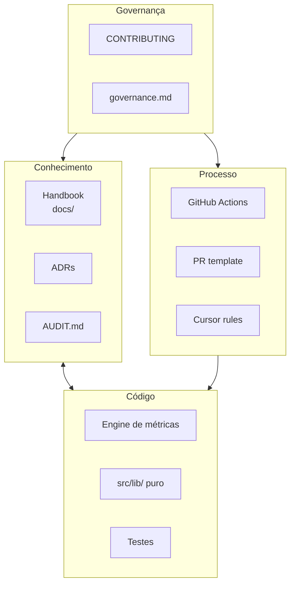

# Sistema de Engenharia Lotus

> A Lotus não é apenas um produto SaaS — é uma **empresa de engenharia** em construção.
> Este documento define o sistema que sustenta qualidade, velocidade e consistência ao longo
> de anos.

---

## Missão do sistema

Garantir que **código, documentação e processos** evoluam juntos, sem divergência, para que
qualquer engenheiro — presente ou futuro — possa:

1. Entender a plataforma rapidamente
2. Implementar com confiança
3. Operar e debugar em produção
4. Evoluir a arquitetura sem big-bang

---

## Pilares

| Pilar            | Artefatos                   | Responsabilidade              |
| ---------------- | --------------------------- | ----------------------------- |
| **Conhecimento** | `docs/`, ADRs, glossário    | Verdade sobre o sistema       |
| **Código**       | `src/`, migrations, testes  | Comportamento real            |
| **Processo**     | CI, PR template, DoD        | Qualidade automatizada        |
| **Governança**   | CONTRIBUTING, regras Cursor | Como decidimos e contribuímos |

---

## Princípios inegociáveis

1. **Docs-as-code** — documentação versionada, revisada em PR, parte do produto
2. **Código reflete docs; docs refletem código** — divergência é bug
3. **ADRs para decisões estruturais** — contexto preservado para o futuro
4. **Testes onde há regra de negócio** — fórmulas, engine, período primeiro
5. **CI como gate** — `npm run check` antes de merge
6. **Melhoria contínua** — o sistema evolui proativamente, não sob demanda

---

## Artefatos do sistema

| Artefato          | Caminho                            |
| ----------------- | ---------------------------------- |
| Ponto de entrada  | `docs/START_HERE.md`               |
| Handbook completo | `docs/README.md`                   |
| Auditoria CTO     | `docs/AUDIT.md`                    |
| Governança        | `docs/09-standards/governance.md`  |
| Contribuição      | `CONTRIBUTING.md`                  |
| CI                | `.github/workflows/ci.yml`         |
| PR template       | `.github/pull_request_template.md` |
| Regras Cursor     | `.cursor/rules/*.mdc`              |
| Validação         | `scripts/validate-engineering.mjs` |
| Env template      | `.env.example`                     |

---

## Definition of Done (empresa)

Uma entrega está completa quando:

- [ ] Código compila e `npm run check` passa
- [ ] Documentação atualizada (se comportamento mudou)
- [ ] ADR criado (se decisão estrutural)
- [ ] Changelog (se visível ao usuário)
- [ ] Sem dívida óbvia introduzida sem registro no roadmap

---

## Evolução planejada

| Fase | Entrega                                   | Status  |
| ---- | ----------------------------------------- | ------- |
| 1    | Handbook + ADRs + Cursor rules            | ✅      |
| 2    | CI + testes unitários (fórmulas, período) | ✅      |
| 3    | Cobertura engine + RLS                    | Roadmap |
| 4    | Deploy proprietário (sem Lovable)         | Roadmap |
| 5    | Coletores + observabilidade APM           | Roadmap |

Ver [Roadmap](../11-roadmap/roadmap.md).

---

## Referências

- [ADR-0011 — Fundação do Sistema de Engenharia](../02-architecture/adr/0011-engineering-system-foundation.md)
- [ADR-0010 — Cursor como ambiente oficial](../02-architecture/adr/0010-cursor-official-development-environment.md)
- [Filosofia de engenharia](./philosophy.md)
