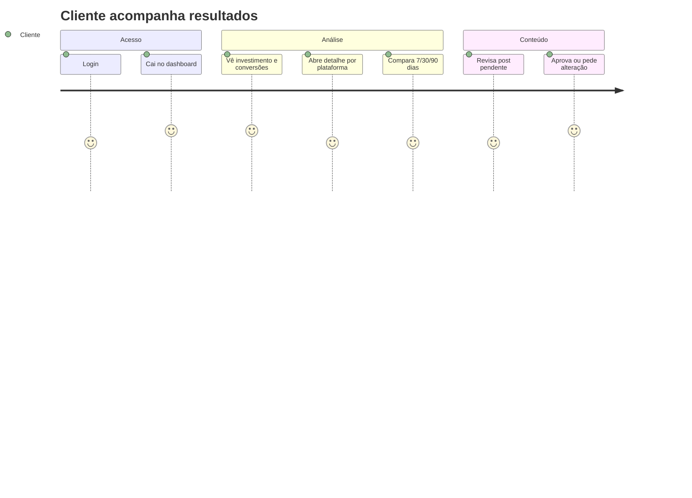
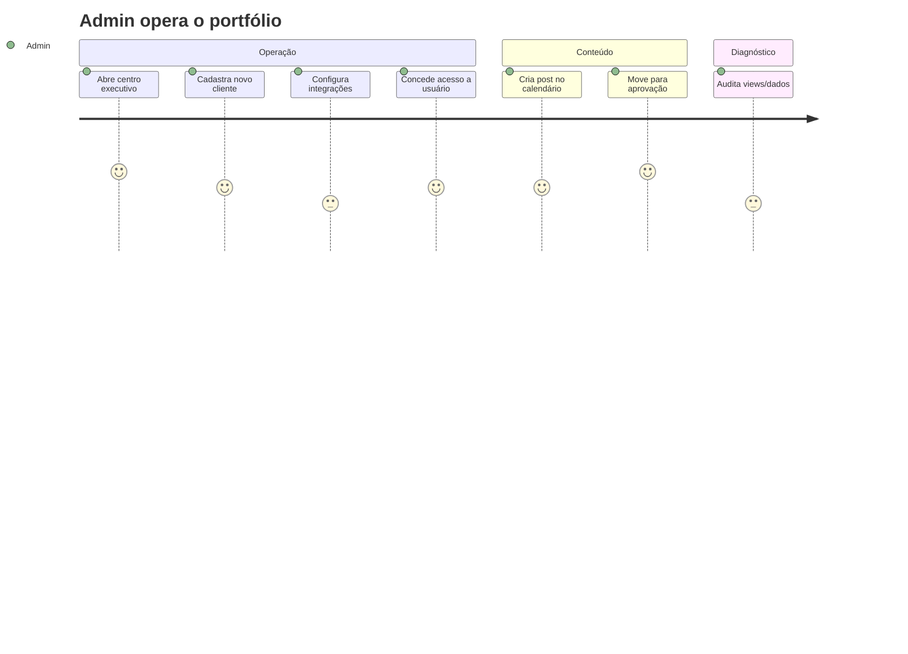

# Visão Geral do Produto

## O problema

Agências e empresas gerenciam contas em múltiplas plataformas de marketing (Meta Ads,
Google Ads, GA4, Instagram, Google Business, TikTok — e futuramente LinkedIn, Pinterest,
YouTube). Os dados ficam dispersos, em formatos diferentes, e a leitura manual é lenta e
propensa a erro. Gestores precisam de **informações confiáveis** para tomada de decisão —
não apenas números em planilhas.

## A solução

A Lotus é um **SaaS de Business Intelligence** que consolida métricas de marketing em
**dashboards especializados por plataforma** e uma **visão consolidada**, com KPIs
calculados de forma consistente, comparativos de período e insights automáticos.

**Estado atual (observado):** além de BI, a plataforma inclui operação de agência —
cadastro de clientes, serviços, usuários, integrações e **calendário editorial com
aprovação de conteúdo**.

**Visão futura:** plataforma proprietária end-to-end, com coletores próprios substituindo
Make e motor de métricas unificado. Ver [Arquitetura alvo](../02-architecture/target-architecture.md).

> **Nota de marca:** o restante do app usa "Lotus", mas as telas de entrada
> (`src/routes/auth.tsx`, `src/routes/index.tsx`) exibem **"Majrá"**.
>
> ⚠️ **INFORMAÇÃO NÃO ENCONTRADA** — não há no repositório a definição oficial da relação
> entre "Majrá" e "Lotus" (empresa vs. produto). Padronizar é item do
> [Roadmap](../11-roadmap/roadmap.md).

---

## Personas

| Persona             | Quem é                  | O que precisa                                                                                           | Onde vive no app                               |
| ------------------- | ----------------------- | ------------------------------------------------------------------------------------------------------- | ---------------------------------------------- |
| **Admin (agência)** | Gestor/operador interno | Visão de portfólio, gestão de clientes/serviços/usuários, aprovação e produção de conteúdo, diagnóstico | `/admin/*` + `/dashboard`                      |
| **Cliente final**   | Empresa atendida        | Ver os próprios resultados, aprovar conteúdo                                                            | `/dashboard`, `/cliente/{slug}`, `/aprovacoes` |

---

## Capacidades principais

### 1. Dashboards de performance

- **Visão executiva (admin):** investimento total, clientes ativos, alcance, sessões,
  conversões, mix de investimento por plataforma, top clientes, status de ingestão.
- **Visão do cliente:** resultados consolidados, comparativos 7/30/90 dias, detalhamento
  por plataforma.
- **Dashboards por plataforma:** Meta Ads, Google Ads, GA4, Instagram — cards, KPIs,
  gráficos, ranking de campanhas, tabela diária e insights.

Detalhes em [Dashboards](../06-dashboards/dashboards.md).

### 2. Gestão de clientes e serviços

CRUD de clientes (com _soft delete_), catálogo de serviços e vínculo cliente↔serviço,
gestão de IDs técnicos de integração. Ver [API Reference](../03-backend/api-reference.md).

### 3. Gestão de usuários e acessos

Criação de usuários (convite ou senha), atribuição de papel (admin/cliente) e concessão de
acesso a clientes específicos.

### 4. Calendário editorial & aprovação

Produção de posts, fluxo de status (`rascunho → em_producao → aguardando_aprovacao →
aprovado → publicado`), com o cliente aprovando ou solicitando alterações e histórico de
revisões/comentários.

### 5. Central de integrações

Catálogo declarativo de plataformas e seus IDs técnicos, com status visual
(configurado/parcial/pré/off). Ver [Integrações](../07-integrations/integrations.md).

---

## Jornadas de uso

### Jornada do cliente final

### Jornada do admin

---

## Estados de "vazio" são parte do produto

A Lotus trata explicitamente contas sem dados ("Sua conta está sendo preparada"),
plataformas sem ingestão e períodos sem registros — sempre com mensagens claras em vez de
telas quebradas. Isso é um princípio de produto, não um detalhe.

---

## O que **não** é a Lotus (hoje)

- Não é a ferramenta que **coleta** os dados das APIs — isso é feito por automações
  externas no Make (ver [workers](../07-integrations/integrations.md#pipeline-de-ingestão-workers)).
- Não envia relatórios por e-mail automaticamente (não encontrado no código).
- Não faz billing/cobrança automatizada (há campos comerciais como `valor_mensal`, mas
  sem motor de cobrança).
