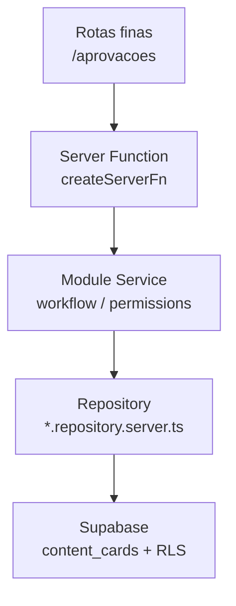
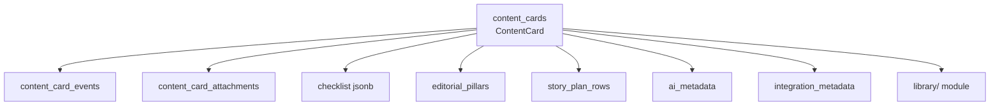

# Content Workflow — Arquitetura

> **Nome visível:** Aprovações · **Módulo:** `approval` · **ADR:** [0018](./adr/0018-content-workflow-module-v1.md)

O **Content Workflow** é o módulo definitivo de produção de conteúdo. O Kanban é uma
**visualização**. O aggregate root é **`ContentCard`** persistido em **`content_cards`**.

---

## Princípios

1. **Card-first** — tudo orbita `content_cards`
2. **Repository pattern** — Supabase só em `*.repository.server.ts`
3. **Event sourcing lite** — `content_card_events` imutável
4. **Biblioteca como módulo** — `library/`; não é filtro
5. **Ports para futuro** — IA, publishers, automação
6. **Boundaries no CI** — `validate-approval-boundaries.mjs`

---

## Fluxo de camadas

---

## Aggregate root

---

## Superfícies

| View | Submódulo | Default |
| ---- | --------- | ------- |
| Kanban | `cards/` + `workflow/` | Sim |
| Calendário | `calendar/` | Admin |
| Pilares | `pillars/` | Tab |
| Stories | `stories/` | Tab |
| Biblioteca | `library/` | Tab |
| Dashboard ops | `dashboard/` | Admin |

Todas leem **`content_cards`** — zero duplicação.

---

## Legado

`posts_editorial` / `post_media` / `post_revisions` existem apenas para migração e código MVP
até Fase 1. Novo código usa exclusivamente `content_cards` e tabelas do domínio oficial.

---

## Referências

- [Backend](../03-backend/content-workflow.md)
- [Fase 0](../03-backend/content-workflow-phase-0.md)
- [Schema](../04-database/content-workflow-schema.md)
