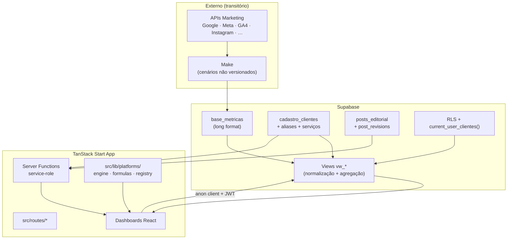

# Arquitetura — Estado Atual

> **Escopo:** fatos observáveis no repositório `supabase-magic-portal/`. Para a visão futura,
> ver [Arquitetura alvo](./target-architecture.md).

---

## Resumo

A Lotus é uma aplicação **full-stack TypeScript** (TanStack Start + React 19) que consome
dados analíticos do **Supabase Postgres**, ingeridos por **automações Make** externas.

Não existe servidor backend dedicado fora do runtime TanStack Start (server functions) e
do Supabase (Auth, RLS, views, funções SQL).

---

## Stack (observada em `package.json` e código)

| Camada | Tecnologia | Notas |
|--------|-----------|-------|
| Framework | TanStack Start + TanStack Router | Roteamento file-based em `src/routes/` |
| UI | React 19, Tailwind v4, Radix, Recharts | Componentes Lotus em `src/components/lotus/` |
| Estado servidor | TanStack React Query | Cache e refetch de views Supabase |
| Backend lógico | Server functions | `admin.functions.ts`, `editorial.functions.ts` |
| Banco/Auth | Supabase | Project ID: `ywvhoctcmibjitvwkkhb` |
| Build | Vite 8 + Nitro | Via `@lovable.dev/vite-tanstack-config` (transitório) |
| Ingestão | **Make** (externo) | Não versionado neste repo |
| Dev oficial | **Cursor** + Git | [ADR-0010](./adr/0010-cursor-official-development-environment.md) |
| Build/deploy transitório | Lovable | Pipeline apenas; features implementadas no repo |

---

## Diagrama de componentes (atual)

---

## Camadas de responsabilidade

### 1. Ingestão (Make — transitório)

- Make consulta APIs oficiais usando IDs técnicos de `cadastro_clientes`.
- Grava em `base_metricas` no formato long (cliente, plataforma, métrica, valor, data).
- **⚠️ INFORMAÇÃO NÃO ENCONTRADA:** schema DDL de `base_metricas`, frequência de sync,
  retries, contrato exato de nomes de métricas por plataforma.

Ver [Pipeline Make](../07-integrations/current-pipeline-make.md).

### 2. Camada SQL (views)

Migrations em `supabase/migrations-official/` (01–08):

- Normalização: `vw_metricas_normalizadas` (aliases de cliente, spend em micros → reais).
- Agregação diária por plataforma: `vw_google_ads_diario`, `vw_meta_ads_diario`, etc.
- Overview: `vw_overview_cliente`.
- Admin: `vw_clientes_admin`, `vw_clientes_ativos`.

**Dívida observada:** views calculam métricas derivadas (CTR, CPM, engagement_rate). Isso
**contradiz** a arquitetura alvo. Ver [Modelo de métricas](../04-database/metrics-model.md).

Migration 07 alterou views para `SECURITY DEFINER` (workaround RLS). Ver
[ADR-0003](./adr/0003-views-security-definer.md).

### 3. Camada de aplicação (TypeScript)

| Módulo | Função |
|--------|--------|
| `src/lib/platforms/registry.ts` | Registro de plataformas ativas |
| `src/lib/platforms/*Def.ts` | Config declarativa por plataforma |
| `src/lib/platforms/formulas.ts` | Fórmulas puras de KPI |
| `src/lib/platforms/engine.ts` | Agregação e cálculo sobre rows das views |
| `src/lib/metrics.ts` | Overview cross-platform (heurísticas MAX para alguns KPIs) |
| `src/lib/period.ts` | Timezone America/Sao_Paulo |

**Dívida observada:** duplicação parcial entre `metrics.ts` e `engine.ts`; insights
duplicados em `dashboard.tsx`.

### 4. Autenticação e autorização

- Browser: Supabase anon key + JWT do usuário logado.
- Server functions sensíveis: service-role (`client.server.ts`).
- Middleware: `requireSupabaseAuth`, `attachSupabaseAuth`.
- Multi-tenant: `current_user_clientes()` + policies RLS.

### 5. Funcionalidades além de BI

- **Admin:** CRUD clientes, serviços, usuários (`admin.functions.ts`).
- **Editorial:** posts, revisões, aprovações (`editorial.functions.ts`, migration 06).

---

## Rotas principais

| Rota | Propósito |
|------|-----------|
| `/dashboard` | Overview do cliente logado |
| `/cliente/$cliente/*` | Dashboards por plataforma |
| `/admin` | Painel administrativo |
| `/aprovacoes` | Fluxo editorial |
| `/auth` | Login |

Detalhes: [Roteamento](../05-frontend/routing.md)

---

## Limitações conhecidas (estado atual)

1. **Chave de cliente por nome** (+ aliases) em vez de FK estável — [ADR-0004](./adr/0004-chave-de-cliente-por-nome-e-aliases.md).
2. **Make externo** — sem observabilidade, versionamento ou testes no repo.
3. **Métricas derivadas no SQL** — divergência potencial com engine TS.
4. **TikTok / GBP** — no catálogo, sem `PlatformDef` completo.
5. **Lovable acoplado** — deploy e env vars com prefixo `OFFICIAL_`.
6. **Schema `base_metricas`** — não versionado nas migrations oficiais.

---

## O que NÃO existe hoje

| Componente (visão futura) | Status |
|---------------------------|--------|
| Coletores proprietários | Não implementado |
| Fila de processamento | Não implementado |
| Workers de sync | Não implementado |
| API interna dedicada | Não implementado (server functions parciais) |
| Motor de métricas isolado como serviço | Parcial (`engine.ts` no frontend bundle) |

---

## Próximo passo na leitura

→ [Arquitetura alvo](./target-architecture.md) · [Fluxo de dados](./data-flow.md)
