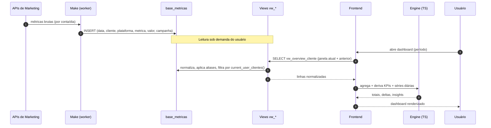
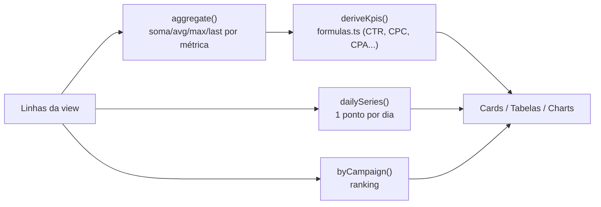
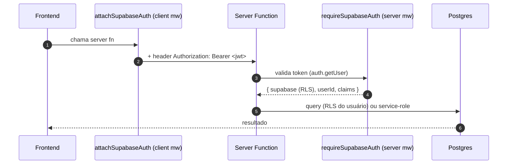
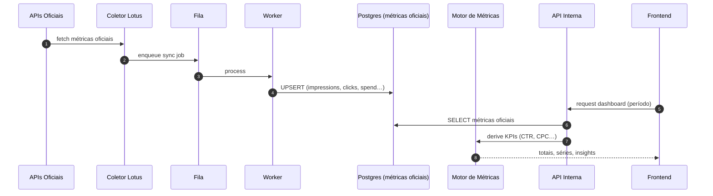

# Arquitetura — Fluxo de Dados

> Este documento descreve o **estado atual**. O fluxo alvo (coletores → fila → workers) está
> em [Arquitetura alvo](./target-architecture.md) e [Coletores alvo](../07-integrations/target-collectors.md).

## Visão ponta a ponta (estado atual)



---

## Etapa 1 — Ingestão (externa, Make)

Cenários no Make leem os **IDs técnicos** de cada cliente em `cadastro_clientes`
(`google_ads_customer_id`, `ga4_property_id`, `facebook_ad_account_id`,
`instagram_page_id`, `google_business_location_id`, `tiktok_ad_account_id`), chamam as APIs
e gravam em `base_metricas` no formato _long_:

| coluna | exemplo |
|--------|---------|
| `data` | `2026-06-25` |
| `cliente` | `Antena` |
| `plataforma` | `Google Ads` |
| `metrica` | `spend` |
| `valor` | `164824476` (micros) |
| `campanha` | `Branding - Junho` |

> ⚠️ **INFORMAÇÃO NÃO ENCONTRADA** — o schema de `base_metricas` e os cenários do Make não
> estão versionados no repositório. O formato acima é **inferido** das views e migrations.
> Detalhes e lacunas em [Integrações → Pipeline de ingestão](../07-integrations/integrations.md#pipeline-de-ingestão-workers).

---

## Etapa 2 — Normalização (Postgres views)

A view base `vw_metricas_normalizadas` (definida em
`supabase/migrations-official/08_aliases_e_null_guard.sql`) faz, em uma só passada:

1. **Padroniza plataforma** para snake_case (`"Google Ads"` → `google_ads`).
2. **Padroniza métrica** para minúsculas.
3. **Converte Google Ads `spend`** de micros para moeda (`valor / 1.000.000`).
4. **Aplica alias de cliente** → expõe sempre o nome canônico (`COALESCE(alias, cliente)`).
5. **Descarta `valor IS NULL`** (ruído).
6. **Filtra por `current_user_clientes()`** (isolação multi-tenant).

A partir dela, views derivadas pivotam por plataforma e dia
(`vw_meta_ads_diario`, `vw_google_ads_diario`, `vw_ga4_diario`, `vw_instagram_diario`,
`vw_google_business_diario`), além de `vw_overview_cliente` e `vw_clientes_ativos`.

Detalhes em [Banco → Views](../04-database/views.md).

---

## Etapa 3 — Leitura (Frontend + React Query)

O frontend consulta as views **diretamente** via client Supabase anon. Padrão recorrente:
buscar a janela `[prevFrom, to]` numa única query para já ter o comparativo.

```ts
// src/routes/_authenticated/dashboard.tsx (resumo)
supabase
  .from("vw_overview_cliente")
  .select("*")
  .gte("data", prevFrom)
  .lte("data", to)
  .order("data", { ascending: true });
```

As queries são encapsuladas em `queryOptions` do React Query, com `queryKey` que inclui o
período — garantindo cache correto por janela.

---

## Etapa 4 — Cálculo (Engine puro)

Nenhum componente calcula KPI. O fluxo é:



- `src/lib/platforms/engine.ts` — agregação genérica a partir de um `PlatformDef`.
- `src/lib/platforms/aggregations.ts` — estratégias (`sum`, `avg`, `max`, `min`, `first`, `last`, `custom`).
- `src/lib/platforms/formulas.ts` — fórmulas oficiais (fonte única de verdade).
- `src/lib/metrics.ts` — agregação específica do overview consolidado + insights.

> **Detalhe importante:** algumas métricas não são somáveis entre dias. Em
> `sumOverview()` (`src/lib/metrics.ts`), `google_spend` e `instagram_reach` usam **MAX por
> cliente** (cumulativo / contagem única), enquanto o resto soma. Isso é intencional e está
> comentado no código.

---

## Etapa 5 — Escrita (Server Functions)

Operações de escrita (cadastro, serviços, usuários, editorial) **não** passam pelo client
anon direto: vão por server functions que validam token + Zod e aplicam regras de papel.
Ver [Backend → API Reference](../03-backend/api-reference.md).



---

## Fluxo alvo (visão futura — não implementado)



Ver [Modelo de métricas](../04-database/metrics-model.md) para regra oficial vs derivada.
