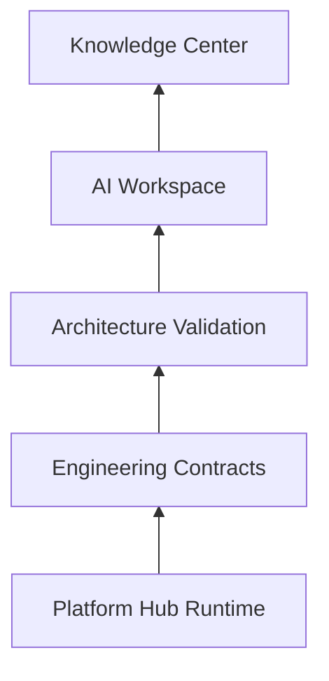

# Engineering Contracts — Platform Hub v3.3

> **Status:** Architecture Frozen v3.3 — contratos estáveis; Runtime/Meta/paridade
> implementados in-memory (ver [ADR-0024](./adr/0024-platform-hub-runtime-meta-parity.md)).
>
> Contratos definem o vocabulário evolutivo do Platform Hub. Emenda exige ADR aceito.

## Localização

| Artefato              | Caminho                                                      |
| --------------------- | ------------------------------------------------------------ |
| Constituição          | [`CONSTITUTION.md`](../../CONSTITUTION.md)                   |
| Contratos TypeScript  | [`contracts/`](../../contracts/)                             |
| Metadados por domínio | `contracts/*/contract.meta.json`                             |
| ADR                   | [ADR-0020](./adr/0020-engineering-contracts-platform-hub.md) |

## Pilares de engenharia



**Engineering Contracts** é a fundação: ADRs explicam _por quê_; `CONSTITUTION.md` _proíbe_;
`contracts/` _define e versiona_.

## Estrutura de contratos

```
contracts/
├── index.ts
├── connection/          ConnectionId, ScopeRef
├── plugin/              PluginManifest, Capability
├── ingest/              IngestEnvelope + profiles/
│   └── profiles/        MetricBatch (metrics-timeseries)
├── provider/            ProviderPort
├── identity/            PlatformIdentity
├── events/              integration.* events
├── health/              reconciliation spec
├── runtime/             SyncRuntime, PluginLoader, MetricWriterPort
└── governance/          RegistryReport, ConformanceSuites
```

## Contratos principais

### Ingestão em dois níveis

```
Provider.collect() → IngestEnvelope
                         ├── profile: metrics-timeseries → MetricBatch → MetricPipeline
                         ├── profile: entity-upsert        (reservado — ADR futuro)
                         └── profile: event-log            (reservado — ADR futuro)
```

### ConnectionId e ScopeRef

- **ConnectionId** — única referência operacional do Hub (Runtime, Pipeline, Health).
- **ScopeRef** — tipo opaco; mapeamento tenant/organização somente no ConnectionResolver e
  `platform-hub-bridges/legacy-cadastro/`.

### Capabilities namespaced

Formato: `{pluginKey}:{domain}:{action}`

Exemplos: `meta:metrics:collect`, `tiktok:content:publish_video`

### Eventos `integration.*`

Catálogo em `contracts/events/integration-events.v1.ts`. Handlers registram no Core EventBus
na Fase 6+.

### Health

Eventos primários + reconciliação periódica (`contracts/health/reconciliation.v1.ts`).

## Metadados (`contract.meta.json`)

Cada pasta de domínio possui `contract.meta.json` com:

- `name`, `version`, `file`
- `deprecated`, `breakingChanges`, `migrationGuide`
- `consumers` — módulos que dependem do contrato

Fase -1 implementa `validate:contracts` comparando snapshots para detectar breaking changes.

## Artefatos de governança

| Spec               | Arquivo                               | Uso                                      |
| ------------------ | ------------------------------------- | ---------------------------------------- |
| Registry Report    | `governance/registry-report.v1.ts`    | `scripts/generated/registry-report.json` |
| Conformance Suites | `governance/conformance-suites.v1.ts` | Testes por perfil                        |

## Comandos (Fase -1)

| Comando                         | Função                          |
| ------------------------------- | ------------------------------- |
| `npm run create:plugin`         | Estrutura mínima do plugin      |
| `npm run generate:plugin`       | Artefatos derivados do manifest |
| `npm run validate:plugin`       | Convention tests                |
| `npm run validate:contracts`    | Contract compatibility          |
| `npm run validate:architecture` | Todos os validators             |
| `npm run hub:doctor`            | Auditor simples                 |

## Escopo Fase -2 (histórico)

A Fase -2 entregou apenas documentação e schemas. Runtime e validators foram Fase -1.

## Estado de implementação (histórico)

| Fase  | Entrega                                          | Status                          |
| ----- | ------------------------------------------------ | ------------------------------- |
| -2    | CONSTITUTION + `contracts/`                      | ✅                              |
| -1    | Governance / DX / example                        | ✅                              |
| 0     | Ports + ADRs 0020–0023                           | ✅                              |
| 1     | Hub Registry + 7 plugins                         | ✅                              |
| 2     | Estrutura + bridges                              | ✅                              |
| 3–6   | Providers, Connections, Health, Runtime+Pipeline | ✅ in-memory                    |
| 7     | Meta official + OAuth svc + baseline reader      | ✅ biblioteca (sem callback UI) |
| 8–12  | Demais plataformas oficiais                      | stubs                           |
| 13–14 | Publisher / Make removido                        | backlog                         |
| 15    | Hub completo + public API ampla                  | parcial                         |

## Próximos gates (não alterar contratos)

1. Dual-run staging: Baseline Reader (Supabase) × OfficialMetaProvider → `coverage ≈ 100%`
2. OAuth callback HTTP (bridge/app) + vault real
3. Migrations `ph_*` + UI `/admin/conexoes`
4. Templates oficiais TikTok → GA4
5. Publisher Runtime → milestone Make removido

## Referências

- Fluxo de produção atual (intocado): [current-pipeline-make.md](../07-integrations/current-pipeline-make.md)
- Integrações: [integrations.md](../07-integrations/integrations.md)
- Modelo de métricas: [metrics-model.md](../04-database/metrics-model.md)
- ADR Runtime/Meta: [0024](./adr/0024-platform-hub-runtime-meta-parity.md)
