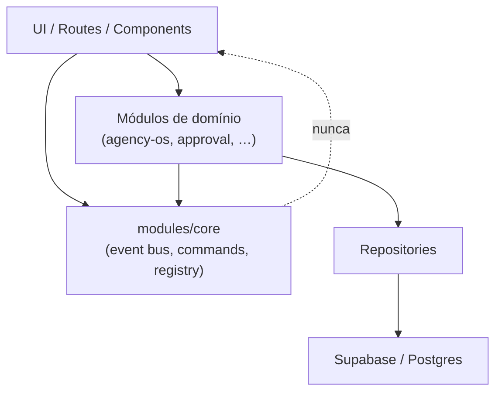
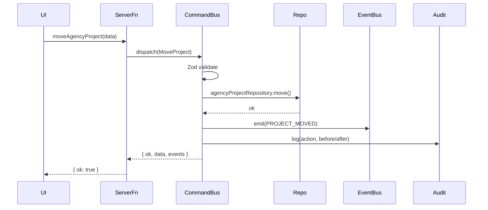
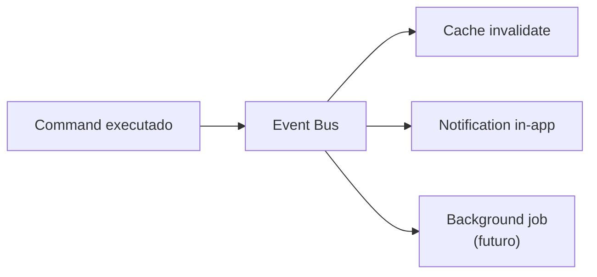

# OS Core — Operating System Layer

A Fase 4 introduz `src/modules/core/`: infraestrutura compartilhada **sem regras de negócio**.
Módulos de domínio (Agency OS, Approval, Financeiro futuro, etc.) registram-se no OS — nunca o contrário.

---

## Camadas e direção de dependência



| Camada | Responsabilidade |
|--------|------------------|
| **UI** | Renderização, TanStack Query, composição |
| **Módulo** | Regras de negócio, builders, validators |
| **Core** | Event bus, command bus, registry, permissions, flags |
| **Repository** | Acesso a dados tipado |
| **Database** | Postgres, views, RLS |

---

## Componentes do Core

| Serviço | Arquivo | Função |
|---------|---------|--------|
| Event Bus | `event-bus/event-bus.ts` | Pub/sub tipado in-process |
| Command Bus | `commands/command-bus.ts` | Validação + execução + eventos |
| Cache Manager | `cache/cache-manager.ts` | TTL in-memory |
| Realtime Manager | `realtime/realtime-manager.ts` | Abstração Supabase Realtime |
| Notification Dispatcher | `notifications/notification-dispatcher.ts` | Multi-canal (in-app ativo) |
| Permission Engine | `permissions/permission-engine.ts` | RBAC preparado |
| Feature Flags | `feature-flags/feature-flag-service.ts` | on/off/beta/experimental |
| Audit Logger | `audit/audit-logger.ts` | Sinks + `core_audit_log` |
| Background Jobs | `jobs/background-job-runner.ts` | Fila in-process |
| Snapshot Builder | `snapshot/snapshot-builder.ts` | Compositor read-model |
| Config Registry | `registry/config-registry.ts` | Registro central de módulos |
| Widget Registry | `registry/widget-registry.ts` | Widgets lazy + permissions |
| Search Engine | `search/search-engine.ts` | Providers por módulo |
| Dashboard Engine | `dashboard/dashboard-engine.tsx` | Monta UI a partir do registry |

---

## Fluxo de comandos



**Comandos Agency OS registrados:** `MoveProject`, `CompleteTask`, `CreateNote`, `MoveLead`, `ConvertLead`.

Server functions existentes mantêm assinatura — internamente delegam ao command bus.

---

## Fluxo de eventos



Exemplo `LEAD_CONVERTED`:

1. Command `ConvertLead` conclui no repository
2. Emite `LEAD_CONVERTED` + `CLIENT_CREATED`
3. Subscriber invalida cache `agency-os`
4. Notification in-app: "Lead convertido em cliente"

Módulos **não** chamam uns aos outros diretamente — reagem a eventos.

---

## Registro de módulos

Bootstrap: `src/modules/os-bootstrap.ts` (importado em `_authenticated/route.tsx`).

Cada módulo expõe `registerXModule()`:

```typescript
configRegistry.register({
  id: "agency-os",
  label: "Agency OS",
  routes: [...],
  widgets: [...],
  dashboards: [...],
  searchProviders: [...],
  commands: [...],      // via registerAgencyOsCommands()
  events: [...],
  permissions: [...],
  featureFlags: [...],
});
```

### Incluir um novo domínio (ex.: Financeiro)

1. Criar `src/modules/financeiro/`
2. Implementar repositories + commands + `registerFinanceModule()`
3. Adicionar uma linha em `os-bootstrap.ts`
4. **Não alterar** `core/` nem outros módulos

---

## Widget & Dashboard Engine

Widgets registrados com metadata (`id`, `permissions`, `lazy`, `colSpan`).

Dashboards referenciam `widgetIds` — a UI usa `<DashboardGrid dashboardId="…" />`.

Exemplo: `agency-os.client-workspace` no workspace de cliente.

---

## Search Engine (Ctrl+K)

| Provider | Escopo | Onde roda |
|----------|--------|-----------|
| `navigation-routes` | Rotas estáticas | Client |
| `agency-os` (server) | Comandos + busca operacional | Server (`searchOs`) |
| Portal clientes | `vw_clientes_ativos` | Client (GlobalSearch) |

---

## Banco de dados

Migration `27_os_core.sql`:

- `core_audit_log` — auditoria append-only
- `core_feature_flags` — overrides por scope

---

## Compatibilidade

- APIs das Fases 1–3 **inalteradas** (mesmos server functions e payloads)
- Comportamento preservado — commands encapsulam a lógica existente
- `searchAgencyOsCommand` mantido; `searchOs` agrega no core

---

## Referências

- Agency OS: `src/modules/agency-os/`
- ADR: [0019-os-core-layer.md](./adr/0019-os-core-layer.md)
- Bootstrap: `src/modules/os-bootstrap.ts`
