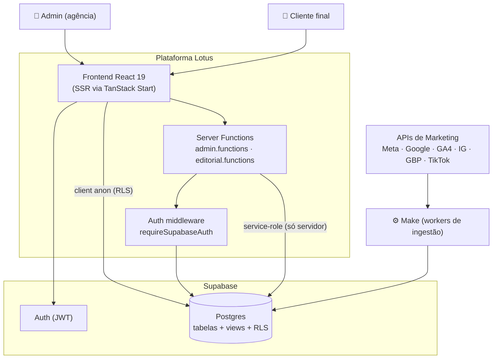
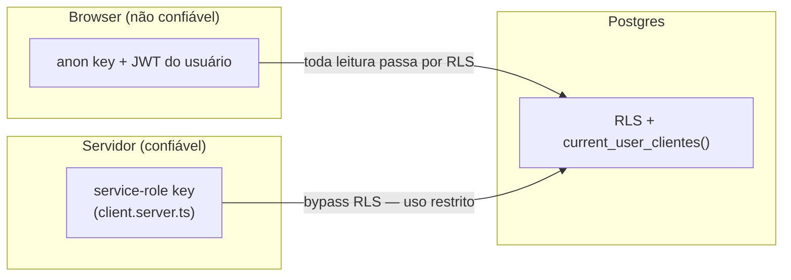

# Arquitetura — Visão Geral

> **Leitura recomendada:** [START HERE](../START_HERE.md) · [Estado atual](./current-state.md) ·
> [Arquitetura alvo](./target-architecture.md)

## Resumo executivo

A Lotus é uma aplicação **full-stack TypeScript** construída sobre **TanStack Start**
(SSR + roteamento por arquivos) e **Supabase** (Postgres + Auth + RLS). Não há servidor
backend próprio: a lógica de servidor vive em **server functions** do TanStack Start, e a
camada de dados/segurança vive no Postgres (RLS + views + funções `SECURITY DEFINER`).

A ingestão das métricas é feita por **automações externas (Make)**, que gravam em uma
tabela legada (`base_metricas`). A aplicação é, em essência, uma **consumidora** desses
dados já ingeridos, com uma poderosa camada de normalização em SQL e um engine de cálculo
declarativo em TypeScript.

**Visão futura:** coletores proprietários, fila de processamento, banco com métricas
oficiais apenas, motor de métricas unificado e API interna — substituindo Make e
desacoplando Lovable. Detalhes em [Arquitetura alvo](./target-architecture.md).

---

## Stack tecnológica (estado atual)

| Camada                   | Tecnologia                                                                                            |
| ------------------------ | ----------------------------------------------------------------------------------------------------- |
| Framework                | TanStack Start (`@tanstack/react-start`, `@tanstack/react-router`)                                    |
| UI                       | React 19, Tailwind CSS v4, Radix UI, componentes shadcn-style, Recharts, lucide-react, sonner, motion |
| Estado de dados          | TanStack React Query                                                                                  |
| Backend                  | Server functions (TanStack Start)                                                                     |
| Banco/Auth               | Supabase (Postgres, Auth, RLS)                                                                        |
| Validação                | Zod                                                                                                   |
| Build/Runtime            | Vite 8 + Nitro (via `@lovable.dev/vite-tanstack-config`), alvo Cloudflare                             |
| Dev oficial              | **Cursor** + Git ([ADR-0010](./adr/0010-cursor-official-development-environment.md))                  |
| Build/deploy transitório | Lovable (pipeline; não implementar features lá)                                                       |

Versões exatas em `package.json`.

---

## Diagrama de contexto (C4 nível 1–2)

---

## Componentes e responsabilidades

### Frontend (`src/routes`, `src/components`)

- Renderiza dashboards e telas de operação.
- Lê **views analíticas diretamente** com o client Supabase anon (sujeito a RLS).
- Usa server functions para operações de escrita/privilegiadas.
- Não calcula KPIs: delega ao engine (`src/lib`).

### Server Functions (`src/lib/admin.functions.ts`, `src/lib/editorial.functions.ts`)

- Executam no servidor.
- Validam o **Bearer token** do usuário (`requireSupabaseAuth`).
- Validam input com Zod.
- Usam o client com RLS do usuário ou, quando necessário, o **admin client service-role**.

### Camada de dados (Supabase / Postgres)

- **Tabelas de domínio** com RLS por papel.
- **Views analíticas** que normalizam `base_metricas`.
- **Funções `SECURITY DEFINER`** (`has_role`, `current_user_clientes`) que sustentam a
  segurança multi-tenant.

### Ingestão (Make — externo)

- Lê IDs técnicos de `cadastro_clientes`, chama as APIs, grava em `base_metricas`.
- **Não versionado neste repositório.** Ver [Integrações](../07-integrations/integrations.md).

---

## Limites e contratos

- **Contrato de segurança:** o browser nunca recebe a service-role. Arquivos `.server.ts`
  são proibidos de import no client. Ver
  [ADR-0005](./adr/0005-server-functions-anon-vs-service-role.md).
- **Contrato de dados:** o frontend assume que as views já entregam dados normalizados
  (snake_case, moeda convertida, nome canônico). Ver [Banco → Views](../04-database/views.md).

---

## Decisões arquiteturais

As decisões estruturais estão registradas como ADRs:

- [ADR-0001 — TanStack Start + Supabase](./adr/0001-tanstack-start-supabase.md)
- [ADR-0002 — Engine declarativo de plataformas](./adr/0002-engine-declarativo-de-plataformas.md)
- [ADR-0003 — Views como SECURITY DEFINER](./adr/0003-views-security-definer.md)
- [ADR-0004 — Chave de cliente por nome + aliases](./adr/0004-chave-de-cliente-por-nome-e-aliases.md)
- [ADR-0005 — Anon vs service-role](./adr/0005-server-functions-anon-vs-service-role.md)
- [ADR-0006 — Timezone America/Sao_Paulo](./adr/0006-timezone-america-sao-paulo.md)

Um resumo narrativo está em [decisions.md](./decisions.md).
