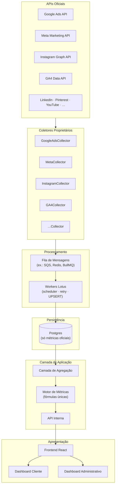
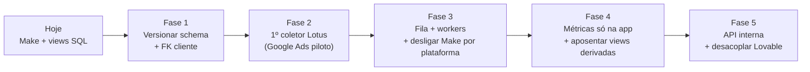

# Arquitetura Alvo (Visão Futura)

> **Escopo:** recomendações estratégicas e direção de engenharia. **Não** descreve código
> existente, salvo onde indicado como ponto de partida.

---

## Objetivo

Tornar a Lotus uma plataforma **completamente proprietária**, onde toda inteligência —
coleta, normalização, agregação, cálculo de KPIs, APIs e dashboards — vive dentro do
ecossistema Lotus, sem dependência operacional de Make, Lovable ou ferramentas equivalentes.

---

## Pipeline alvo

---

## Coletores proprietários

Cada plataforma terá um coletor dedicado. Exemplos (nomenclatura alvo):

| Coletor                   | Plataforma              |
| ------------------------- | ----------------------- |
| `GoogleAdsCollector`      | Google Ads              |
| `MetaCollector`           | Meta Ads                |
| `InstagramCollector`      | Instagram               |
| `GA4Collector`            | Google Analytics 4      |
| `GoogleBusinessCollector` | Google Business Profile |
| `TikTokCollector`         | TikTok                  |
| `LinkedInCollector`       | LinkedIn Ads            |
| `PinterestCollector`      | Pinterest               |

### Responsabilidades de cada coletor

| Capacidade          | Descrição                                             |
| ------------------- | ----------------------------------------------------- |
| Autenticação        | OAuth / service accounts conforme API                 |
| Renovação de tokens | Refresh automático antes de expirar                   |
| Retries             | Backoff exponencial, dead-letter queue                |
| Logs                | Structured logging por sync run                       |
| Monitoramento       | Métricas de sucesso/falha/latência                    |
| Scheduler           | Cron ou fila com prioridade por cliente               |
| UPSERT              | Idempotência por (cliente, plataforma, métrica, data) |
| Tratamento de erros | Classificação retentável vs fatal                     |
| Observabilidade     | Traces, alertas, dashboard operacional                |

**Status atual:** nenhum coletor implementado neste repositório. Make cumpre papel parcial
de forma externa. Ver [Coletores alvo](../07-integrations/target-collectors.md).

---

## Princípios da arquitetura alvo

### 1. Fonte única de verdade

Toda regra de negócio e fórmula existe **uma única vez**. Nenhum dashboard, relatório ou
export calcula KPI de forma independente.

**Recomendação:** pacote compartilhado `@lotus/metrics` (ou monorepo workspace) consumido
por API, workers e frontend.

### 2. Banco armazena apenas métricas oficiais

O Postgres persiste **somente** valores retornados pelas APIs oficiais.

**Nunca persistir (calcular na aplicação):**

- CTR, CPC, CPA, CPM
- Taxa de conversão
- Engagement Rate
- Frequency
- Qualquer KPI derivado

Ver [Modelo de métricas](../04-database/metrics-model.md).

### 3. Camada de fórmulas única

Todas as fórmulas em um módulo compartilhado. **Nenhum componente React implementa cálculos.**

**Ponto de partida atual:** `src/lib/platforms/formulas.ts` — evoluir para pacote
compartilhado e remover cálculos das views SQL.

### 4. Arquitetura declarativa de plataformas

Adicionar plataforma = três passos:

1. Criar `PlatformDef` (métricas oficiais, labels, gráficos).
2. Registrar no `Registry`.
3. Implementar coletor correspondente.

**Sem** alteração estrutural de dashboards ou rotas.

**Ponto de partida atual:** engine declarativo parcialmente implementado — [ADR-0002](./adr/0002-engine-declarativo-de-plataformas.md).

---

## Métricas oficiais por plataforma (alvo)

| Plataforma | Armazenar no banco                                                          |
| ---------- | --------------------------------------------------------------------------- |
| Google Ads | impressions, clicks, spend, conversions                                     |
| Meta Ads   | impressions, reach, clicks, spend, conversions                              |
| Instagram  | reach, accounts_engaged, likes, comments, saves, shares, total_interactions |
| GA4        | users, sessions, events, conversions                                        |

Todo o restante é calculado pelo motor de métricas.

---

## API interna

**Recomendação:** camada HTTP/RPC interna entre frontend e dados processados.

Responsabilidades:

- Autenticação e autorização (JWT + tenant scope).
- Agregação por período (delegando ao motor de métricas).
- Endpoints admin (clientes, sync status, reprocessamento).
- Não expor service-role ao cliente.

**Estado atual:** server functions TanStack Start cobrem admin/editorial parcialmente;
leitura analítica vai direto do browser → Supabase views.

---

## Escalabilidade (requisitos de design)

| Dimensão       | Meta                                                           |
| -------------- | -------------------------------------------------------------- |
| Clientes       | Centenas                                                       |
| Plataformas    | Dezenas                                                        |
| Sincronizações | Milhares/dia                                                   |
| Manutenção     | Coletores isolados, testáveis                                  |
| Performance    | Agregação incremental, índices por (cliente, data, plataforma) |
| Testes         | Unit (fórmulas), integração (coletores mock), contrato (APIs)  |

---

## Migração incremental (recomendada)

Roadmap detalhado: [../11-roadmap/roadmap.md](../11-roadmap/roadmap.md)

---

## ADRs relacionados (alvo)

| ADR                                                        | Tema                                           |
| ---------------------------------------------------------- | ---------------------------------------------- |
| [0007](./adr/0007-derived-metrics-in-application-layer.md) | Métricas derivadas só na aplicação             |
| [0008](./adr/0008-proprietary-data-collectors.md)          | Coletores proprietários substituem Make        |
| [0009](./adr/0009-platform-proprietary-infrastructure.md)  | Infraestrutura proprietária (sem Lovable/Make) |

---

## Lacunas a definir (não inventar)

- Tecnologia exata da fila (SQS, Redis, BullMQ, etc.).
- Linguagem/runtime dos workers (Node, Python, Go).
- Estratégia de hosting pós-Lovable (Cloudflare, Vercel, AWS, etc.).
- SLA de sincronização por tier de cliente.
- Modelo de credenciais OAuth centralizado vs por cliente.
