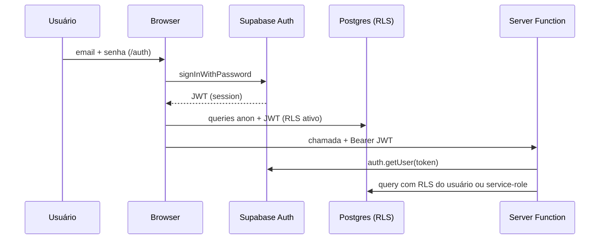

# Autenticação & Autorização

> **Auth Module v3 — concluído (30/06/2026).** Registro oficial:
> [Auth Module v3](./auth-module-v3.md) · Arquitetura:
> [Auth, Access e Admin](../02-architecture/auth-access-admin.md) ·
> [ADR-0014](../02-architecture/adr/0014-auth-module-v3-architecture.md)

---

## Responsabilidades por módulo

### Auth

Responsável **apenas** por: login, logout, sessão, callback, UI de convite/recovery,
alteração da própria senha.

**Não conhece:** clientes, permissões, dashboards, regras de negócio, lifecycle, Access.

Código: `src/modules/auth/`, rotas `src/routes/auth/*`.

### Access

Responsável por: lifecycle, permissões, papéis, bloqueios, destino pós-login, autorização,
Recovery Mode (server), orchestrator.

Código: `src/modules/access/`, `src/lib/access.functions.server.ts`.

### Admin

Responsável por: criar/excluir/reativar/desativar usuário, reenviar convite, recovery por e-mail,
Recovery Mode (UI), auditoria.

Código: `src/modules/admin/`.

### Cliente (domínio)

Empresas, dados, dashboards, relatórios, integrações. **Auth nunca importa este domínio.**

---

## Visão geral

A Lotus usa **Supabase Auth** (email/senha). Autorização combina:

1. **Papéis** (`admin` | `cliente`) em `user_roles`
2. **Acesso por cliente** em `client_access`
3. **RLS** no Postgres + função `current_user_clientes()`
4. **Guards** no frontend (rotas) e **middleware** nas server functions



---

## Login e sessão (módulo Auth + Access)

| Item               | Detalhe                                                                 |
| ------------------ | ----------------------------------------------------------------------- |
| Rotas públicas     | `/auth` (multi-view) + `/auth/callback`                                 |
| Views em `/auth`   | `login`, `set-password`, `forgot-password`, `link-error`                |
| Callback           | `verifyOtp` / `exchangeCodeForSession` → orchestrator → redirect        |
| Segurança conta    | `/account/security` (alterar senha com reautenticação)                  |
| Storage            | `localStorage` key `sb-{projectId}-auth-token`                          |
| Redirect pós-login | `resolvePostAuthDestination()` → `/admin` ou `/dashboard` (Access)        |

### Princípios arquiteturais

1. **Auth** estabelece/encerra sessão — nunca decide admin, lifecycle ou metadata.
2. **Access** autoriza, lifecycle, bloqueios e destinos pós-login.
3. **Regra de Ouro:** rotas Auth importam `@/modules/auth` + orchestrator (`post-auth-orchestrator.server`) — nunca `@/modules/access` barrel.
4. **Convite e recovery** nunca fazem login automático: `updateUser(password)` → `signOut()` → login normal.
5. **Orchestrator** (`postAuthOnLoginSuccess`, `postAuthOnInvitePasswordSet`, etc.) é a única ponte Auth → Access.

Código: `src/modules/auth/`, `src/modules/access/`, `src/modules/admin/`, `src/lib/access.functions.server.ts`.

### Lifecycle (6 estados fechados)

```
invite_pending → awaiting_password → active → disabled / revoked
```

| Estado | Significado |
|--------|-------------|
| `invite_pending` | Convite enviado, senha não definida |
| `awaiting_password` | Senha definida via convite, aguardando primeiro login |
| `active` | Usuário operacional |
| `disabled` | Soft ban de negócio |
| `revoked` | Ban Auth + lifecycle revogado |

Legado `invite_expired` migrado para `invite_pending` (migration `16_lifecycle_invite_expired_removal.sql`).

### Fronteira Supabase × Lots BI

- **Supabase Auth:** identidade, e-mail, senha, ban, sessões, `user_metadata.lots_bi`
- **Lots BI Postgres:** `access_accounts.lifecycle_status`, `blocked_reason`, `access_audit_log`
- **Runtime:** `assembleUserAccessProfile()` compõe a view model admin/diagnóstico
- **Regra:** sessão JWT válida ≠ usuário ativo — guards usam lifecycle + metadata

Namespace `user_metadata.lots_bi`:

```json
{
  "password_set_at": "ISO-8601",
  "onboarding_completed_at": "ISO-8601"
}
```

### Política de cadastro

Usuários são criados **somente via admin** (`createUserAccount`). Signup público desabilitado na UI.

Links de convite/recovery usam `redirectTo` = `{APP_URL}/auth/callback`.

---

## Gestão de acessos (admin)

| Recurso | Rota / API |
| ------- | ---------- |
| Lista paginada | `/admin/usuarios` → `listUserAccessProfiles` |
| Detalhe + Recovery Mode | `/admin/usuarios/$userId` → `performAccessRecovery` |
| Auditoria | `access_audit_log` (append-only) |

Recovery Mode (3 ações operacionais): reenviar convite, enviar redefinição de senha, excluir usuário.

Ver [Known Operational Limitation — Recovery Mode (v3)](./auth-module-v3.md#known-operational-limitation--recovery-mode-v3)
para o workaround oficial quando o reenvio de convite não dispara e-mail em `invite_pending`.

Código: `src/modules/admin/`, `src/modules/access/`, `src/lib/access.functions.server.ts`.

### Migrations obrigatórias (produção)

| Migration | Propósito |
|-----------|-----------|
| `13_access_management.sql` | Tabelas `access_accounts`, audit |
| `14_access_lifecycle_fix.sql` | Backfill lifecycle pós-migration 13 |
| `15_auth_invalidate_sessions.sql` | RPC `access_invalidate_auth_sessions` (Recovery Mode) |
| `16_lifecycle_invite_expired_removal.sql` | Dados legados `invite_expired` → `invite_pending` |
| `17_fix_invalidate_sessions_uuid_cast.sql` | Corrige cast `varchar` vs `uuid` na RPC de invalidação de sessões |

Aplicar via Supabase CLI ou SQL Editor antes de usar Recovery Mode e gate de lifecycle.
Ver [Migrations](../04-database/migrations.md).

---

## Login e sessão (legado — substituído)

| Item               | Detalhe                                        |
| ------------------ | ---------------------------------------------- |
| Rota (antiga)      | `src/routes/auth.tsx` (monolito — removido)    |
| Redirect convites  | Agora `/auth/callback` (`buildAuthCallbackUrl`) |

---

## Papéis (`app_role`)

| Papel       | Enum      | Capacidades                                                       |
| ----------- | --------- | ----------------------------------------------------------------- |
| **Admin**   | `admin`   | CRUD clientes/usuários/serviços, editorial, debug, todas as views |
| **Cliente** | `cliente` | Dashboards dos clientes vinculados, aprovações editorial          |

Verificação: RPC `has_role(user_id, role)` (migration `01_auth_roles_access.sql`).

---

## Guards de rota (frontend)

| Guard       | Arquivo                    | Comportamento                                              |
| ----------- | -------------------------- | ---------------------------------------------------------- |
| Autenticado | `_authenticated/route.tsx` | Sem user → `/auth`; `assertAccessActive()` bloqueia lifecycle |
| Admin       | `admin/route.tsx`          | `checkIsAdmin()` false → `/dashboard`                      |

> Guards de rota são **UX**, não segurança. A barreira real é RLS + `assertAdmin` nas server functions.

---

## Server functions — middleware

### `attachSupabaseAuth` (`auth-attacher.ts`)

Registrado globalmente em `src/start.ts`. Injeta header `Authorization: Bearer <jwt>` em
todas as chamadas de server function a partir do browser.

### `requireSupabaseAuth` (`auth-middleware.ts`)

- Valida Bearer token via `supabase.auth.getUser(token)`
- Expõe `{ supabase, userId, claims }` com **RLS ativo**
- 401 se token ausente ou inválido

### `assertAdmin` (em `admin.functions.ts`)

Chama `has_role` RPC; 403 se não admin. Usado em operações sensíveis.

### Service-role (`client.server.ts`)

- Usado **somente** em `.server.ts` (import dinâmico)
- Bypass RLS — para `auth.admin.listUsers`, criação de usuário, etc.
- **Nunca** expor `OFFICIAL_SERVICE_ROLE_KEY` com prefixo `VITE_`

Ver [ADR-0005](../02-architecture/adr/0005-server-functions-anon-vs-service-role.md).

---

## Multi-tenant

Função SQL `current_user_clientes()` retorna nomes de clientes que o usuário pode ver:

- **Admin:** todos os clientes ativos (via `DISTINCT` em `base_metricas` — dívida D3)
- **Cliente:** nomes em `client_access` → `cadastro_clientes.nome_cliente`

Views analíticas filtram com `WHERE cliente IN (SELECT * FROM current_user_clientes())`.

Aliases: `cliente_aliases` reconcilia nomes divergentes do Make. Ver [ADR-0004](../02-architecture/adr/0004-chave-de-cliente-por-nome-e-aliases.md).

---

## Matriz de acesso por recurso

| Recurso                              | Admin               | Cliente                              |
| ------------------------------------ | ------------------- | ------------------------------------ |
| `vw_overview_cliente`, `vw_*_diario` | ✅ (todos clientes) | ✅ (clientes vinculados)             |
| `cadastro_clientes` SELECT           | ✅ all              | ✅ próprios                          |
| `cadastro_clientes` INSERT/UPDATE    | ✅                  | ❌                                   |
| `posts_editorial`                    | ✅ all              | SELECT + UPDATE limitado (aprovação) |
| Server functions admin               | ✅                  | ❌ (403)                             |
| `/admin/*`                           | ✅                  | ❌ (redirect)                        |

Detalhes de policies: [RLS Policies](../04-database/rls-policies.md).

---

## Referências

- [Auth Module v3 — entrega](./auth-module-v3.md)
- [Arquitetura Auth, Access e Admin](../02-architecture/auth-access-admin.md)
- [ADR-0014](../02-architecture/adr/0014-auth-module-v3-architecture.md)
- [Roadmap — evoluções Auth](../11-roadmap/roadmap.md#auth--access--próximas-evoluções)
- [Segurança](./security.md)
- [API Reference](./api-reference.md)
- [Roteamento](../05-frontend/routing.md)
- [Schema](../04-database/schema.md)
