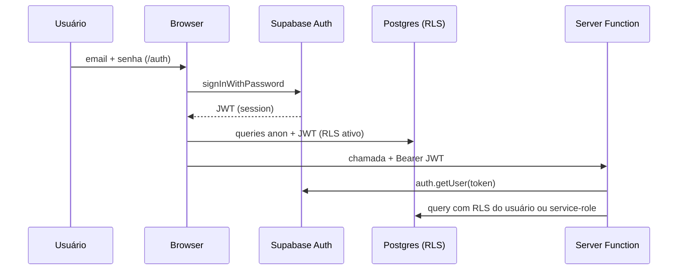

# Autenticação & Autorização

---

## Visão geral

A Lotus usa **Supabase Auth** (email/senha). Autorização combina:

1. **Papéis** (`admin` | `cliente`) em `user_roles`
2. **Acesso por cliente** em `client_access`
3. **RLS** no Postgres + função `current_user_clientes()`
4. **Guards** no frontend (rotas) e **middleware** nas server functions

---

## Login e sessão

| Item               | Detalhe                                        |
| ------------------ | ---------------------------------------------- |
| Rota               | `/auth` (`src/routes/auth.tsx`)                |
| Métodos            | `signInWithPassword`, `signUp` (público hoje)  |
| SSR                | Desabilitado na rota (`ssr: false`)            |
| Storage            | `localStorage` key `sb-{projectId}-auth-token` |
| Redirect pós-login | `/dashboard`                                   |

### Política de cadastro

**Estado atual:** `/auth` permite **signup público** (`signUp`).

**Recomendação (roadmap):** desabilitar signup público; criar usuários apenas via
`createUserAccount` (admin). Ver [API Reference](./api-reference.md).

### Branding na tela de login

A UI exibe **"Majrá"** (`auth.tsx`). O handbook e código interno usam **Lotus**.
Relação oficial não documentada no negócio — ver [Glossário](../00-company/glossary.md).

---

## Papéis (`app_role`)

| Papel       | Enum      | Capacidades                                                       |
| ----------- | --------- | ----------------------------------------------------------------- |
| **Admin**   | `admin`   | CRUD clientes/usuários/serviços, editorial, debug, todas as views |
| **Cliente** | `cliente` | Dashboards dos clientes vinculados, aprovações editorial          |

Verificação: RPC `has_role(user_id, role)` (migration `01_auth_roles_access.sql`).

---

## Guards de rota (frontend)

| Guard       | Arquivo                    | Comportamento                         |
| ----------- | -------------------------- | ------------------------------------- |
| Autenticado | `_authenticated/route.tsx` | Sem user → `/auth`                    |
| Admin       | `admin/route.tsx`          | `checkIsAdmin()` false → `/dashboard` |

> Guards de rota são **UX**, não segurança. A barreira real é RLS + `assertAdmin` nas server functions.

---

## Server functions — middleware

### `attachSupabaseAuth` (`auth-attacher.ts`)

Registrado globalmente em `src/start.ts`. Injeta header `Authorization: Bearer <jwt>` em
todas as chamadas de server function a partir do browser.

### `requireSupabaseAuth` (`auth-middleware.ts`)

- Valida Bearer token via `supabase.auth.getUser(token)`
- Expõe `{ supabase, userId, claims }` com **RLS ativo**
- 401 se token ausente ou inválido

### `assertAdmin` (em `admin.functions.ts`)

Chama `has_role` RPC; 403 se não admin. Usado em operações sensíveis.

### Service-role (`client.server.ts`)

- Usado **somente** em `.server.ts` (import dinâmico)
- Bypass RLS — para `auth.admin.listUsers`, criação de usuário, etc.
- **Nunca** expor `OFFICIAL_SERVICE_ROLE_KEY` com prefixo `VITE_`

Ver [ADR-0005](../02-architecture/adr/0005-server-functions-anon-vs-service-role.md).

---

## Multi-tenant

Função SQL `current_user_clientes()` retorna nomes de clientes que o usuário pode ver:

- **Admin:** todos os clientes ativos (via `DISTINCT` em `base_metricas` — dívida D3)
- **Cliente:** nomes em `client_access` → `cadastro_clientes.nome_cliente`

Views analíticas filtram com `WHERE cliente IN (SELECT * FROM current_user_clientes())`.

Aliases: `cliente_aliases` reconcilia nomes divergentes do Make. Ver [ADR-0004](../02-architecture/adr/0004-chave-de-cliente-por-nome-e-aliases.md).

---

## Matriz de acesso por recurso

| Recurso                              | Admin               | Cliente                              |
| ------------------------------------ | ------------------- | ------------------------------------ |
| `vw_overview_cliente`, `vw_*_diario` | ✅ (todos clientes) | ✅ (clientes vinculados)             |
| `cadastro_clientes` SELECT           | ✅ all              | ✅ próprios                          |
| `cadastro_clientes` INSERT/UPDATE    | ✅                  | ❌                                   |
| `posts_editorial`                    | ✅ all              | SELECT + UPDATE limitado (aprovação) |
| Server functions admin               | ✅                  | ❌ (403)                             |
| `/admin/*`                           | ✅                  | ❌ (redirect)                        |

Detalhes de policies: [RLS Policies](../04-database/rls-policies.md).

---

## Referências

- [Segurança](./security.md)
- [API Reference](./api-reference.md)
- [Roteamento](../05-frontend/routing.md)
- [Schema](../04-database/schema.md)
