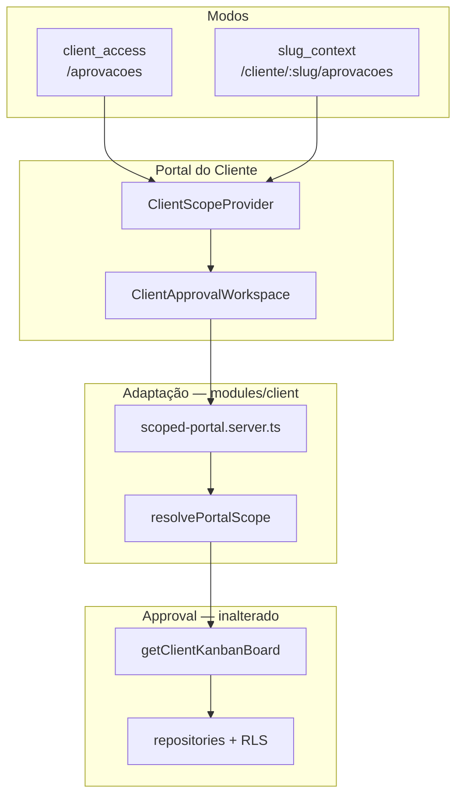

# Content Workflow — Fase 5.1 (Integração Portal do Cliente)

## Objetivo

Permitir que o admin, ao **visualizar um cliente** em `/cliente/:slug`, acesse Aprovações
no mesmo contexto das demais páginas do portal — sem alterar o domínio Approval.

## Arquitetura

## ClientScope

| Campo               | Descrição                                  |
| ------------------- | ------------------------------------------ |
| `mode`              | `client_access` ou `slug_context`          |
| `cadastroClienteId` | ID canônico do cliente                     |
| `clienteSlug`       | Slug da rota (modo slug)                   |
| `scopeInput`        | Payload para server functions de adaptação |

## Rotas

| URL                         | Modo            | Comportamento                                       |
| --------------------------- | --------------- | --------------------------------------------------- |
| `/aprovacoes`               | `client_access` | Inalterado — escopo via `client_access(auth.uid())` |
| `/cliente/:slug/aprovacoes` | `slug_context`  | Staff visualiza cards do cliente do slug            |
| `/admin/aprovacoes`         | —               | Inalterado — workspace admin                        |

## O que **não** mudou

- Repositories, RLS, migrations, event sourcing, status machine
- Server functions originais em `modules/approval/*`
- Workspace admin

## Arquivos novos

| Caminho                                                     | Papel                        |
| ----------------------------------------------------------- | ---------------------------- |
| `src/modules/client/context/`                               | `ClientScopeProvider`, tipos |
| `src/modules/client/scoped-portal.functions.ts`             | Adaptação → Approval         |
| `src/modules/client/components/ClientApprovalWorkspace.tsx` | UI compartilhada             |
| `src/routes/.../cliente.$cliente.aprovacoes.tsx`            | Rota contextual              |
