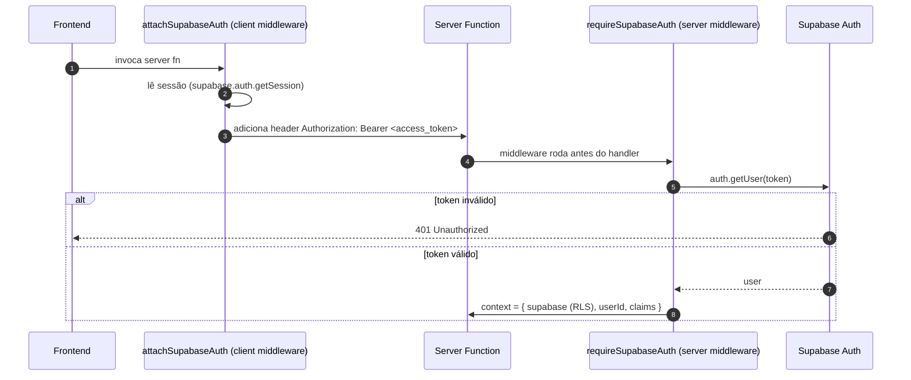

# Backend — Visão Geral

A Lotus não tem um servidor backend separado. O "backend" é composto por:

1. **Server Functions** do TanStack Start (`src/lib/*.functions.ts`).
2. **Middlewares de autenticação** (`src/integrations/supabase/*`).
3. **Dois clients Supabase** (anon e service-role).
4. A **camada de dados no Postgres** (RLS + views + funções) — documentada em
   [Banco de dados](../04-database/schema.md).

Documentação dedicada: [Autenticação](./auth.md) · [Segurança](./security.md) ·
[RLS Policies](../04-database/rls-policies.md) · [API Reference](./api-reference.md)

---

## Clients Supabase

| Client | Arquivo | Onde roda | Privilégio |
|--------|---------|-----------|-----------|
| **anon** | `src/integrations/supabase/client.ts` | Browser + SSR | Sujeito a RLS |
| **service-role** | `src/integrations/supabase/client.server.ts` | Só servidor | Bypass de RLS |

- O client anon persiste sessão em `localStorage` (`storageKey: sb-<projectId>-auth-token`),
  com auto-refresh de token.
- O client service-role tem `persistSession: false` e **nunca** pode ser importado no
  browser (sufixo `.server.ts`). Ver [ADR-0005](../02-architecture/adr/0005-server-functions-anon-vs-service-role.md).

> **Variáveis de ambiente** usam prefixo `OFFICIAL_` (ex.: `OFFICIAL_SUPABASE_URL`,
> `OFFICIAL_SUPABASE_ANON_KEY`, `OFFICIAL_SERVICE_ROLE_KEY`) porque `SUPABASE_` é reservado
> pela plataforma Lovable. Lista completa em [Operações → Deployment](../08-operations/deployment.md).

---

## Autenticação — como o token flui



- **`attachSupabaseAuth`** (`auth-attacher.ts`) — middleware de _client_ registrado
  globalmente em `src/start.ts`. Anexa o `access_token` da sessão a cada chamada.
- **`requireSupabaseAuth`** (`auth-middleware.ts`) — middleware de _function_. Rejeita
  requests sem `Bearer` válido e injeta `{ supabase, userId, claims }` no contexto.

---

## Padrões de uma server function

Todas seguem o mesmo formato (exemplo real, `createCliente`):

```ts
export const createCliente = createServerFn({ method: "POST" })
  .middleware([requireSupabaseAuth])              // 1. exige token válido
  .inputValidator((d) => clienteFields.parse(d))  // 2. valida input com Zod
  .handler(async ({ data, context }) => {
    await assertAdmin(context);                    // 3. checa papel quando preciso
    const payload = sanitizeClientePayload(data);  // 4. normaliza ("" -> null)
    const { data: row, error } = await context.supabase
      .from("cadastro_clientes").insert(payload).select("*").single();
    if (error) throw new Error(translatePgError(error.message)); // 5. erro amigável
    return row;
  });
```

Convenções observadas:
- **`assertAdmin(ctx)`** chama a RPC `has_role` e lança `Forbidden` se não for admin.
- **`translatePgError`** converte erros do Postgres em mensagens pt-BR (ex.: slug duplicado).
- **Soft delete** para clientes: `deactivateCliente` apenas seta `ativo = false`. `DELETE`
  físico de cliente **não é exposto**.
- Operações que precisam de service-role importam `supabaseAdmin` **dinamicamente** dentro do
  handler (`await import("@/integrations/supabase/client.server")`).

---

## Tratamento de erros no SSR

- `src/start.ts` registra um `errorMiddleware` que captura exceções de servidor e renderiza
  uma página de erro (`renderErrorPage`).
- `src/server.ts` é o entrypoint SSR (configurado em `vite.config.ts` via
  `tanstackStart.server.entry`). Ele normaliza respostas 500 que o `h3` "engole" como JSON
  `{"unhandled":true,"message":"HTTPError"}` em uma página de erro HTML real, logando o erro
  original capturado por `src/lib/error-capture.ts`.

---

## Onde está o quê

| Arquivo | Responsabilidade |
|---------|------------------|
| `src/lib/admin.functions.ts` | CRUD de clientes, serviços, usuários, acessos, diagnóstico |
| `src/lib/editorial.functions.ts` | Calendário editorial e aprovação de conteúdo |
| `src/integrations/supabase/client.ts` | Client anon |
| `src/integrations/supabase/client.server.ts` | Client service-role |
| `src/integrations/supabase/auth-middleware.ts` | `requireSupabaseAuth` |
| `src/integrations/supabase/auth-attacher.ts` | `attachSupabaseAuth` |
| `src/start.ts` | Registro de middlewares globais |
| `src/server.ts` | Entrypoint SSR + normalização de erro |

A referência completa de cada função está em [API Reference](./api-reference.md).
