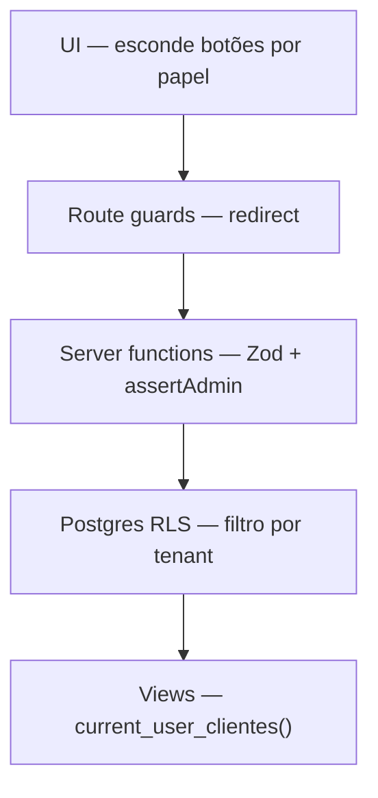

# Segurança

---

## Princípio: defesa em profundidade

A Lotus **não confia apenas na UI**. Cada camada valida independentemente:

---

## Segredos e variáveis

| Variável                          | Exposição       | Risco se vazar                 |
| --------------------------------- | --------------- | ------------------------------ |
| `VITE_OFFICIAL_SUPABASE_ANON_KEY` | Bundle browser  | Baixo (RLS protege)            |
| `OFFICIAL_SUPABASE_ANON_KEY`      | Servidor        | Baixo                          |
| `OFFICIAL_SERVICE_ROLE_KEY`       | **Só servidor** | **Crítico** — bypass total RLS |

Regras:

- Service-role **nunca** com prefixo `VITE_`
- Arquivos `*.server.ts` não importáveis no client
- `.env` no `.gitignore`; template em `.env.example`

Ver [Deployment](../08-operations/deployment.md).

---

## Validação de entrada

Toda server function que recebe payload:

1. `requireSupabaseAuth`
2. Validação **Zod** do body
3. `assertAdmin` quando operação administrativa

Exemplo: `createCliente`, `updateCliente`, `createUserAccount`.

---

## RLS (Row Level Security)

Todas as tabelas de domínio têm RLS habilitada. Policies documentadas em
[RLS Policies](../04-database/rls-policies.md).

### Exceção: views `SECURITY DEFINER`

Views analíticas rodam como owner do banco (migration 07), contornando RLS em
`base_metricas`. Isolamento mantido via `WHERE current_user_clientes()` na view.

**Dívida:** reavaliar quando policy correta existir em `base_metricas`.
Ver [ADR-0003](../02-architecture/adr/0003-views-security-definer.md).

---

## Soft delete

Clientes não são apagados fisicamente — `ativo = false` via `deactivateCliente`.
Preserva histórico analítico e integridade referencial.

Posts editorial: `deletePost` faz DELETE físico (exceção documentada).

---

## Signup público

**Risco atual:** qualquer pessoa pode criar conta em `/auth`.

**Mitigação planejada:** desabilitar signup; fluxo invite-only via admin.
Ver [roadmap](../11-roadmap/roadmap.md) Fase 2.

---

## Checklist de segurança para PRs

- [ ] Nova tabela tem RLS + policies?
- [ ] Nova server function usa `requireSupabaseAuth` + Zod?
- [ ] Operação admin usa `assertAdmin`?
- [ ] Service-role só em `.server.ts`?
- [ ] Nenhum segredo em `VITE_*`?
- [ ] Dados sensíveis filtrados por `current_user_clientes()`?

---

## Referências

- [Autenticação](./auth.md)
- [ADR-0005](../02-architecture/adr/0005-server-functions-anon-vs-service-role.md)
- [ADR-0003](../02-architecture/adr/0003-views-security-definer.md)
