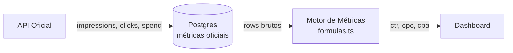
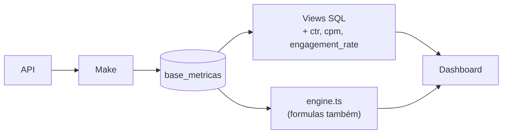

# Modelo de Métricas — Oficiais vs Derivadas

---

## Regra fundamental (arquitetura alvo)

> O banco de dados armazena **apenas métricas oficiais** provenientes das APIs.
> Métricas derivadas são **sempre** calculadas pela aplicação.

Motivo: evitar divergência entre dashboards, facilitar auditoria de fórmulas e permitir
evolução de definições de KPI sem migrations de schema.

---

## Métricas oficiais (persistir)

### Google Ads

| Métrica     | Tipo                                               |
| ----------- | -------------------------------------------------- |
| impressions | contagem                                           |
| clicks      | contagem                                           |
| spend       | monetário (API em micros → normalizar na ingestão) |
| conversions | contagem                                           |

### Meta Ads

| Métrica     | Tipo      |
| ----------- | --------- |
| impressions | contagem  |
| reach       | contagem  |
| clicks      | contagem  |
| spend       | monetário |
| conversions | contagem  |

### Instagram

| Métrica            | Tipo     |
| ------------------ | -------- |
| reach              | contagem |
| accounts_engaged   | contagem |
| likes              | contagem |
| comments           | contagem |
| saves              | contagem |
| shares             | contagem |
| total_interactions | contagem |

### GA4

| Métrica     | Tipo     |
| ----------- | -------- |
| users       | contagem |
| sessions    | contagem |
| events      | contagem |
| conversions | contagem |

---

## Métricas derivadas (NUNCA persistir — calcular na app)

| Métrica           | Fórmula típica                            |
| ----------------- | ----------------------------------------- |
| CTR               | (clicks / impressions) × 100              |
| CPC               | spend / clicks                            |
| CPA               | spend / conversions                       |
| CPM               | (spend / impressions) × 1000              |
| Taxa de conversão | (conversions / clicks) × 100              |
| Engagement Rate   | (interações / reach ou impressions) × 100 |
| Frequency         | impressions / reach                       |

Implementação alvo: módulo único compartilhado. Ponto de partida atual:
`src/lib/platforms/formulas.ts`.

---

## Gap atual vs arquitetura alvo

**Fato observado:** as views SQL em `supabase/migrations-official/` **calculam métricas
derivadas**, incluindo:

- `vw_google_ads_diario`: colunas `ctr`, `cpm` (CASE WHEN impressions > 0 …)
- `vw_meta_ads_diario`: `ctr`, `cpm`
- `vw_ga4_diario`: `engagement_rate`
- `vw_instagram_diario`: `engagement_rate`
- `vw_metricas_normalizadas`: também expõe `ctr`, `cpm` via AVG de valores long

Isso **viola** o princípio alvo e cria risco de divergência com `formulas.ts` / `engine.ts`.

### Plano de convergência (recomendação)

1. Views passam a expor **somente** somas/contagens de métricas oficiais por dia.
2. Frontend/API aplica `formulas.ts` para KPIs derivados.
3. Remover colunas derivadas das views em migration dedicada.
4. Testes de paridade durante transição.

ADR: [0007 — Métricas derivadas na camada de aplicação](../02-architecture/adr/0007-derived-metrics-in-application-layer.md)

---

## Formato de armazenamento

### Estado atual: `base_metricas` (long format)

**Observado:** Make grava linhas no formato largo→long (cliente, plataforma, métrica, valor, data).

**⚠️ INFORMAÇÃO NÃO ENCONTRADA:** DDL completo de `base_metricas` nas migrations oficiais.

### Formato alvo (recomendação)

Tabela tipada por plataforma ou tabela genérica com:

- `cliente_id` (FK UUID, não nome)
- `plataforma` (enum)
- `metrica` (enum por plataforma)
- `valor` (numeric)
- `data` (date, timezone America/Sao_Paulo)
- `ingested_at`, `source_run_id` (rastreabilidade)

Índice composto: `(cliente_id, plataforma, metrica, data)` UNIQUE para UPSERT idempotente.

---

## Onde cada camada calcula hoje

| Camada            | O que faz                          | Alinhado ao alvo?               |
| ----------------- | ---------------------------------- | ------------------------------- |
| Make              | Grava métricas oficiais (inferido) | Parcial — não auditável no repo |
| Views SQL         | Agrega + **calcula derivadas**     | ❌ Dívida                       |
| `formulas.ts`     | Calcula KPIs derivados             | ✅ Correto                      |
| `engine.ts`       | Agrega rows + aplica fórmulas      | ✅ Correto                      |
| `metrics.ts`      | Overview com heurísticas MAX       | ⚠️ Duplica lógica parcial       |
| Componentes React | Consomem valores                   | ✅ (não calculam diretamente)   |

---

## Diagrama alvo

## Diagrama atual (simplificado)

---

## Referências

- [Views analíticas](./views.md)
- [Dashboards — KPIs](../06-dashboards/dashboards.md)
- [Coletores alvo](../07-integrations/target-collectors.md)
