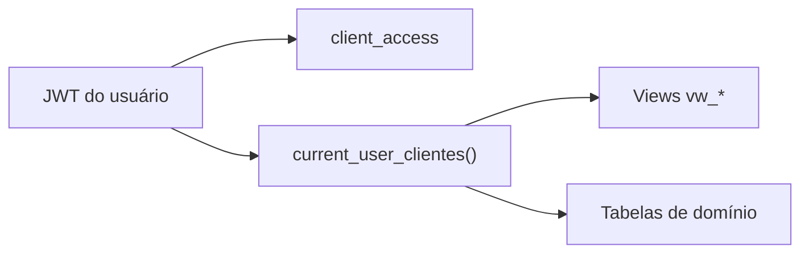

# RLS — Catálogo de Policies

Fonte: `supabase/migrations-official/`. Toda tabela de domínio tem
`ENABLE ROW LEVEL SECURITY`.

---

## Funções auxiliares

| Função | Propósito |
|--------|-----------|
| `has_role(user_id, role)` | Verifica papel (`admin` \| `cliente`) |
| `current_user_clientes()` | Retorna nomes de clientes visíveis ao JWT atual |

---

## `profiles`

| Policy | Operação | Regra | Migration |
|--------|----------|-------|-----------|
| `profiles_select_own` | SELECT | `auth.uid() = id` | 01 |
| `profiles_update_own` | UPDATE | `auth.uid() = id` | 01 |

---

## `user_roles`

| Policy | Operação | Regra | Migration |
|--------|----------|-------|-----------|
| `user_roles_select_own` | SELECT | `auth.uid() = user_id` | 01 |

> Admin gerencia roles via service-role (`createUserAccount`), não via policy INSERT.

---

## `client_access`

| Policy | Operação | Regra | Migration |
|--------|----------|-------|-----------|
| `client_access_select_own` | SELECT | `auth.uid() = user_id` | 01 |
| `client_access_admin_all` | ALL | `has_role(auth.uid(), 'admin')` | 01 |

---

## `cadastro_clientes`

| Policy | Operação | Regra | Migration |
|--------|----------|-------|-----------|
| `cadastro_clientes_admin_all` | ALL | `has_role(auth.uid(), 'admin')` | 03 |
| `cadastro_clientes_select_proprio` | SELECT | `nome_cliente IN (SELECT * FROM current_user_clientes())` | 03 |

---

## `servicos`

| Policy | Operação | Regra | Migration |
|--------|----------|-------|-----------|
| `servicos_select_all_auth` | SELECT | `auth.role() = 'authenticated'` | 03 |
| `servicos_admin_all` | ALL | `has_role(auth.uid(), 'admin')` | 03 |

---

## `cliente_servicos`

| Policy | Operação | Regra | Migration |
|--------|----------|-------|-----------|
| `cliente_servicos_admin_all` | ALL | `has_role(auth.uid(), 'admin')` | 03 |
| `cliente_servicos_select_proprio` | SELECT | Cliente vinculado via `current_user_clientes()` | 03 |

---

## `cliente_aliases`

| Policy | Operação | Regra | Migration |
|--------|----------|-------|-----------|
| `cliente_aliases_select_auth` | SELECT | `auth.role() = 'authenticated'` | 08 |
| `cliente_aliases_admin_all` | ALL | `has_role(auth.uid(), 'admin')` | 08 |

---

## `posts_editorial`

| Policy | Operação | Regra | Migration |
|--------|----------|-------|-----------|
| `posts_admin_all` | ALL | `has_role(auth.uid(), 'admin')` | 06 |
| `posts_client_select` | SELECT | Cliente do post ∈ `current_user_clientes()` | 06 |
| `posts_client_update` | UPDATE | Cliente + **somente** transição de `aguardando_aprovacao` | 06 |

### Regra especial `posts_client_update`

Cliente final pode atualizar post **apenas** quando status atual é `aguardando_aprovacao`
(fluxo de aprovação em `/aprovacoes`). Implementado na policy SQL (migration 06).

---

## `post_revisions`

| Policy | Operação | Regra | Migration |
|--------|----------|-------|-----------|
| `revisions_admin_all` | ALL | `has_role(auth.uid(), 'admin')` | 06 |
| `revisions_client_select` | SELECT | Post pertence a cliente visível | 06 |
| `revisions_client_insert` | INSERT | Cliente pode comentar em posts visíveis | 06 |

---

## `base_metricas`

**RLS habilitada, sem policy para `authenticated`.** Motivo das views `SECURITY DEFINER`.
Ver [ADR-0003](../02-architecture/adr/0003-views-security-definer.md).

---

## Diagrama de isolamento

---

## Referências

- [Schema](./schema.md)
- [Autenticação](../03-backend/auth.md)
- [Segurança](../03-backend/security.md)
