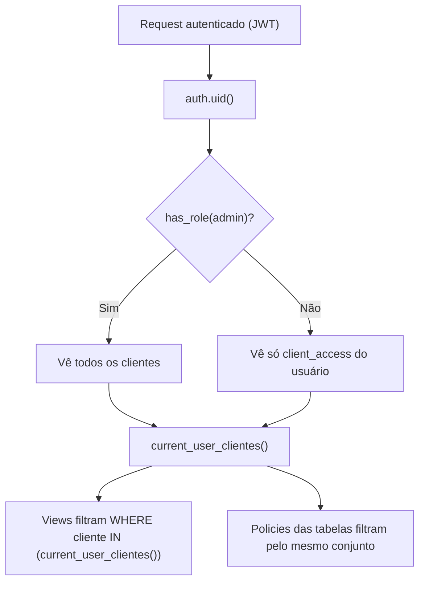

# Banco de Dados — Schema & Modelo de Dados

Projeto Supabase: `ywvhoctcmibjitvwkkhb`. Postgres com RLS habilitada em todas as tabelas de
domínio. As definições vivem em `supabase/migrations-official/`.

**Modelo de métricas (oficiais vs derivadas):** [metrics-model.md](./metrics-model.md)

**RLS policies:** [rls-policies.md](./rls-policies.md)

---

## Diagrama de entidades (ERD)

```mermaid
erDiagram
    auth_users ||--|| profiles : "1:1 (trigger)"
    auth_users ||--o{ user_roles : "tem papéis"
    auth_users ||--o{ client_access : "tem acessos"
    cadastro_clientes ||--o{ cliente_servicos : "contrata"
    servicos ||--o{ cliente_servicos : "ofertado em"
    cadastro_clientes ||--o{ posts_editorial : "tem posts"
    posts_editorial ||--o{ post_revisions : "histórico"
    cadastro_clientes ||--o{ client_access : "referenciado por"
    cliente_aliases }o--|| cadastro_clientes : "nome_canonico"
    base_metricas }o--|| cliente_aliases : "alias_metricas (texto)"

    cadastro_clientes {
        bigint id PK
        text nome_cliente
        text slug UK
        boolean ativo
        text IDs_tecnicos
        numeric valor_mensal
    }
    base_metricas {
        uuid id
        date data
        text cliente
        text plataforma
        text metrica
        numeric valor
        text campanha
    }
    profiles {
        uuid id PK_FK
        text email
        text nome
    }
    user_roles {
        uuid id PK
        uuid user_id FK
        app_role role
    }
    client_access {
        uuid id PK
        uuid user_id FK
        text cliente_nome
        bigint cadastro_cliente_id FK
    }
    servicos {
        uuid id PK
        text nome UK
        boolean ativo
    }
    cliente_servicos {
        uuid id PK
        bigint cadastro_cliente_id FK
        uuid servico_id FK
        numeric valor
    }
    posts_editorial {
        uuid id PK
        bigint cadastro_cliente_id FK
        text cliente_nome
        date data_publicacao
        post_status status
    }
    post_revisions {
        uuid id PK
        uuid post_id FK
        post_revision_tipo tipo
        post_status status_de
        post_status status_para
    }
    cliente_aliases {
        serial id PK
        text nome_canonico
        text alias_metricas UK
    }
```

> A junção entre `base_metricas` e o cadastro é **textual** (por nome), reconciliada via
> `cliente_aliases`. Ver [ADR-0004](../02-architecture/adr/0004-chave-de-cliente-por-nome-e-aliases.md).

---

## Tabelas

### `base_metricas` (legada, externa)

Fonte bruta das métricas, em formato _long_: `(id, data, cliente, plataforma, metrica, valor,
campanha, created_at)`. Populada pelo Make.

> ⚠️ **INFORMAÇÃO NÃO ENCONTRADA** — não há migration que crie/defina `base_metricas` neste
> repositório. As migrations apenas **adicionam índices** sobre ela
> (`idx_base_metricas_cliente_data`, `idx_base_metricas_plataforma`). Tipos exatos e
> constraints são inferidos do uso nas views.

### `cadastro_clientes` (fonte oficial de clientes)

- `id bigint` (PK legada, com sequence), `nome_cliente`, `slug` (único), `ativo`.
- Dados comerciais: `empresa`, `email_principal`, `telefone`, `observacoes`, `data_inicio`,
  `valor_mensal`, `mlabs_url`.
- Flags de plataforma: algumas `text` por compatibilidade com o Make
  (`google_ads_ativo`, `meta_ativo`, `ga4_ativo`, `google_business_ativo`), outras `boolean`
  (`instagram_ativo`, `tiktok_ativo`).
- IDs técnicos de integração: `google_ads_customer_id`, `facebook_ad_account_id`,
  `instagram_username`, `instagram_page_id`, `ga4_property_id`,
  `google_business_location_id`, `tiktok_ad_account_id`.
- Trigger `tg_set_updated_at` mantém `updated_at`.

### `profiles`

1:1 com `auth.users` (PK = FK). Criada automaticamente pelo trigger `handle_new_user` no
INSERT de `auth.users`. Usuário só lê/atualiza o próprio (`id = auth.uid()`).

### `user_roles`

Papéis do usuário. Enum `app_role` = `{ admin, cliente }`. Unicidade `(user_id, role)`.

### `client_access`

Concede a um usuário acesso a um cliente (por `cliente_nome`; com `cadastro_cliente_id`
opcional, preenchido por trigger `tg_client_access_link_cadastro` quando o nome bate).

### `servicos` + `cliente_servicos`

Catálogo de serviços (seed: Gestão de Tráfego, Social Media, Desenvolvimento Web, Google Meu
Negócio, SEO, Consultoria, Automação) e o vínculo N:N com clientes (com `valor` e
`observacoes` por contrato).

### `posts_editorial` + `post_revisions`

Calendário editorial e histórico. Enums:

- `post_status` = `{ rascunho, em_producao, aguardando_aprovacao, aprovado, publicado }`.
- `post_revision_tipo` = `{ comentario, solicitacao_alteracao, aprovacao, mudanca_status }`.

### `cliente_aliases`

Reconcilia `base_metricas.cliente` (texto do Make) ↔ `cadastro_clientes.nome_cliente`
(canônico). Seeds: `Antena → Antena Imobiliária`, `Big Frio juec → BigFrioJuec`,
`Rafa Teo → Rafa Teo Ferreira`.

---

## Funções importantes (`SECURITY DEFINER`)

### `has_role(_user_id, _role) → boolean`

Checa papel sem cair em recursão de RLS. Usada nas policies e em `assertAdmin`.

### `current_user_clientes() → setof text`

**Coração do multi-tenant.** Retorna os nomes (canônicos) de clientes visíveis ao usuário:

```sql
-- cliente: o que está em client_access
SELECT cliente_nome FROM client_access WHERE user_id = auth.uid()
UNION
-- admin: todos os clientes (DISTINCT canônico via aliases)
SELECT DISTINCT COALESCE(al.nome_canonico, bm.cliente)
FROM base_metricas bm
LEFT JOIN cliente_aliases al ON al.alias_metricas = bm.cliente
WHERE has_role(auth.uid(), 'admin');
```

> **Dívida:** para admin, faz `SELECT DISTINCT` em `base_metricas` em runtime — comentado no
> SQL como ponto a substituir por catálogo dedicado quando a base crescer.

---

## Modelo de segurança (RLS)



Padrão geral das policies:

- **Admin** → `FOR ALL USING/ WITH CHECK has_role(auth.uid(),'admin')`.
- **Cliente** → `SELECT` restrito a `nome_cliente IN (current_user_clientes())` (e variações
  para `cliente_servicos`, `posts_editorial`, `post_revisions`).
- `servicos` e `cliente_aliases` → SELECT liberado a qualquer autenticado.

Detalhe das views em [views.md](./views.md); histórico em [migrations.md](./migrations.md).
