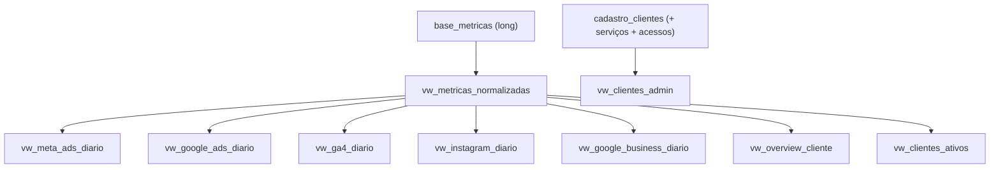

# Views Analíticas (`vw_*`)

Todas as views são **`SECURITY DEFINER`** (ver
[ADR-0003](../02-architecture/adr/0003-views-security-definer.md)) e concedem `SELECT` ao
papel `authenticated`. A isolação multi-tenant acontece em `vw_metricas_normalizadas`, da
qual as demais derivam.

Definições atuais em `supabase/migrations-official/08_aliases_e_null_guard.sql` (a 07 e 02
são versões anteriores das mesmas views).

---

## Cadeia de derivação

---

## `vw_metricas_normalizadas` (base)

Uma linha por registro bruto, já tratado. Transformações:

1. `plataforma` → snake_case (`"Google Ads"` → `google_ads`).
2. `metrica` → minúsculas.
3. **Google Ads `spend`** convertido de micros: `valor / 1.000.000`.
4. `cliente` → nome canônico via `COALESCE(cliente_aliases.nome_canonico, base_metricas.cliente)`.
5. Filtro `valor IS NOT NULL`.
6. Filtro `cliente IN (current_user_clientes())`.

Colunas: `id, data, cliente, plataforma, metrica, valor, campanha, created_at`.

---

## Views por plataforma (pivot diário)

| View                        | Granularidade             | Colunas principais                                                                                                             |
| --------------------------- | ------------------------- | ------------------------------------------------------------------------------------------------------------------------------ |
| `vw_meta_ads_diario`        | data × cliente × campanha | reach, impressions, clicks, cpc, cpm, ctr, frequency, spend                                                                    |
| `vw_google_ads_diario`      | data × cliente × campanha | impressions, clicks, spend + ctr/cpc/cpm derivados na view                                                                     |
| `vw_ga4_diario`             | data × cliente            | active_users, sessions, engaged_sessions, pageviews, event_count, conversions, engagement_rate                                 |
| `vw_instagram_diario`       | data × cliente            | reach, interactions, accounts_engaged, likes, comments, saves, shares, profile_links_taps, engagement_rate                     |
| `vw_google_business_diario` | data × cliente            | profile_views, searches, direction_requests, website_clicks, phone_calls, messages, photo_views, reviews_count, reviews_rating |

> `vw_meta_ads_diario` usa `AVG` para cpc/cpm/ctr/frequency (médias do dia) e `SUM` para
> volumes. `vw_google_ads_diario` deriva ctr/cpc/cpm a partir dos totais (não média de médias).

---

## `vw_overview_cliente` (consolidado)

Uma linha por `data × cliente` com os números cross-plataforma usados nos dashboards de visão
geral:

| Coluna                                      | Origem               |
| ------------------------------------------- | -------------------- |
| `meta_spend`, `google_spend`                | spend por plataforma |
| `total_impressions`, `total_clicks`         | meta + google        |
| `ga4_sessions`, `ga4_conversions`           | GA4                  |
| `instagram_reach`, `instagram_interactions` | Instagram            |

---

## `vw_clientes_ativos` (status de ingestão)

Por cliente: `ultima_data_recebida`, `ultima_ingestao` (max `created_at`),
`plataformas_ativas` (array), `total_registros`. Alimenta listas de "status das contas".

---

## `vw_clientes_admin` (cadastro enriquecido)

Junta `cadastro_clientes` com: array de `servicos` ativos, `qtd_acessos` (de `client_access`),
todas as flags e IDs técnicos. É o que `listClientes` retorna para o painel admin.

---

## Notas de consumo no frontend

- O frontend lê estas views **diretamente** com o client anon (RLS aplicada).
- Para dashboards, costuma-se buscar `[prevFrom, to]` em uma query e dividir em janela
  atual/anterior no cliente (ver [Fluxo de dados](../02-architecture/data-flow.md)).
- As views entregam **nome canônico**; o slug do cliente é resolvido no frontend
  (`clienteRefQuery` em `src/routes/_authenticated/cliente.$cliente.tsx`).
