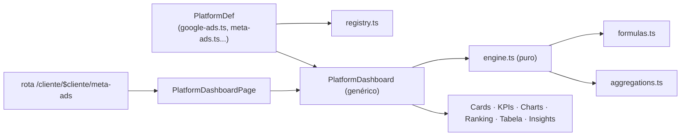

# Design System & Engine de Plataformas

## Duas camadas de componentes

| Camada                  | Pasta                  | Papel                                                                                                          |
| ----------------------- | ---------------------- | -------------------------------------------------------------------------------------------------------------- |
| **Kit base**            | `src/components/ui`    | Primitivos shadcn/Radix (button, dialog, table, select, tabs, tooltip, sidebar…). Estilo neutro, reutilizável. |
| **Design system Lotus** | `src/components/lotus` | Componentes de produto, com a identidade visual e a lógica de domínio.                                         |

### Componentes-chave de `lotus/`

- `AppShell` — casca com sidebar/topbar e navegação por grupos.
- `PageHeader` — cabeçalho de página (eyebrow, título, descrição, ações).
- `StatCard` — card de métrica com valor, delta e ênfase (`hero`/`default`/`compact`).
- `SectionCard` — bloco de seção com cabeçalho.
- `PeriodPicker` / `PeriodToggle` — seleção de período.
- `DeltaPill` — variação percentual colorida (respeita `positiveIsGood`).
- `charts/` — `AreaChartLotus`, `BarChartLotus`, `DonutChartLotus`, `ChartFrame`, `EvolutionChart`.
- `IntegrationCard` / `IntegrationStatusPill` — central de integrações.
- `ImpersonateClienteMenu` — "ver como cliente" (navegação).
- `theme-provider` / `ThemeToggle` — tema claro/escuro.
- `ConfirmDialog`, `FormField`, `CollapsibleSection`, `LotusSkeleton`, `LotusMark`.

---

## Engine declarativo de plataformas

O coração dos dashboards por plataforma. Ver
[ADR-0002](../02-architecture/adr/0002-engine-declarativo-de-plataformas.md).



### Anatomia de um `PlatformDef`

Definido em `src/lib/platforms/types.ts`. Cada plataforma declara:

- `metrics[]` — métricas brutas (coluna da view, formato, **estratégia de agregação**, se
  "subir é bom").
- `heroMetrics[]` — quais aparecem em destaque.
- `kpis[]` — derivados, com `compute(totals)` usando `formulas.ts`.
- `charts[]` — gráficos a renderizar.
- `questions[]` — perguntas de negócio que a página responde (header narrativo).
- `view` — view Supabase de leitura; `campaignField` habilita ranking de campanhas.

Exemplo (Google Ads, `src/lib/platforms/google-ads.ts`): métricas `spend/impressions/clicks`,
KPIs `ctr/cpc/cpm`, gráficos de investimento e tráfego.

### Estratégias de agregação (`aggregations.ts`)

`sum`, `max`, `min`, `avg`, `first` (1º dia não-nulo), `last` (último não-nulo), `custom`.
Sempre ignoram `null`/`NaN`.

### Fórmulas oficiais (`formulas.ts`) — fonte única de verdade

`ctr`, `cpc`, `cpm`, `cpa`, `convRate`, `frequency`, `engagementRate`, `eventsPerSession`,
`viewsPerUser`, `dailyAverage`. Todas recebem **totais já agregados** (nunca média de médias)
e usam divisão segura.

### Como adicionar uma nova plataforma

1. Criar `src/lib/platforms/<nova>.ts` exportando um `PlatformDef`.
2. Registrar em `src/lib/platforms/registry.ts`.
3. Criar a rota fina `src/routes/_authenticated/cliente.$cliente.<nova>.tsx`:
   ```tsx
   export const Route = createFileRoute("/_authenticated/cliente/$cliente/<nova>")({
     component: () => <PlatformDashboardPage def={novaDef} />,
   });
   ```
4. Garantir que existe a view `vw_<nova>_diario` no banco.
5. **Atualizar a documentação** ([Dashboards](../06-dashboards/dashboards.md) e
   [Integrações](../07-integrations/integrations.md)).

Nenhum componente de renderização precisa mudar.

---

## Dois caminhos de agregação (atenção)

Hoje convivem:

- `src/lib/platforms/engine.ts` — para dashboards **por plataforma** (genérico).
- `src/lib/metrics.ts` — para o **overview consolidado** (admin executivo + visão geral do
  cliente), com lógica especial (`sumOverview` usa MAX para `google_spend`/`instagram_reach`).

Convergir os dois é item de [Roadmap](../11-roadmap/roadmap.md). Até lá, **não duplique
fórmulas** — ambos importam de `formulas.ts`.
