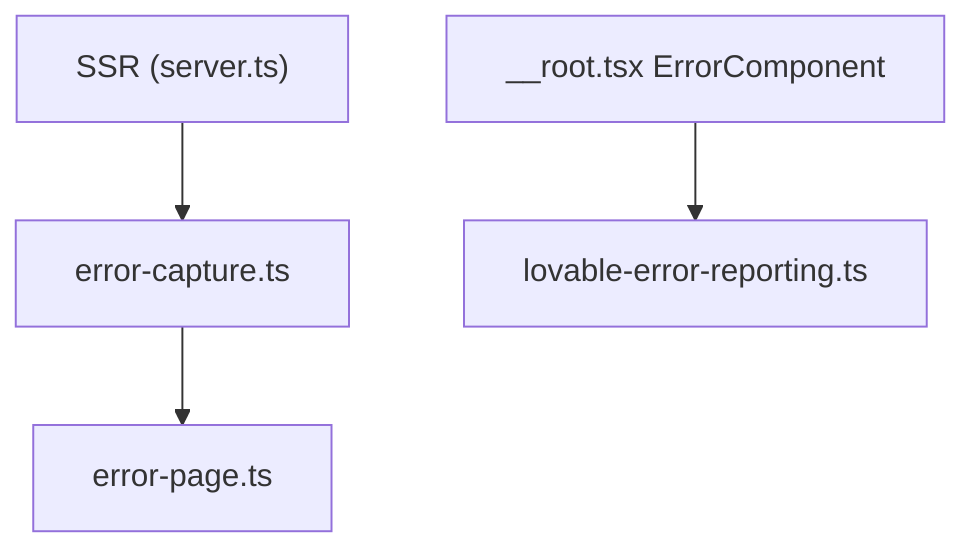

# Erros & Observabilidade (Frontend)

---

## Camadas de tratamento de erro



| Módulo            | Arquivo                              | Quando                                 |
| ----------------- | ------------------------------------ | -------------------------------------- |
| Captura SSR       | `src/lib/error-capture.ts`           | h3 engole stack traces                 |
| Página 500        | `src/lib/error-page.ts`              | HTML amigável no servidor              |
| Entry SSR         | `src/server.ts`                      | Normaliza exceções na renderização     |
| Error boundary    | `src/routes/__root.tsx`              | Erros React no client                  |
| Lovable reporting | `src/lib/lovable-error-reporting.ts` | `window.__lovableEvents` (transitório) |
| Console           | `start.ts`, rotas                    | `console.error` / `console.warn`       |

---

## `error-capture.ts`

Recupera erros que o runtime h3/TanStack Start pode engolir silenciosamente durante SSR.
Registra listeners globais para garantir que stacks cheguem ao log.

---

## `error-page.ts`

Renderiza HTML de erro 500 para o usuário quando a renderização SSR falha.
Separado da UI React para funcionar mesmo quando o bundle client não carrega.

---

## `__root.tsx` — ErrorComponent

Componente de fallback para erros de rota no client. Exibe mensagem genérica em inglês
(cópia a padronizar — item de polish no roadmap).

---

## `lovable-error-reporting.ts` (**transitório**)

Envia exceções do browser para `window.__lovableEvents.captureException` quando disponível.
Parte da integração Lovable — **substituir** por APM proprietário (Sentry/Datadog) na Fase 6.

```typescript
// Uso: reportLovableError(error, context?)
```

---

## Logging no client

| Local                  | Nível            | Exemplo              |
| ---------------------- | ---------------- | -------------------- |
| `cliente.$cliente.tsx` | `warn`           | Slug não resolvido   |
| Server functions       | throw `Response` | 401/403 com mensagem |

Não há structured logging centralizado no frontend hoje.

---

## Saúde de dados (operacional)

| Sinal             | Onde                                   |
| ----------------- | -------------------------------------- |
| `ultima_ingestao` | `vw_clientes_ativos`                   |
| Debug snapshot    | `/admin/debug` → `getDebugSnapshot`    |
| Audit de views    | `/admin/debug/views` → `getViewsAudit` |

Ver [Runbook](../08-operations/runbook.md) e [Observabilidade (Ops)](../08-operations/observability.md).

---

## Referências

- [Troubleshooting](../08-operations/troubleshooting.md)
- [ADR-0009](../02-architecture/adr/0009-platform-proprietary-infrastructure.md) — APM futuro
