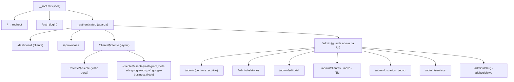
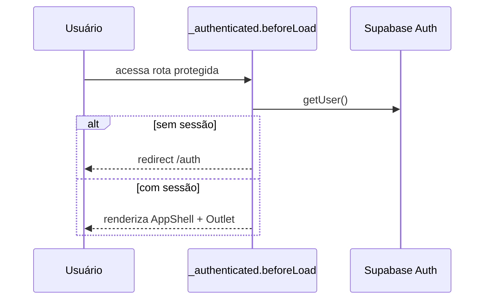

# Roteamento & Guardas

A Lotus usa **file-based routing** do TanStack Start. Cada arquivo em `src/routes` é uma
rota. `routeTree.gen.ts` é **gerado automaticamente** — nunca editar à mão. Convenções
completas em `src/routes/README.md`.

> Não criar `src/pages/` nem `app/layout.tsx` (convenções de Next/Remix). O único layout raiz
> é `src/routes/__root.tsx`.

---

## Mapa de rotas

---

## Guarda de autenticação

`src/routes/_authenticated/route.tsx`:

- `ssr: false` + `beforeLoad` chama `supabase.auth.getUser()`. Sem usuário → `redirect({ to: "/auth" })`.
- Em `/` (`index.tsx`), redireciona para `/dashboard` (logado) ou `/auth`.

---

## Navegação por papel

No layout autenticado, `checkIsAdmin` (server fn) define os grupos de navegação:

- **Cliente:** Visão geral (`/dashboard`), Aprovações (`/aprovacoes`).
- **Admin:** Operações (visão geral, relatórios, editorial, clientes, usuários, serviços) +
  Diagnóstico (debug, auditoria de views).
- Admin também vê atalho "Painel admin" e o seletor **"Ver como cliente"**
  (`ImpersonateClienteMenu`) — que apenas **navega** para a página do cliente, não impersona
  sessão.

> A navegação admin é decidida na UI (via `checkIsAdmin`). A **barreira real** continua sendo
> a RLS + `assertAdmin` nas server functions — a UI esconder o link não substitui a checagem
> de servidor.

---

## Resolução de cliente (slug → nome canônico)

`/cliente/$cliente` usa `slug`. `clienteRefQuery`
(`src/routes/_authenticated/cliente.$cliente.tsx`) resolve o `slug` para o **nome canônico**
(`queryName`) usado nas queries das views, casando por `cadastro_clientes.slug` ou por
`slugify(vw_clientes_ativos.cliente)`. As subrotas de plataforma só aparecem quando há dados
(`clientePlatformsQuery`).
