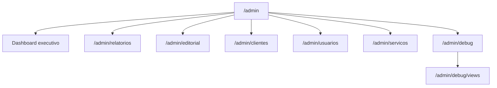

# Módulos Admin & Operacionais

Telas além dos dashboards analíticos padrão. Persona principal: **admin da agência**.

---

## Mapa de rotas admin

---

## Dashboard executivo (`/admin`)

| Item    | Detalhe                                     |
| ------- | ------------------------------------------- |
| Arquivo | `admin/index.tsx`                           |
| Dados   | `vw_overview_cliente`, `vw_clientes_ativos` |
| Motor   | `metrics.ts` — `sumOverview`, agregações    |
| Período | `PeriodSelector` + `resolvePeriod`          |

Visão de portfólio: investimento total, clientes ativos, comparativo de período.

---

## Relatórios (`/admin/relatorios`)

| Item      | Detalhe                                                       |
| --------- | ------------------------------------------------------------- |
| Arquivo   | `admin/relatorios.tsx`                                        |
| Propósito | Hub de relatórios — **não** duplica dashboards                |
| Dados     | `vw_clientes_ativos`, `vw_overview_cliente`                   |
| Motor     | `metrics.ts` — `aggregateByCliente`, `deriveCtr`, `deriveCpa` |
| Período   | `PeriodToggle` (7/30/90 dias)                                 |

Funcionalidades:

- Lista de clientes com última ingestão e plataformas ativas
- Ranking por investimento / métricas
- Links para dashboard individual do cliente

---

## Editorial (`/admin/editorial`)

| Item    | Detalhe                             |
| ------- | ----------------------------------- |
| Arquivo | `admin/editorial.tsx`               |
| Backend | `editorial.functions.ts`            |
| Tabelas | `posts_editorial`, `post_revisions` |

Calendário de conteúdo: criar, editar, transicionar status, comentários.

Status do fluxo (enum): rascunho → aguardando_aprovacao → aprovado / rejeitado / publicado.

---

## Aprovações (`/aprovacoes`)

| Item    | Detalhe                                     |
| ------- | ------------------------------------------- |
| Arquivo | `aprovacoes.tsx`                            |
| Persona | **Cliente final**                           |
| Backend | `listPosts`, `transitionPost` (RLS cliente) |

Cliente aprova ou solicita alteração em posts com status `aguardando_aprovacao`.

Policy SQL: `posts_client_update` (migration 06).

---

## Clientes (`/admin/clientes`)

| Rota   | Arquivo              | Função                                     |
| ------ | -------------------- | ------------------------------------------ |
| Lista  | `clientes.index.tsx` | `listClientes`                             |
| Novo   | `clientes.novo.tsx`  | `createCliente`                            |
| Editar | `clientes.$id.tsx`   | `getCliente`, `updateCliente`, integrações |

### Integrações no formulário

Usa `INTEGRATIONS` de `integrations-catalog.ts` para renderizar campos técnicos e status
(`configured` | `partial` | `pre` | `off`).

### `useDirtyBlocker`

Hook em `clientes.$id.tsx` — bloqueia navegação com alterações não salvas.

---

## Usuários (`/admin/usuarios`)

| Rota  | Função                             |
| ----- | ---------------------------------- |
| Lista | `listUsersWithRoles`               |
| Novo  | `createUserAccount` (service-role) |

Gerencia papéis (`admin`/`cliente`) e `client_access`.

---

## Serviços (`/admin/servicos`)

Catálogo de serviços contratáveis (`servicos` + `cliente_servicos`).
`listServicos` (autenticado), `upsertServico` / `setClienteServicos` (admin).

---

## Debug (`/admin/debug`, `/admin/debug/views`)

| Rota                 | Server function    | Propósito                       |
| -------------------- | ------------------ | ------------------------------- |
| `/admin/debug`       | `getDebugSnapshot` | Amostra de ingestão por cliente |
| `/admin/debug/views` | `getViewsAudit`    | Security + amostra de cada view |

Ferramentas operacionais de primeira classe. Ver [Runbook](../08-operations/runbook.md).

### `countPostsAguardando`

Implementada em `editorial.functions.ts` mas **não wired** na UI (badge futuro).

---

## Referências

- [API Reference](../03-backend/api-reference.md)
- [Dashboards analíticos](./dashboards.md)
- [Integrações](../07-integrations/integrations.md)
