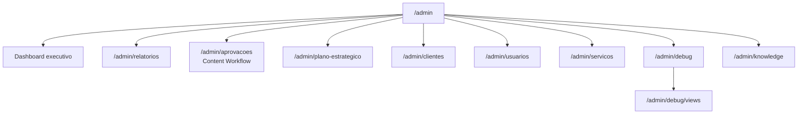

# Módulos Admin & Operacionais

Telas além dos dashboards analíticos padrão. Persona principal: **admin da agência**.

---

## Mapa de rotas admin

---

## Dashboard executivo (`/admin`)

| Item    | Detalhe                                     |
| ------- | ------------------------------------------- |
| Arquivo | `admin/index.tsx`                           |
| Dados   | `vw_overview_cliente`, `vw_clientes_ativos` |
| Motor   | `metrics.ts` — `sumOverview`, agregações    |
| Período | `PeriodSelector` + `resolvePeriod`          |

Visão de portfólio: investimento total, clientes ativos, comparativo de período.

---

## Relatórios (`/admin/relatorios`)

| Item      | Detalhe                                                       |
| --------- | ------------------------------------------------------------- |
| Arquivo   | `admin/relatorios.tsx`                                        |
| Propósito | Hub de relatórios — **não** duplica dashboards                |
| Dados     | `vw_clientes_ativos`, `vw_overview_cliente`                   |
| Motor     | `metrics.ts` — `aggregateByCliente`, `deriveCtr`, `deriveCpa` |
| Período   | `PeriodToggle` (7/30/90 dias)                                 |

Funcionalidades:

- Lista de clientes com última ingestão e plataformas ativas
- Ranking por investimento / métricas
- Links para dashboard individual do cliente

---

## Content Workflow — Aprovações (`/admin/aprovacoes`)

| Item    | Detalhe                                              |
| ------- | ---------------------------------------------------- |
| Nome UI | **Aprovações**                                       |
| Domínio | Content Workflow (substitui Calendário Editorial)    |
| Módulo  | `src/modules/approval/`                              |
| Backend | `cards/`, `events/`, `attachments/` server fns       |
| Tabelas | `content_cards`, `content_card_events`, `content_card_attachments`, `editorial_pillars`, `story_plan_rows` |
| Docs    | [content-workflow.md](./content-workflow.md)         |

Workflow completo de produção de conteúdo. **Kanban** é a visualização default; também:
Calendário, Pilares editoriais, Plano de Stories, Biblioteca, Dashboard operacional.

Status: `producao` → `edicao` → `aguardando_aprovacao` → `aprovado` → `publicado` → `arquivado`.

Card = entidade central. Timeline imutável em `content_card_events`.

Legado `/admin/editorial` → redirect para `/admin/aprovacoes`.

Ver [ADR-0018](../02-architecture/adr/0018-content-workflow-module-v1.md).

---

## ~~Editorial~~ (`/admin/editorial`) — REMOVIDO

Redirect permanente para `/admin/aprovacoes`. UI MVP e `editorial.functions.ts` removidos na Fase 5.

## Plano Estratégico (`/admin/plano-estrategico`)

| Item    | Detalhe                                        |
| ------- | ---------------------------------------------- |
| Arquivo | `admin/plano-estrategico.tsx`                  |
| Backend | `strategic-plan.functions.ts`                  |
| Tabelas | `planos_estrategicos` + entidades relacionadas |
| Docs    | [plano-estrategico.md](./plano-estrategico.md) |

Centro de inteligência estratégica: diagnóstico automático, objetivos, estratégias com peso,
hipóteses, oportunidades, decisões, aprendizados, radar e integração editorial.

---

## Aprovações — Portal Cliente (`/aprovacoes`)

| Item    | Detalhe                                     |
| ------- | ------------------------------------------- |
| Arquivo | `modules/client/components/ClientApprovalWorkspace.tsx` |
| Persona | **Cliente final** ou **admin em `/cliente/:slug/aprovacoes`** |
| Backend | `modules/client/scoped-portal.functions.ts` → Approval |

| Rota | Modo `ClientScope` |
| ---- | ------------------ |
| `/aprovacoes` | `client_access` |
| `/cliente/:slug/aprovacoes` | `slug_context` |

Portal read-only: Kanban, Calendário, Pilares, Stories, Biblioteca. Cliente comenta, aprova e reprova
(no modo slug, visualização sem ações de aprovação).

---

## Clientes (`/admin/clientes`)

| Rota   | Arquivo              | Função                                     |
| ------ | -------------------- | ------------------------------------------ |
| Lista  | `clientes.index.tsx` | `listClientes`                             |
| Novo   | `clientes.novo.tsx`  | `createCliente`                            |
| Editar | `clientes.$id.tsx`   | `getCliente`, `updateCliente`, integrações |

### Integrações no formulário

Usa `INTEGRATIONS` de `integrations-catalog.ts` para renderizar campos técnicos e status
(`configured` | `partial` | `pre` | `off`).

### `useDirtyBlocker`

Hook em `clientes.$id.tsx` — bloqueia navegação com alterações não salvas.

---

## Usuários (`/admin/usuarios`)

| Rota  | Função                             |
| ----- | ---------------------------------- |
| Lista | `listUsersWithRoles`               |
| Novo  | `createUserAccount` (service-role) |

Gerencia papéis (`admin`/`cliente`) e `client_access`.

---

## Serviços (`/admin/servicos`)

Catálogo de serviços contratáveis (`servicos` + `cliente_servicos`).
`listServicos` (autenticado), `upsertServico` / `setClienteServicos` (admin).

---

## Debug (`/admin/debug`, `/admin/debug/views`)

| Rota                 | Server function    | Propósito                       |
| -------------------- | ------------------ | ------------------------------- |
| `/admin/debug`       | `getDebugSnapshot` | Amostra de ingestão por cliente |
| `/admin/debug/views` | `getViewsAudit`    | Security + amostra de cada view |

Ferramentas operacionais de primeira classe. Ver [Runbook](../08-operations/runbook.md).

---

## Knowledge Center (`/admin/knowledge`)

| Item   | Detalhe                                                         |
| ------ | --------------------------------------------------------------- |
| Rotas  | `admin/knowledge/`, `admin/knowledge/$` (splat)                 |
| Código | `src/lib/knowledge-center/`, `src/components/knowledge-center/` |
| Fonte  | `docs/**/*.md` via `import.meta.glob` — auto-discovery          |
| Acesso | Somente admin                                                   |

Centro de conhecimento integrado: navegação estilo GitBook, busca ⌘K, Mermaid, favoritos,
recentes, breadcrumb e TOC. Ver [knowledge-center.md](./knowledge-center.md).

### `countPostsAguardando`

Implementada em `editorial.functions.ts` mas **não wired** na UI (badge futuro).

---

## Referências

- [API Reference](../03-backend/api-reference.md)
- [Dashboards analíticos](./dashboards.md)
- [Integrações](../07-integrations/integrations.md)
