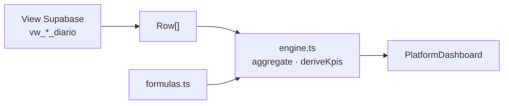

# Engine de Métricas — Visão Geral

A Lotus possui **dois motores complementares** de agregação:

| Motor | Módulo | Uso |
|-------|--------|-----|
| **Platform engine** | `src/lib/platforms/` | Dashboards por plataforma (`PlatformDef`) |
| **Overview engine** | `src/lib/metrics.ts` | Overview consolidado, relatórios admin |

**Meta de longo prazo:** convergir em um único pacote `@lotus/metrics`. Dívida D8 no roadmap.

---

## Fluxo do platform engine



1. React Query busca rows da view (`PlatformDef.view`)
2. `aggregatePeriod(def, rows, period)` calcula totais, KPIs, séries, campanhas
3. `PlatformDashboard` renderiza cards, charts, tabelas — **sem cálculo**

---

## Módulos

| Arquivo | Função |
|---------|--------|
| `types.ts` | Contrato `PlatformDef`, `MetricDef`, `KpiDef`, `ChartDef` |
| `registry.ts` | `PLATFORM_REGISTRY` — plataformas ativas |
| `engine.ts` | `aggregate`, `deriveKpis`, `dailySeries`, `byCampaign`, `aggregatePeriod` |
| `formulas.ts` | Fórmulas oficiais (CTR, CPC, …) |
| `aggregations.ts` | Estratégias sum/max/min/avg/first/last/custom |
| `{platform}.ts` | Um `PlatformDef` por plataforma |

Documentação detalhada:

- [PlatformDef — catálogo](./platform-catalog.md)
- [Fórmulas](./formulas.md)
- [Período](./period.md)
- [Overview (`metrics.ts`)](./overview-aggregation.md)

---

## Registry atual

```typescript
// src/lib/platforms/registry.ts
google_ads | meta_ads | instagram | ga4
```

GBP e TikTok: view SQL existe; **sem** `PlatformDef` — usam `PlatformPlaceholder`.

---

## Princípios

1. **KPIs derivados** calculados sobre **totais do período**, nunca média de médias
2. **Estratégia de agregação** declarada em cada `MetricDef` (sum vs max para reach)
3. **Fórmulas** só em `formulas.ts`
4. **Componentes** só consomem resultados do engine

Ver [ADR-0002](../02-architecture/adr/0002-engine-declarativo-de-plataformas.md),
[ADR-0007](../02-architecture/adr/0007-derived-metrics-in-application-layer.md).

---

## Gap: views SQL vs engine

Views ainda expõem colunas derivadas (`ctr`, `cpm`, `engagement_rate`). O engine **recalcula**
via `formulas.ts`. Risco de divergência — ver [Modelo de métricas](../04-database/metrics-model.md).

---

## Como adicionar plataforma

1. Migration: view `vw_{plataforma}_diario` + colunas em `cadastro_clientes`
2. Entrada em `integrations-catalog.ts`
3. Criar `{plataforma}.ts` com `PlatformDef`
4. Registrar em `registry.ts`
5. Rota `cliente.$cliente.{plataforma}.tsx` com `PlatformDashboardPage`
6. Documentar em [platform-catalog.md](./platform-catalog.md)

Nenhum componente genérico precisa mudar.

---

## Referências

- [Dashboards](../06-dashboards/dashboards.md)
- [Design System](../05-frontend/component-system.md)
