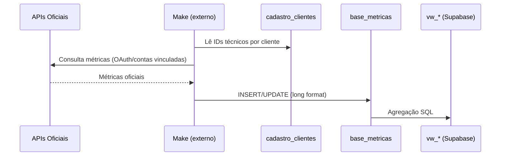

# Pipeline Make (Transitório)

> **⚠️ TRANSITÓRIO:** Make é a solução **atual** de coleta de dados. Faz parte da validação
> inicial do produto, **não** da arquitetura definitiva. Plano: substituir por
> [Coletores proprietários](./target-collectors.md).

---

## Fluxo atual

---

## O que sabemos (observado / inferido)

| Fato | Fonte |
|------|-------|
| Make grava em `base_metricas` | Análise de views + docs de integrações |
| IDs técnicos em `cadastro_clientes` | Migration 05 (`google_ads_customer_id`, etc.) |
| Spend Google Ads chega em micros | Views convertem `/ 1_000_000` |
| Chave de cliente por **nome** (+ aliases) | Migration 08, ADR-0004 |
| Make **não está versionado** neste repo | Ausência de cenários/config |

---

## O que NÃO sabemos

> ⚠️ INFORMAÇÃO NÃO ENCONTRADA no repositório:

- Cenários Make (quantidade, estrutura, módulos).
- Frequência de sincronização por plataforma/cliente.
- Política de retries e tratamento de rate limit.
- Contrato exato de nomes de métricas gravadas por plataforma.
- Monitoramento e alertas operacionais.
- Onde credenciais OAuth são armazenadas (Make vault?).

**Recomendação:** documentar cenários Make externamente (Notion/runbook ops) até migrar
para coletores Lotus; ou exportar definição como artefato versionado.

---

## Riscos do estado atual

| Risco | Impacto |
|-------|---------|
| Sem versionamento | Mudança no Make quebra dashboards silenciosamente |
| Sem observabilidade | Falhas de sync descobertas tarde |
| Chave por nome | Duplicatas, aliases, dados órfãos |
| Métricas derivadas no SQL | Divergência com engine TS |
| Dependência de pessoa/processo | Bus factor alto |

---

## Critérios para desligar Make (por plataforma)

Substituir Make quando **todos** forem verdadeiros para aquela plataforma:

- [ ] Coletor Lotus implementado e testado
- [ ] Paridade de dados validada (amostragem ≥ 7 dias)
- [ ] Scheduler + retries + alertas operacionais
- [ ] UPSERT idempotente com `cliente_id` FK
- [ ] Runbook de reprocessamento documentado
- [ ] Make desligado para aquela plataforma (não big-bang global)

---

## Relacionamento com cadastro de clientes

Make depende de campos técnicos em `cadastro_clientes`:

- `google_ads_customer_id`
- `meta_ad_account_id`
- `instagram_business_account_id`
- `ga4_property_id`
- (outros conforme migration 05)

Admin atualiza via painel → Make lê na próxima execução.

---

## Próximos passos

1. Versionar schema de `base_metricas` (migration).
2. Piloto: `GoogleAdsCollector` substituindo cenário Make do Google Ads.
3. Ver [Arquitetura alvo](../02-architecture/target-architecture.md).
