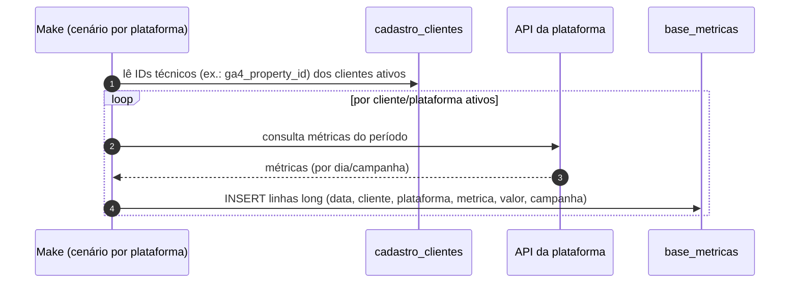

# Integrações & Pipeline de Ingestão

> **Dois estados:** ingestão **atual** via [Make (transitório)](./current-pipeline-make.md) ·
> ingestão **alvo** via [Coletores proprietários](./target-collectors.md).

A Lotus integra com plataformas de marketing de forma **declarativa**: cada plataforma é uma
entrada em um catálogo (`src/lib/integrations-catalog.ts`) e suas credenciais técnicas são
colunas em `cadastro_clientes`. Os mesmos campos são lidos pelos workers do Make (hoje) ou
pelos coletores Lotus (futuro) para coletar dados.

---

## Catálogo de integrações

Fonte: `src/lib/integrations-catalog.ts`. Cada integração define a coluna que sinaliza
"ativa" (`activeField`) e os campos de ID técnico; o campo `primary` determina o status visual.

| Integração | `activeField` | Campos técnicos (coluna) |
|------------|---------------|--------------------------|
| Google Ads | `google_ads_ativo` | `google_ads_customer_id` (primary) |
| Meta Ads | `meta_ativo` | `facebook_ad_account_id` (primary) |
| Instagram | `instagram_ativo` | `instagram_username`, `instagram_page_id` (primary) |
| Google Analytics 4 | `ga4_ativo` | `ga4_property_id` (primary) |
| Google Business | `google_business_ativo` | `google_business_location_id` (primary) |
| TikTok Ads | `tiktok_ativo` | `tiktok_ad_account_id` (primary) |

### Status visual de uma integração
Calculado por `getIntegrationStatus(integration, values, active)`:

| Status | Condição |
|--------|----------|
| `configured` | ativa **e** com ID principal preenchido |
| `partial` | ativa, **sem** ID principal |
| `pre` | inativa, **mas** com ID já preenchido |
| `off` | inativa e sem ID |

Adicionar plataforma ao catálogo = **uma migration aditiva (`ADD COLUMN`)** + uma entrada em
`INTEGRATIONS`. (Para aparecer como dashboard, também precisa de view + `PlatformDef`.)

---

## Pipeline de ingestão

| Estado | Documento |
|--------|-----------|
| **Atual (Make — transitório)** | [current-pipeline-make.md](./current-pipeline-make.md) |
| **Alvo (Coletores Lotus)** | [target-collectors.md](./target-collectors.md) |

Resumo do pipeline **atual** (detalhes no doc dedicado):

> ⚠️ **INFORMAÇÃO NÃO ENCONTRADA / EXTERNA** — cenários Make **não estão versionados** neste
> repositório. O que segue é inferido do schema e views.

### Modelo inferido

### O que sabemos (confirmado pelo código)
- Os IDs técnicos que o Make consome moram em `cadastro_clientes` (migration
  `05_cadastro_clientes_make_ids.sql` foi criada exatamente para isso, "eliminando a
  dependência do Google Sheets como fonte de IDs").
- A saída é `base_metricas` em formato _long_.
- O Google Ads envia `spend` em **micros** (convertido na view).
- O nome do cliente vindo do Make pode divergir do cadastro (resolvido por
  [aliases](../02-architecture/adr/0004-chave-de-cliente-por-nome-e-aliases.md)).
- Algumas flags `*_ativo` são `text` justamente por compatibilidade com o Make.

### Lacunas a preencher (donos: Eng + Ops)
- Frequência/agendamento dos cenários (diário? horário?).
- Estratégia de _retry_ e tratamento de falha por plataforma.
- Janela de reprocessamento / _backfill_.
- Observabilidade: como sabemos que uma ingestão falhou? (hoje só dá para inferir por
  `vw_clientes_ativos.ultima_ingestao`).
- Contrato exato de nomes de `metrica` por plataforma.

> **Sinais de saúde disponíveis hoje:** `vw_clientes_ativos` (última data/ingestão por
> cliente), `/admin/debug` e `/admin/debug/views`. Ver [Runbook](../08-operations/runbook.md).

---

## Convenção: nomes de métrica esperados

As views esperam métricas com nomes específicos (em minúsculas após normalização). Resumo do
que cada view consome (fonte: definições em `08_aliases_e_null_guard.sql`):

| Plataforma | Métricas esperadas |
|------------|--------------------|
| Meta Ads | reach, impressions, clicks, cpc, cpm, ctr, frequency, spend |
| Google Ads | impressions, clicks, spend |
| GA4 | activeusers, sessions, engagedsessions, screenpageviews, eventcount, conversions |
| Instagram | reach, total_interactions, accounts_engaged, likes, comments, saves, shares, profile_links_taps |
| Google Business | profile_views, searches, direction_requests, website_clicks, phone_calls, messages, photo_views, reviews_count, reviews_rating |

> Se o Make mudar o nome de uma métrica, o número **somem silenciosamente** da view. Manter
> esta tabela sincronizada com os cenários é crítico.
