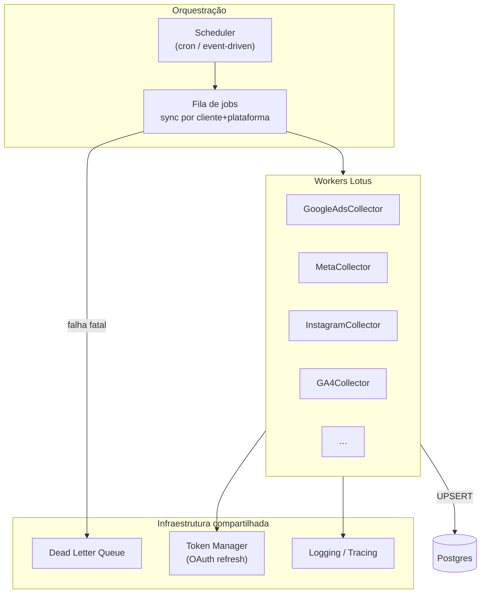

# Coletores Proprietários (Alvo)

> **Visão futura.** Nenhum coletor descrito aqui está implementado neste repositório.
> Make cumpre função parcial hoje. Ver [Pipeline Make (transitório)](./current-pipeline-make.md).

---

## Visão geral



---

## Interface alvo de um coletor

**Recomendação** (não implementada):

```typescript
interface PlatformCollector {
  platform: PlatformId;
  authenticate(clienteId: string): Promise<Credentials>;
  fetchMetrics(params: SyncParams): Promise<OfficialMetricRow[]>;
  upsert(rows: OfficialMetricRow[]): Promise<SyncResult>;
}

interface SyncParams {
  clienteId: string;
  dateFrom: string; // YYYY-MM-DD, America/Sao_Paulo
  dateTo: string;
  runId: string;
}

interface OfficialMetricRow {
  clienteId: string;
  platform: PlatformId;
  metric: string; // enum — métrica oficial apenas
  value: number;
  date: string;
  ingestedAt: string;
  sourceRunId: string;
}
```

---

## Coletores planejados

| Classe                    | Plataforma   | Métricas oficiais                              | Prioridade sugerida |
| ------------------------- | ------------ | ---------------------------------------------- | ------------------- |
| `GoogleAdsCollector`      | Google Ads   | impressions, clicks, spend, conversions        | Alta (piloto)       |
| `MetaCollector`           | Meta Ads     | impressions, reach, clicks, spend, conversions | Alta                |
| `InstagramCollector`      | Instagram    | reach, accounts_engaged, likes, …              | Média               |
| `GA4Collector`            | GA4          | users, sessions, events, conversions           | Média               |
| `GoogleBusinessCollector` | GBP          | TBD — definir com produto                      | Baixa               |
| `TikTokCollector`         | TikTok       | TBD                                            | Baixa               |
| `LinkedInCollector`       | LinkedIn Ads | TBD                                            | Futuro              |
| `PinterestCollector`      | Pinterest    | TBD                                            | Futuro              |

Métricas oficiais detalhadas: [Modelo de métricas](../04-database/metrics-model.md)

---

## Capacidades transversais

### Autenticação e tokens

- Armazenar refresh tokens criptografados (tabela dedicada — **não existe hoje**).
- Worker renova token antes de cada sync batch.
- Revogação detectada → alerta admin + status `auth_error` no cliente.

### Retries

| Erro             | Ação                              |
| ---------------- | --------------------------------- |
| Rate limit (429) | Backoff + requeue                 |
| Timeout          | Retry até N vezes                 |
| 401/403          | Não retentar; alertar             |
| Dados inválidos  | Log + skip row; não abortar batch |

### UPSERT idempotente

Chave natural: `(cliente_id, plataforma, metrica, data)`.

Permite reprocessamento seguro de janelas históricas.

### Observabilidade

Por sync run, registrar:

- `run_id`, `cliente_id`, `plataforma`, `started_at`, `finished_at`
- `rows_upserted`, `rows_skipped`, `error_code`
- Expor em dashboard admin (não existe hoje).

---

## Relação com PlatformDef (frontend)

Coletor e `PlatformDef` compartilham a **lista de métricas oficiais** — idealmente gerada
de uma única fonte (schema compartilhado ou codegen).

Fluxo alvo:

1. `PlatformDef` declara métricas oficiais + KPIs derivados (fórmulas).
2. Coletor valida que só persiste métricas listadas como `official`.
3. Motor de métricas calcula derivadas na leitura.

---

## Lacunas a definir

> ⚠️ INFORMAÇÃO NÃO ENCONTRADA — decisões pendentes:

- Runtime dos workers (Node vs Python vs Go).
- Fila (Redis/BullMQ, SQS, Cloud Tasks, etc.).
- Hosting (mesmo projeto Cloudflare? serviço separado?).
- Estratégia multi-tenant de credenciais OAuth.
- Backfill histórico: limites por API e política de retenção.

ADR: [0008 — Coletores proprietários](../02-architecture/adr/0008-proprietary-data-collectors.md)

---

## Migração desde Make

Ver critérios em [current-pipeline-make.md](./current-pipeline-make.md#critérios-para-desligar-make-por-plataforma).
