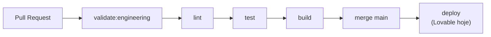

# CI/CD

---

## Estado atual

| Item                   | Status                              |
| ---------------------- | ----------------------------------- |
| GitHub Actions         | ✅ `.github/workflows/ci.yml`       |
| Lint no PR             | ✅ `npm run lint`                   |
| Testes no PR           | ✅ `npm run test` (Vitest)          |
| Build no PR            | ✅ `npm run build`                  |
| Validação engenharia   | ✅ `npm run validate:engineering`   |
| Gate local             | ✅ `npm run check`                  |
| Deploy automático      | ❌ Manual via Lovable (transitório) |
| Migrations automáticas | ❌ Manual no Supabase dashboard     |

---

## Pipeline implementado



### Workflow: `CI` (`.github/workflows/ci.yml`)

Dispara em `push` e `pull_request` para `main`.

| Step        | Comando                                  |
| ----------- | ---------------------------------------- |
| Install     | `npm ci`                                 |
| Engineering | `npm run validate:engineering`           |
| Lint        | `npm run lint`                           |
| Test        | `npm run test`                           |
| Build       | `npm run build` (env placeholders no CI) |

### Gate local

```bash
npm run check
# = validate:engineering + lint + test + build
```

Requer `.env` local para o passo `build` (ver `.env.example`).

---

## PR template

Checklist alinhado ao handbook: `.github/pull_request_template.md`

---

## Deploy (transitório)

Deploy de produção ainda via Lovable/Nitro/Cloudflare. Ver [Deployment](./deployment.md).

### Pipeline alvo (deploy proprietário)

```yaml
# Futuro — após desacoplar Lovable
steps:
  - npm run check
  - deploy Cloudflare (secrets reais)
  - smoke test
```

Ver [ADR-0009](../02-architecture/adr/0009-platform-proprietary-infrastructure.md).

---

## Migrations

Gate **manual**: aplicar SQL no Supabase antes/depois do deploy conforme compatibilidade.
Ver [Migrations](../04-database/migrations.md).

---

## Referências

- [ADR-0011](../02-architecture/adr/0011-engineering-system-foundation.md)
- [Testing](../09-standards/testing.md)
- [Governança](../09-standards/governance.md)
