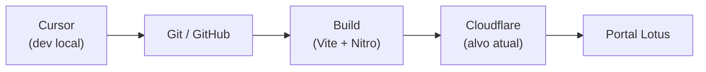

# Deployment & Ambiente

> **Desenvolvimento oficial:** Cursor + repositório Git. Lovable **não** é ambiente de
> implementação — apenas build/deploy transitório. Ver
> [Fluxo de desenvolvimento](../09-standards/development-workflow.md) · [ADR-0010](../02-architecture/adr/0010-cursor-official-development-environment.md).

## Pipeline de entrega

| Etapa | Ferramenta atual | Status |
|-------|------------------|--------|
| Desenvolvimento | **Cursor** | ✅ Oficial |
| Versionamento | Git / GitHub | ✅ Oficial |
| Build | Vite + `@lovable.dev/vite-tanstack-config` | ⚠️ Transitório |
| Deploy | Lovable → Nitro/Cloudflare | ⚠️ Transitório |
- **Bundler:** Vite 8, configurado via `@lovable.dev/vite-tanstack-config` (`vite.config.ts`).
- O preset já inclui: `tanstackStart`, `viteReact`, `tailwindcss`, `tsConfigPaths`, **Nitro**
  (build, alvo padrão **Cloudflare**), injeção de `VITE_*`, alias `@`, dedupe e plugins de
  erro. **Não adicionar esses plugins manualmente** (quebra com plugins duplicados).
- Entrypoint SSR redirecionado para `src/server.ts` (via `tanstackStart.server.entry`), que
  envolve a renderização com tratamento de erro robusto.

## Scripts (`package.json`)
| Script | Comando | Uso |
|--------|---------|-----|
| `dev` | `vite dev` | Desenvolvimento local |
| `build` | `vite build` | Build de produção |
| `build:dev` | `vite build --mode development` | Build com modo dev |
| `preview` | `vite preview` | Servir o build localmente |
| `lint` | `eslint .` | Lint |
| `format` | `prettier --write .` | Formatação |

## Plataforma Lovable (transitória — build/deploy apenas)

> A partir de 2026-06-26, Lovable **não é** ambiente de desenvolvimento. Features são
> implementadas no Cursor; Lovable permanece apenas enquanto o pipeline de build/deploy
> depender dele.

Este projeto ainda está **conectado ao Lovable** para build (ver `AGENTS.md`). Implicações:

- Commits no branch conectado **podem sincronizar** com o Lovable — manter branch funcional.
- **Nunca reescrever histórico publicado** (sem `push --force`, rebase/amend/squash de commits
  já enviados).
- **Não implementar features** no editor Lovable — somente neste repositório.
- Meta: substituir por CI/CD proprietário (GitHub Actions). Ver [ADR-0009](../02-architecture/adr/0009-platform-proprietary-infrastructure.md).

## Variáveis de ambiente

> O prefixo é `OFFICIAL_` (não `SUPABASE_`, reservado pelo Lovable). Template: `.env.example`.
> Detalhes por ambiente: [Ambientes](./environments.md).

| Variável | Onde | Uso |
|----------|------|-----|
| `VITE_OFFICIAL_SUPABASE_URL` / `OFFICIAL_SUPABASE_URL` | client/server | URL do projeto Supabase |
| `VITE_OFFICIAL_SUPABASE_ANON_KEY` / `OFFICIAL_SUPABASE_ANON_KEY` | client/server | Chave anônima (RLS) |
| `VITE_OFFICIAL_SUPABASE_PROJECT_ID` | client | ID do projeto (default `ywvhoctcmibjitvwkkhb`) |
| `OFFICIAL_SERVICE_ROLE_KEY` | **só servidor** | Chave service-role (bypass RLS) |

- O client anon falha no boot se faltarem URL/anon key (`client.ts`).
- O client admin falha no boot se faltarem URL/service-role (`client.server.ts`).

### Segurança de segredos
- `OFFICIAL_SERVICE_ROLE_KEY` **nunca** pode ser exposta com prefixo `VITE_` (iria para o
  bundle do browser). Ver [ADR-0005](../02-architecture/adr/0005-server-functions-anon-vs-service-role.md).
- Arquivos `.server.ts` não podem ser importados pelo client.

## Banco de dados
- Projeto Supabase `ywvhoctcmibjitvwkkhb`.
- Migrations em `supabase/migrations-official/`. Ver [migrations](../04-database/migrations.md).

> ⚠️ **INFORMAÇÃO NÃO ENCONTRADA** — não há pipeline de CI/CD nem automação de migrations
> versionados no repositório. O alvo Cloudflare vem do preset Lovable, mas a configuração do
> ambiente de produção (domínio, secrets em produção) não está documentada aqui. Confirmar com
> Ops e registrar.

## Checklist de deploy (proposto)
- [ ] `npm run lint` e `npm run build` passam localmente.
- [ ] Migrations novas aplicadas no Supabase e validadas (bloco de validação da migration).
- [ ] Variáveis de ambiente presentes no ambiente de destino.
- [ ] Documentação atualizada no mesmo PR (ver [doc-as-code](../09-standards/documentation.md)).
- [ ] Branch funcional; histórico Git intacto (sem rewrite de commits publicados).
