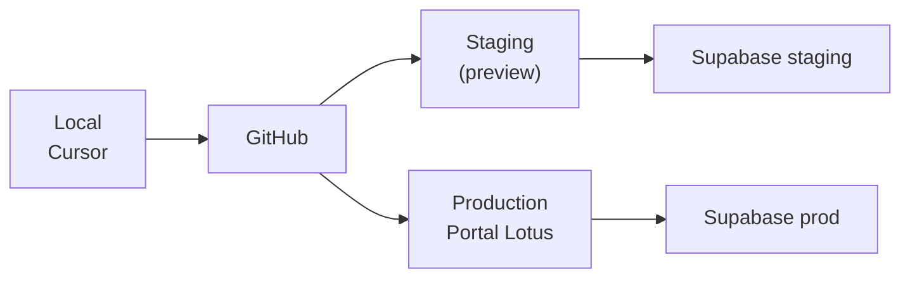

# Ambientes

---

## Mapa de ambientes

| Ambiente     | Propósito                 | Status documentado           |
| ------------ | ------------------------- | ---------------------------- |
| **Local**    | Desenvolvimento no Cursor | ✅                           |
| **Produção** | Portal Lotus (usuários)   | Parcial                      |
| **Staging**  | Pré-produção              | ⚠️ INFORMAÇÃO NÃO ENCONTRADA |

---

## Local (desenvolvimento)

| Item     | Valor                                  |
| -------- | -------------------------------------- |
| Comando  | `npm run dev` · ver [SETUP.md](../../../SETUP.md) |
| Setup    | `npm run setup` — valida Node e `.env`              |
| URL      | `http://localhost:5173` (Vite default) |
| Env      | `.env` (copiar de `.env.example`)      |
| Supabase | Projeto `ywvhoctcmibjitvwkkhb`         |

### Variáveis necessárias

Ver `.env.example` e [Deployment](./deployment.md).

Em dev, **duplicar** URL e anon key com e sem prefixo `VITE_`:

- Browser lê `VITE_OFFICIAL_*`
- Server functions leem `OFFICIAL_*` (sem VITE)

---

## Produção

| Item   | Observado                                         |
| ------ | ------------------------------------------------- |
| Build  | `npm run build` → Nitro → Cloudflare              |
| Preset | `@lovable.dev/vite-tanstack-config` (transitório) |
| Deploy | Via Lovable (transitório) **ou** GitHub Actions → Cloudflare (`deploy.yml`) |

Deploy proprietário: [CI/CD](./cicd.md) · ADR-0012.

> ⚠️ **INFORMAÇÃO NÃO ENCONTRADA:** domínio de produção, URL pública do Portal Lotus,
> mapeamento de secrets no Cloudflare/Lovable dashboard.

**Ação recomendada:** documentar URL e painel de secrets quando confirmado com Ops.

---

## Staging

Não há ambiente staging documentado ou configurado no repositório.

**Recomendação:** projeto Supabase separado + branch `staging` + deploy preview no CI.
Ver [CI/CD](./cicd.md).

---

## Supabase

| Ambiente                | Project ID             |
| ----------------------- | ---------------------- |
| Atual (único observado) | `ywvhoctcmibjitvwkkhb` |

Migrations aplicadas manualmente hoje — ver [Migrations](../04-database/migrations.md).

---

## Diagrama alvo

---

## Referências

- [Deployment](./deployment.md)
- [Onboarding](../10-onboarding/onboarding.md)
