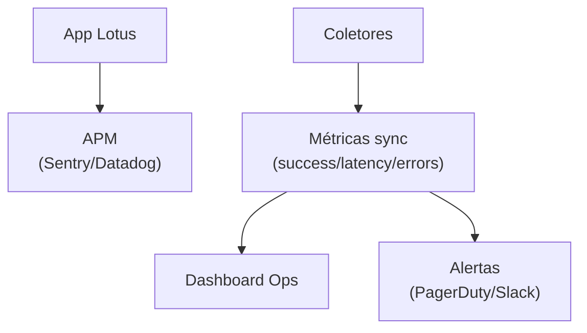

# Observabilidade & Monitoramento

---

## Estado atual

| Capacidade | Implementação | Maturidade |
|------------|---------------|------------|
| Logs SSR | `console.error` em `server.ts`, `start.ts` | Básico |
| Logs client | `console.warn/error` pontuais | Básico |
| Error reporting | `lovable-error-reporting.ts` | Transitório |
| APM / tracing | Não existe | — |
| Alertas | Não existe | — |
| Saúde ingestão | `vw_clientes_ativos.ultima_ingestao` | Manual |
| Debug interno | `/admin/debug*` | ✅ Ferramenta de produto |

---

## Sinais de saúde de dados

### `vw_clientes_ativos`

| Coluna | Significado |
|--------|-------------|
| `ultima_data_recebida` | Última data com métricas no banco |
| `ultima_ingestao` | Última execução de ingestão (inferida) |
| `plataformas_ativas` | Plataformas com dados |
| `total_registros` | Volume em `base_metricas` |

**Uso:** `/admin`, `/admin/relatorios`, runbook de diagnóstico.

### Alertas recomendados (não implementados)

- `ultima_ingestao` > 24h defasada
- Cliente ativo sem dados em plataforma configurada
- Taxa de erro em coletor (futuro)

---

## Ferramentas de debug (produto)

| Ferramenta | Rota | Função |
|------------|------|--------|
| Data snapshot | `/admin/debug` | `getDebugSnapshot` |
| Views audit | `/admin/debug/views` | `getViewsAudit` — RLS, security, amostras |

Documentar resposta: ver [API Reference](../03-backend/api-reference.md).

---

## Logs

### Onde olhar hoje

| Ambiente | Onde |
|----------|------|
| Local | Terminal do `npm run dev` |
| Produção | ⚠️ INFORMAÇÃO NÃO ENCONTRADA — logs Cloudflare/Lovable |

### Formato

Não há structured logging (JSON). Apenas `console.*` textual.

---

## Visão alvo

| Componente | Recomendação |
|--------------|--------------|
| Frontend errors | Sentry ou equivalente |
| Server functions | Trace ID por request |
| Coletores | Log estruturado por `run_id` |
| Ingestão | SLA dashboard por cliente/plataforma |

Ver [Coletores alvo](../07-integrations/target-collectors.md).

---

## Performance (observabilidade)

Não há profiling ou Web Vitals reporting hoje.

**Recomendação:** React Query devtools em dev; RUM em produção quando APM existir.

---

## Referências

- [Erros no frontend](../05-frontend/observability-errors.md)
- [Runbook](./runbook.md)
- [Troubleshooting](./troubleshooting.md)
