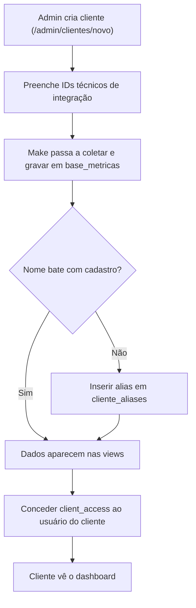

# Runbook Operacional

Guia prático para diagnosticar incidentes comuns. Índice ampliado:
[Troubleshooting](./troubleshooting.md) · [Observabilidade](./observability.md).

Ferramentas de diagnóstico embutidas:
`/admin/debug` (`getDebugSnapshot`) e `/admin/debug/views` (`getViewsAudit`).

---

## 🔴 Dashboards aparecem vazios (para todos)

**Sintoma:** admin e clientes veem dashboards sem dados.

**Causas prováveis e checagem:**

1. **Views sem dados por RLS** — esse foi o incidente histórico que originou
   [ADR-0003](../02-architecture/adr/0003-views-security-definer.md). Verifique em
   `/admin/debug/views` se a contagem via admin autenticado é > 0. Se as views voltaram a ser
   `security_invoker`, dashboards zeram.
2. **`current_user_clientes()` retornando vazio** — `/admin/debug/views` mostra o resultado
   para admin e service-role. Para admin deve listar todos os clientes.
3. **Ingestão parada** — veja `vw_clientes_ativos.ultima_ingestao` em `/admin` (Status das
   contas). Se está muito defasada, o problema é no Make, não no app.

---

## 🟠 Um cliente específico vê dashboard vazio

1. Confirme que ele tem `client_access` para o cliente certo (`/admin/usuarios`).
2. Confirme **divergência de nome**: o nome em `base_metricas.cliente` pode diferir do
   `cadastro_clientes.nome_cliente`. Cheque `cliente_aliases`; se faltar um alias, os dados
   não aparecem. Ver [ADR-0004](../02-architecture/adr/0004-chave-de-cliente-por-nome-e-aliases.md).
3. Em `/admin/debug/views`, veja `distinct_clientes` de `base_metricas` e o `normalization_map`.

**Correção típica:** inserir o alias faltante em `cliente_aliases`
(`nome_canonico` = nome do cadastro, `alias_metricas` = nome em base_metricas).

---

## 🟠 Números errados (ex.: investimento absurdo)

1. **Google Ads em micros:** se aparecer algo como `R$ 164.824.476`, a conversão `/1.000.000`
   não está sendo aplicada — verifique se a view ativa é a da migration 08 (ou 07), não uma
   versão antiga.
2. **`google_spend`/`instagram_reach` inflados:** lembre que `sumOverview` usa **MAX por
   cliente** para essas métricas. Se alguém trocou para soma, os números inflam. Ver
   [Dashboards](../06-dashboards/dashboards.md#regras-de-agregação-que-importam).
3. **NULLs contaminando médias:** `vw_metricas_normalizadas` filtra `valor IS NOT NULL`.

---

## 🟠 Datas/“hoje” deslocados

Se o período parece "um dia à frente/atrás", quase sempre é uso indevido de
`Date.toISOString()` em vez de `brtToday()`/`addDaysISO`. Ver
[ADR-0006](../02-architecture/adr/0006-timezone-america-sao-paulo.md).

---

## 🟠 Erro 500 / página de erro genérica

- `src/server.ts` renderiza uma página de erro quando o SSR falha (inclusive erros que o `h3`
  "engole"). O erro original é logado via `src/lib/error-capture.ts`.
- Procure no log do runtime (Cloudflare/Lovable) a exceção capturada.

---

## 🟢 Onboarding de um novo cliente (operacional)

---

## Contatos / donos

> ⚠️ **INFORMAÇÃO NÃO ENCONTRADA** — não há, no repositório, definição de on-call,
> responsáveis por incidente ou SLA. Preencher com Eng/Ops.
