# Organização de Código & Convenções

Complementa [Padrões de desenvolvimento](./development.md) e
[Estrutura do repositório](../05-frontend/repository-structure.md).

---

## Onde colocar código novo

| Se você está… | Coloque em… |
|---------------|-------------|
| Adicionando rota/tela | `src/routes/` |
| Adicionando componente de produto | `src/components/lotus/` |
| Adicionando primitivo UI genérico | `src/components/ui/` |
| Adicionando cálculo/KPI | `src/lib/platforms/formulas.ts` ou `engine.ts` |
| Adicionando plataforma | `src/lib/platforms/{nome}.ts` + `registry.ts` |
| Adicionando server function | `src/lib/*.functions.ts` |
| Adicionando hook reutilizável | `src/hooks/` |
| Adicionando integração (campo admin) | `integrations-catalog.ts` + migration |
| Adicionando tabela/view | `supabase/migrations-official/` |

---

## Naming

| Tipo | Convenção | Exemplo |
|------|-----------|---------|
| Rotas | kebab-case arquivo | `cliente.$cliente.meta-ads.tsx` |
| Componentes | PascalCase | `PlatformDashboard` |
| Server functions | camelCase verb | `createCliente` |
| PlatformDef export | camelCase + Def | `googleAdsDef` |
| Views SQL | snake_case `vw_*` | `vw_meta_ads_diario` |
| Migrations | `NN_descricao.sql` | `08_aliases_e_null_guard.sql` |

---

## Imports

```typescript
// Preferir alias
import { ctr } from "@/lib/platforms/formulas"

// Service-role — dynamic import no server only
const { getAdminClient } = await import("@/integrations/supabase/client.server")
```

---

## Camadas — o que cada uma pode fazer

```mermaid
flowchart TB
    R["routes/\ncomposição + data fetching"]
    C["components/\nrenderização"]
    L["lib/\nlógica pura"]
    I["integrations/\nclients externos"]

    R --> C
    R --> L
    R --> I
    C --> L
    L -.->|nunca| C
```



- `lib/` **não importa** React
- `formulas.ts` **não importa** Supabase
- Componentes **não calculam** KPI

---

## Server functions — padrão

```typescript
export const myFn = createServerFn({ method: "POST" })
  .middleware([requireSupabaseAuth])
  .validator(z.object({ ... }))
  .handler(async ({ context, data }) => {
    await assertAdmin(context)
    // ...
  })
```

---

## Migrations — padrão

```sql
-- ============================================================================
-- NN — Título
-- Causa-raiz: por que esta migration existe
-- ============================================================================
-- Idempotente: DROP IF EXISTS + CREATE
```

Sempre: GRANTs, RLS, policies, bloco de validação.

---

## Comentários

Comentar **decisões de negócio** e **trade-offs**, não o óbvio.
Bons exemplos: `instagram.ts` (MAX vs SUM), `period.ts` (BRT), migrations (causa-raiz).

---

## Anti-patterns

| ❌ Evitar | ✅ Fazer |
|----------|---------|
| CTR calculado em componente | `formulas.ts` + `KpiDef` |
| Tela nova por plataforma | `PlatformDef` + rota thin |
| `toISOString()` para hoje | `brtToday()` |
| `any` em server functions | Tipos gerados Supabase |
| Feature no editor Lovable | Cursor + este repo |

---

## Referências

- [Fluxo oficial](./development-workflow.md)
- [Engine](../06-engine/overview.md)
- [Documentação](./documentation.md)
