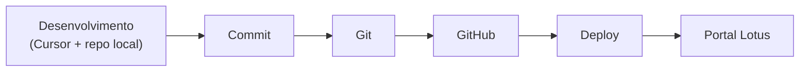

# Fluxo Oficial de Desenvolvimento

> **Decisão oficial (2026-06-26):** o **Cursor** é o ambiente principal de engenharia da Lotus.
> O **Lovable** deixa de ser ambiente de desenvolvimento e passa a ser tratado apenas como
> plataforma **transitória de build/deploy** enquanto ainda fizer parte da arquitetura.
>
> ADR: [0010 — Cursor como ambiente oficial](../02-architecture/adr/0010-cursor-official-development-environment.md)

---

## Pipeline de engenharia



| Etapa | Onde | Responsabilidade |
|-------|------|------------------|
| Desenvolvimento | Cursor, neste repositório | Implementação, testes locais, documentação |
| Commit | Git local | Mensagem clara; código pronto para produção |
| GitHub | Remote | PR, revisão, histórico versionado |
| Deploy | Pipeline (Lovable/Nitro/Cloudflare hoje) | Build e publicação |
| Portal Lotus | Produção | Usuários finais |

**Regra:** toda implementação é feita **aqui**, no código. Não desenvolver no editor Lovable.

---

## Antes de qualquer alteração

Checklist obrigatório para toda nova funcionalidade:

1. **Analisar** o código existente nos módulos relacionados.
2. **Identificar** arquivos e camadas afetados (routes, lib, components, migrations, docs).
3. **Verificar** se já existe implementação semelhante (engine, componentes Lotus, server functions).
4. **Reutilizar** antes de criar — componentes, hooks, fórmulas, patterns de query.
5. **Evitar duplicação** — nunca código paralelo quando houver solução reutilizável.

### Sequência de trabalho

```
Compreender o problema → Propor arquitetura → Implementar → Documentar → Validar build
```

Não pular direto para implementação. Não entregar atalhos que aumentem dívida técnica.

---

## Qualidade do código

Prioridades em toda implementação:

| Princípio | Prática na Lotus |
|-----------|------------------|
| Simplicidade | Menor diff que resolve o problema |
| Clareza | Nomes explícitos; comentários só para o *porquê* |
| Escalabilidade | Engine declarativo; coletores isolados (futuro) |
| Performance | Queries enxutas; React Query com keys corretas |
| Reutilização | `PlatformDef`, componentes `lotus/`, `formulas.ts` |
| Tipagem forte | TypeScript estrito; evitar `any` |
| Baixo acoplamento | Lógica em `src/lib/`; UI só consome |

---

## Arquitetura

Respeitar rigorosamente os [Princípios de engenharia](../00-company/philosophy.md):

- Fonte única de verdade — nenhuma regra duplicada.
- Nenhum cálculo repetido em componentes.
- Toda fórmula em `src/lib/platforms/formulas.ts`.
- Arquitetura declarativa de plataformas (`PlatformDef` + registry).
- Componentes desacoplados da lógica de negócio.
- Fácil manutenção e expansão para novas plataformas.

Detalhes: [Padrões de desenvolvimento](./development.md) · [Arquitetura alvo](../02-architecture/target-architecture.md)

---

## Git e versionamento

Este projeto é **totalmente versionado**. Toda alteração deve ser enviável ao GitHub.

### Boas práticas

- Commits descritivos (o *porquê*, não só o *o quê*).
- PRs pequenos, focados e revisáveis.
- Branch sempre em estado funcional (`lint` + `build` passam).
- Evitar alterações experimentais no branch conectado ao deploy.

### Lovable e histórico Git

O repositório ainda pode estar conectado ao Lovable para build/deploy. Enquanto isso:

- **Não reescrever histórico publicado** (sem force-push, rebase/amend/squash de commits já enviados).
- Commits no branch conectado podem sincronizar com o Lovable — manter branch funcional.

Ver `AGENTS.md` e [Deployment](../08-operations/deployment.md).

---

## Definition of Done

Uma tarefa **não está concluída** até que:

- [ ] `npm run lint` e `npm run build` passam localmente.
- [ ] Tipagem limpa; sem imports não utilizados; sem código morto; sem TODOs esquecidos.
- [ ] Arquitetura existente respeitada; reutilização maximizada.
- [ ] **Documentação atualizada** no mesmo PR ([Doc-as-Code](./documentation.md)).
- [ ] **ADR** criado se decisão arquitetural relevante.
- [ ] **Changelog** atualizado se mudança visível ao usuário.
- [ ] Migrations (se houver) aditivas, idempotentes e validadas.

---

## Documentação e ADRs

A documentação faz parte do produto. Matriz completa em
[Documentação como código](./documentation.md) e `.cursor/rules/docs-maintenance.mdc`.

Mudanças em banco, arquitetura, dashboards, componentes, integrações, APIs, autenticação ou
regras de negócio devem refletir **imediatamente** em `docs/`.

ADRs em `docs/02-architecture/adr/` para decisões difíceis de reverter.

---

## Visão estratégica

Cada decisão de hoje deve aproximar a Lotus da **autossuficiência total**:

- Remover Make, Lovable, Horizons e dependências operacionais externas.
- Toda inteligência dentro do ecossistema Lotus.

Ver [Missão](../00-company/mission.md) · [Roadmap](../11-roadmap/roadmap.md)

---

## Regras Cursor

O agente e desenvolvedores no Cursor devem seguir:

| Regra | Arquivo |
|-------|---------|
| Engenharia e fluxo oficial | `.cursor/rules/lotus-engineering.mdc` |
| Manutenção de documentação | `.cursor/rules/docs-maintenance.mdc` |
