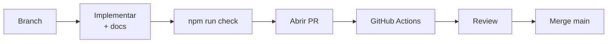

# Governança de Engenharia

Como a Lotus toma decisões técnicas, contribui com código e mantém qualidade ao longo do tempo.

---

## Hierarquia de verdade

Quando houver conflito, prevalece nesta ordem:

1. **Código em produção** (comportamento real)
2. **ADRs aceitos** (decisões explícitas)
3. **Handbook (`docs/`)** (documentação derivada)
4. **Roadmap** (intenção futura)

Se código e docs divergem → **corrigir o que estiver errado** (geralmente a doc; às vezes o código).

---

## Processo de decisão (ADR)

| Quando                      | Ação                                             |
| --------------------------- | ------------------------------------------------ |
| Decisão difícil de reverter | Criar ADR em `docs/02-architecture/adr/`         |
| Decisão aceita              | `status: accepted`                               |
| Decisão substituída         | Novo ADR referencia o anterior como `superseded` |
| Proposta futura             | `status: proposed`                               |

Template: [adr/README.md](../02-architecture/adr/README.md)

---

## Processo de contribuição (PR)

1. Branch a partir de `main` funcional
2. Implementação + documentação no **mesmo PR**
3. `npm run check` local
4. PR com [template](../../.github/pull_request_template.md)
5. CI verde obrigatório
6. Review (quando time definir owners)

---

## Versionamento

| Artefato   | Estratégia                                                     |
| ---------- | -------------------------------------------------------------- |
| Código app | `main` = deployável; semver do produto TBD                     |
| Migrations | Sequencial `NN_descricao.sql`; aditivas                        |
| Docs       | `last_review` no frontmatter; changelog para mudanças visíveis |
| ADRs       | Imutáveis após aceitos; correções via novo ADR                 |

---

## Qualidade automatizada

| Gate       | Comando / local                |
| ---------- | ------------------------------ |
| Lint       | `npm run lint`                 |
| Testes     | `npm run test`                 |
| Build      | `npm run build`                |
| Engenharia | `npm run validate:engineering` |
| Tudo       | `npm run check`                |

CI: `.github/workflows/ci.yml`

---

## Melhoria contínua (mandato CTO)

Engenheiros e agentes Cursor devem **proativamente**:

- Registrar lacunas em `AUDIT.md` (seção L1–L9)
- Propor ADRs para decisões novas
- Expandir testes em módulos puros
- Atualizar handbook quando código mudar
- Propor padrões para processos repetitivos

Regra Cursor: `.cursor/rules/lotus-governance.mdc`

---

## Papéis (inicial)

| Papel                 | Responsabilidade                              |
| --------------------- | --------------------------------------------- |
| **Contribuidor**      | PRs com check + docs                          |
| **Reviewer**          | ⚠️ INFORMAÇÃO NÃO ENCONTRADA — definir owners |
| **Maintainer**        | Merge, migrations prod, deploy                |
| **CTO / Arquitetura** | ADRs, roadmap, sistema de engenharia          |

---

## Referências

- [CONTRIBUTING.md](../../CONTRIBUTING.md)
- [Sistema de Engenharia](../00-company/engineering-system.md)
- [CI/CD](../08-operations/cicd.md)
- [Testing](../09-standards/testing.md)
