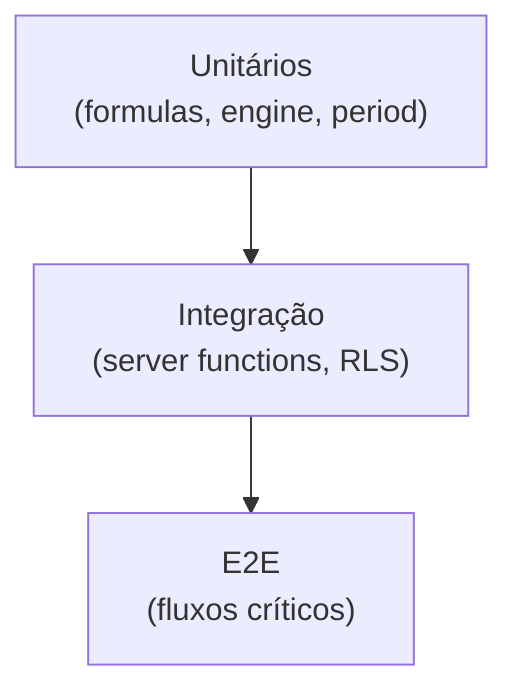

# Estratégia de Testes

---

## Estado atual

| Tipo | Status |
|------|--------|
| Unitários | ❌ Nenhum (`*.test.ts` ausente) |
| Integração | ❌ |
| E2E (Playwright) | ❌ |
| RLS / SQL | ❌ |
| CI enforcement | ❌ |

`package.json` não inclui `vitest`, `jest` ou `playwright`.

---

## Pirâmide alvo



---

## Prioridade 1 — Unitários (alto ROI)

Módulos **puros**, sem I/O:

| Módulo | Casos críticos |
|--------|----------------|
| `formulas.ts` | Divisão por zero, CTR, CPC, CPM |
| `engine.ts` | `aggregate` sum vs max, `pctDelta`, `dailySeries` |
| `aggregations.ts` | Cada estratégia |
| `period.ts` | `brtToday`, presets, `prevFrom/prevTo` |
| `integrations-catalog.ts` | `getIntegrationStatus` matrix |

### Setup recomendado

```bash
npm install -D vitest @vitest/coverage-v8
```

```json
// package.json scripts (futuro)
"test": "vitest run",
"test:watch": "vitest"
```

---

## Prioridade 2 — Integração

| Alvo | Abordagem |
|------|-----------|
| Server functions | Mock Supabase client |
| RLS policies | Supabase local ou test project |
| Views SQL | Fixture data + snapshot queries |

---

## Prioridade 3 — E2E

Fluxos críticos:

1. Login → dashboard com dados
2. Admin cria cliente + integração
3. Aprovação editorial (cliente)

Ferramenta sugerida: Playwright.

---

## Definition of Done (futuro)

Quando suite existir:

- [ ] Nova fórmula → teste em `formulas.test.ts`
- [ ] Nova agregação → teste em `engine.test.ts`
- [ ] PR falha se testes quebram

---

## Cobertura mínima alvo

| Área | Meta inicial |
|------|--------------|
| `formulas.ts` | 100% |
| `engine.ts` | >90% |
| `period.ts` | >90% |
| Server functions | Casos críticos (auth, admin) |
| UI components | Smoke E2E apenas |

---

## Referências

- [CI/CD](../08-operations/cicd.md)
- [Fórmulas](../06-engine/formulas.md)
- [Roadmap](../11-roadmap/roadmap.md) Fase 2
