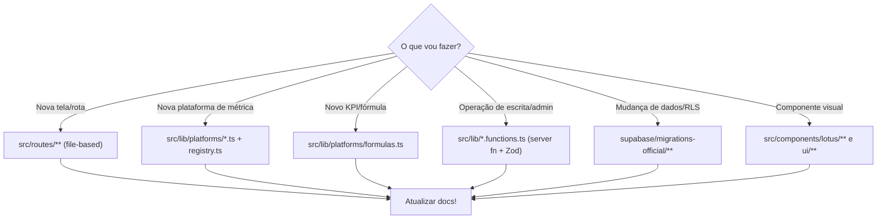

# Onboarding de Desenvolvedores

> **Primeiro passo:** leia **[START HERE](../START_HERE.md)** (~1 hora) para contexto de
> produto, arquitetura atual vs alvo e mapa do repositório.

Este guia complementa o START HERE com **setup técnico** e primeiros passos práticos.
Reserve ~1 dia adicional para ambiente e primeiro PR.

---

## Dia 0 — Contexto (leitura)

Leia, nesta ordem:

1. **[START HERE](../START_HERE.md)** (obrigatório)
2. [Missão & Visão](../00-company/mission.md) + [Filosofia](../00-company/philosophy.md)
3. [Estado atual](../02-architecture/current-state.md) e [Arquitetura alvo](../02-architecture/target-architecture.md)
4. [Glossário](../00-company/glossary.md) (referência)

---

## Dia 0 — Setup do ambiente

> **Ambiente oficial:** [Cursor](https://cursor.com) + clone deste repositório. Não desenvolva
> no Lovable. Ver [Fluxo oficial](../09-standards/development-workflow.md).

### Pré-requisitos

- Node.js (versão compatível com Vite 8 / `@types/node` ^22 — use a LTS atual).
- npm.
- Acesso ao projeto Supabase `ywvhoctcmibjitvwkkhb` e às chaves (peça ao time).
- **Cursor** instalado (ambiente oficial de engenharia).

> O repositório pode sincronizar com Lovable apenas para **build/deploy** — não use o editor
> Lovable para implementar features. Ver [Fluxo oficial](../09-standards/development-workflow.md).

### Passos

```bash
# 1. Clonar o repositório do app
#    (o app fica em supabase-magic-portal)
cd supabase-magic-portal

# 2. Instalar dependências
npm install

# 3. Configurar variáveis de ambiente
cp .env.example .env
# Preencha OFFICIAL_* e VITE_OFFICIAL_* com chaves do Supabase

# 4. Rodar em desenvolvimento
npm run dev
```

### Variáveis mínimas (`.env`)

| Variável                          | Necessária para               |
| --------------------------------- | ----------------------------- |
| `VITE_OFFICIAL_SUPABASE_URL`      | client anon                   |
| `VITE_OFFICIAL_SUPABASE_ANON_KEY` | client anon                   |
| `OFFICIAL_SUPABASE_URL`           | server functions / middleware |
| `OFFICIAL_SUPABASE_ANON_KEY`      | middleware de auth            |
| `OFFICIAL_SERVICE_ROLE_KEY`       | operações admin (só servidor) |

> Detalhes em [Operações → Deployment](../08-operations/deployment.md).
> Nunca commite `.env` nem exponha a service-role com prefixo `VITE_`.

---

## Mapa mental de "onde mexer"



---

## Seu primeiro PR (sugestão de tarefa de aquecimento)

1. Escolha uma melhoria pequena e segura (ex.: um _empty state_, um rótulo, um teste de
   `formulas.ts`).
2. Siga o [Fluxo oficial de desenvolvimento](../09-standards/development-workflow.md) e os
   [Padrões de Desenvolvimento](../09-standards/development.md).
3. Atualize a doc afetada (ver matriz em [Doc-as-Code](../09-standards/documentation.md)).
4. Rode `npm run lint` e `npm run build`.
5. Abra o PR usando o checklist de documentação.

---

## Conceitos que você precisa entender cedo

- **Multi-tenant via `current_user_clientes()`** — por que cada usuário só vê o que vê
  ([Schema](../04-database/schema.md)).
- **Engine declarativo** — por que não criamos uma tela por plataforma
  ([Design System](../05-frontend/component-system.md)).
- **Aliases de cliente** — por que existe `cliente_aliases`
  ([ADR-0004](../02-architecture/adr/0004-chave-de-cliente-por-nome-e-aliases.md)).
- **Datas em BRT** — por que nunca usamos `toISOString()` para "hoje"
  ([ADR-0006](../02-architecture/adr/0006-timezone-america-sao-paulo.md)).

---

## Onde pedir ajuda

> ⚠️ **INFORMAÇÃO NÃO ENCONTRADA** — canais de comunicação do time (Slack/Discord), donos por
> área e processo de code review não estão no repositório. Preencher com o time.
