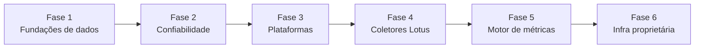

# Roadmap & Dívidas Técnicas

Este roadmap cobre **duas linhas do tempo**:

1. **Curto/médio prazo** — estabilizar o que existe hoje (código observado).
2. **Longo prazo** — evoluir para [arquitetura alvo](../02-architecture/target-architecture.md)
   (plataforma proprietária, sem Make/Lovable).

Itens 🔧 = dívida técnica · ✨ = evolução de produto · 🎯 = marco estratégico (alvo)

---

## Visão por fases

| Fase | Foco                 | Relaciona-se a    |
| ---- | -------------------- | ----------------- |
| 1–3  | Estado atual estável | Código existente  |
| 4–6  | Arquitetura alvo     | Visão estratégica |

---

## Fase 0 — Engenharia tradicional ✅ (decisão tomada)

- 🎯 **Cursor como ambiente oficial de engenharia.** Lovable = build/deploy transitório apenas.
  Ver [ADR-0010](../02-architecture/adr/0010-cursor-official-development-environment.md).
- 🎯 **Fluxo oficial documentado:** `docs/09-standards/development-workflow.md` +
  `.cursor/rules/lotus-engineering.mdc`.
- 🎯 **Sistema de Engenharia fundado:** CI, Vitest, CONTRIBUTING, governança.
  Ver [ADR-0011](../02-architecture/adr/0011-engineering-system-foundation.md).

## Auth & Access — Auth Module v3 ✅ (concluído 30/06/2026)

- 🎯 **Separação Auth / Access / Admin** com orchestrator e boundary validation.
  Ver [ADR-0014](../02-architecture/adr/0014-auth-module-v3-architecture.md) e
  [Auth Module v3](../03-backend/auth-module-v3.md).
- 🎯 Fluxos convite e recovery **sem auto-login**.
- 🎯 Recovery Mode administrativo (3 ações operacionais).
- 🎯 Migrations 13–17 para lifecycle, invalidação de sessões e correção de cast UUID.

### Auth & Access — Próximas evoluções

> **Fora da versão v3.** Evoluções de autorização → módulo **Access**. Evoluções de identidade → **Auth**.

- ✨ Melhorias Recovery Mode (UX, feedback por ação, confirmações).
- ✨ **Reenvio confiável de convite em `invite_pending`** — investigar comportamento do Supabase
  Auth (OTP/Invite) e estratégia de reenvio sem exclusão do usuário. _Baixa prioridade; não bloqueia
  o sistema._ Workaround oficial documentado em
  [Known Operational Limitation — Recovery Mode (v3)](../03-backend/auth-module-v3.md#known-operational-limitation--recovery-mode-v3).
- ✨ **MFA** (TOTP / WebAuthn).
- ✨ **OAuth** / provedores sociais.
- ✨ **SSO** corporativo (SAML/OIDC).
- ✨ Melhorias UX nos fluxos auth (copy, estados de loading, acessibilidade).
- ✨ Auditorias avançadas (export, retenção, alertas).
- 🔧 Consolidar onboarding em Postgres (`access_accounts`) — reduzir `user_metadata.lots_bi`.
- 🔧 Completar migração `features/access` → `modules/access/domain`.
- 🔧 Remover stubs deprecated `features/auth`.
- 🔧 Fail-closed total em `postAuthOnLoginSuccess` (sem fallback em erro de profile).
- 🔧 Remover valor `invite_expired` do enum Postgres.
- 🔧 Desacoplar ciclo Access ↔ Admin (envio de e-mail em módulo de integração).

## Content Workflow — Aprovações v1 🎯 (aprovado 05/07/2026)

> Módulo definitivo de **Workflow de Conteúdo**. Aggregate root oficial: **`content_cards`**.
> Kanban = visualização. Ver [ADR-0018](../02-architecture/adr/0018-content-workflow-module-v1.md).

### Fase 0 — Infraestrutura ✅ (concluída 06/07/2026)

- ✅ Migration 18, scaffold `src/modules/approval/`, repository pattern, boundaries CI, ports stubs
- 📄 Spec: [content-workflow-phase-0.md](../03-backend/content-workflow-phase-0.md)

### Fase 1 — Kanban interno ✅ (concluída 06/07/2026)

- ✅ Rota `/admin/aprovacoes` — Kanban DnD, CRUD, drawer, upload, timeline
- 📄 [content-workflow-phase-1.md](../03-backend/content-workflow-phase-1.md)

### Fase 2 — Portal Cliente ✅ (concluída 06/07/2026)

- ✅ `/aprovacoes` com domínio `content_cards` — Kanban read-only
- ✅ Preview social (`MediaPreview`), comentários, aprovar, solicitar alteração
- ✅ Eventos `approved`, `changes_requested`, `commented` — sem alterar Card
- ✅ Migration 19 (enum + RLS cliente)
- 📄 [content-workflow-phase-2.md](../03-backend/content-workflow-phase-2.md)

### Fase 3 — Planejamento Editorial ✅ (concluída 06/07/2026)

- ✅ Pilares editoriais (CRUD, reordenar, arquivar) — agência; leitura cliente
- ✅ Calendário editorial (mês/semana/dia) sobre `content_cards`
- ✅ Plano de Stories (`story_plan_rows`) estilo planilha
- ✅ Abas Kanban | Calendário | Pilares | Stories em `/admin/aprovacoes` e `/aprovacoes`
- ✅ Migration 20 (triggers `updated_at`)
- 📄 [content-workflow-phase-3.md](../03-backend/content-workflow-phase-3.md)

### Fase 4 — Biblioteca + Dashboard ops ✅

- Biblioteca oficial, dashboard operacional, hard delete bloqueado, ports IA
- 📄 [content-workflow-phase-4.md](../03-backend/content-workflow-phase-4.md)

### Fase 5 — Consolidação ✅ (concluída 06/07/2026)

- ✅ Legado removido (`editorial.functions`, tabelas `posts_editorial`+)
- ✅ Redirect `/admin/editorial` → `/admin/aprovacoes`
- ✅ UX polish, boundaries estendidos, migration 22
- 📄 [content-workflow-phase-5.md](../03-backend/content-workflow-phase-5.md)

**Content Workflow v3 encerrado.**

Plano: [content-workflow-implementation-plan.md](../03-backend/content-workflow-implementation-plan.md)

### Content Workflow — Evoluções futuras (pós-v1)

- ✨ Integração **Meta Graph** (Instagram, Facebook)
- ✨ Publicação **TikTok**, **LinkedIn**
- ✨ **OpenAI** / **Claude** via `ContentAiPort`
- ✨ Automação **Make** / **n8n** via `WorkflowAutomationPort`
- ✨ Agendamento automático de publicação
- ✨ Métricas pós-publicação (engajamento real vs planejado)
- ✨ Biblioteca → IA, relatórios, pesquisa, cases, portfólio
- ✨ ~~Descontinuar tabelas legado (`posts_editorial`, `post_media`, `post_revisions`)~~ ✅ Fase 5
- ✨ Notificações server-side (substituir localStorage)

---

## Fase 1 — Fundações de dados (alta prioridade)

- 🔧 **Chave de cliente por ID (FK), não por nome.** Migrar `base_metricas`/pipeline para
  referenciar `cadastro_clientes.id`. Ver [ADR-0004](../02-architecture/adr/0004-chave-de-cliente-por-nome-e-aliases.md).
- 🔧 **Versionar `base_metricas`.** Trazer schema para migrations. Ver
  [Pipeline Make](../07-integrations/current-pipeline-make.md).
- 🔧 **Catálogo de clientes dedicado** para substituir `SELECT DISTINCT` em
  `current_user_clientes()` (admin).

## Fase 2 — Confiabilidade & segurança

- 🔧 **Reavaliar `SECURITY DEFINER` das views.** Ver [ADR-0003](../02-architecture/adr/0003-views-security-definer.md).
- 🔧 **Testes automatizados** — `formulas.ts` + `period.ts` ✅; expandir `engine.ts` + RLS.
- 🔧 **Tipagem Supabase** (`supabase gen types`).
- ~~Endurecer cadastro de usuários (limitar signUp público)~~ — **Entregue** Auth Module v3.
- 🔧 **Observabilidade de ingestão** (alertas por `ultima_ingestao`).

## Fase 3 — Cobertura de plataformas & consistência

- ✨ **Completar TikTok e Google Business** (view + PlatformDef + registry) ou remover.
- 🔧 **Unificar agregação** (`metrics.ts` + `engine.ts` + insights duplicados).
- ✨ **Resolver identidade Majrá vs Lotus.**
- ✨ **LinkedIn, Pinterest, YouTube** — apenas após Fase 4 (coletores).

## Fase 4 — Coletores Lotus 🎯 (substituir Make)

> **Transitório → Proprietário.** Ver [ADR-0008](../02-architecture/adr/0008-proprietary-data-collectors.md).

- 🎯 **Piloto `GoogleAdsCollector`** — paridade com Make, dual-run, desligar Make para Google Ads.
- 🎯 **Fila + workers** — scheduler, retries, dead-letter, UPSERT idempotente.
- 🎯 **Token manager** — OAuth refresh centralizado (tabela de credenciais — não existe hoje).
- 🎯 **Dashboard admin de sync** — status por cliente/plataforma/run.
- 🎯 Migrar Meta → Instagram → GA4 (ordem sugerida, validar com produto).
- 🎯 **Desligar Make** plataforma a plataforma.

## Fase 5 — Motor de métricas unificado 🎯

> Ver [ADR-0007](../02-architecture/adr/0007-derived-metrics-in-application-layer.md).

- 🎯 **Remover métricas derivadas das views SQL** (CTR, CPM, engagement_rate).
- 🎯 **Pacote `@lotus/metrics`** — fórmulas compartilhadas entre API, workers e frontend.
- 🎯 **API interna** — leitura analítica via server layer (não browser → views direto).
- 🔧 **Testes de paridade** SQL vs TS durante transição.

## Fase 6 — Infraestrutura proprietária 🎯

> Ver [ADR-0009](../02-architecture/adr/0009-platform-proprietary-infrastructure.md).

- 🎯 **CI/CD completo** — lint/test/build ✅; deploy + migrations automáticas pendente.
- 🎯 **Desacoplar Lovable** — remover `@lovable.dev/vite-tanstack-config`.
- 🔧 **Materializar views pesadas** quando volume exigir.
- ✨ **Relatórios/export agendados.**

---

## Tabela de dívidas técnicas (rastreável)

| #   | Dívida                                | Impacto         | Esforço | Fase |
| --- | ------------------------------------- | --------------- | ------- | ---- |
| D1  | Junção de cliente por nome            | Alto            | Alto    | 1    |
| D2  | `base_metricas`/Make fora de versão   | Alto            | Médio   | 1    |
| D3  | `DISTINCT` em runtime no multi-tenant | Médio           | Médio   | 1    |
| D4  | Views `SECURITY DEFINER`              | Alto            | Médio   | 2    |
| D5  | Ausência de testes                    | Alto            | Médio   | 2    |
| D6  | `any` em server functions             | Médio           | Baixo   | 2    |
| D7  | `signUp` público aberto               | ~~Médio~~ ✅ Auth v3 | —       | 2    |
| D8  | Insights duplicados                   | Baixo           | Baixo   | 3    |
| D9  | TikTok/GBP incompletos                | Médio           | Médio   | 3    |
| D10 | Marca Majrá/Lotus                     | Baixo           | Baixo   | 3    |
| D11 | Métricas derivadas no SQL             | Alto            | Médio   | 5    |
| D12 | Make como único pipeline              | Alto            | Alto    | 4    |
| D13 | Sem coletores proprietários           | Alto            | Alto    | 4    |
| D14 | Lovable acoplado ao build             | Médio           | Médio   | 6    |
| D11 | Sem CI/CD                             | ~~Médio~~ ✅ CI | —       | 6    |

> Ao resolver uma dívida, mova para o [Changelog](../12-changelog/changelog.md).

---

## O que está fora de escopo (até nova decisão)

- Rewrite completo do frontend (migração incremental preferida).
- Multi-região / multi-cloud (não documentado como requisito).
- Horizons — **⚠️ INFORMAÇÃO NÃO ENCONTRADA** no repositório.
