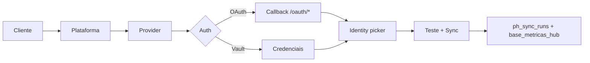

# Platform Hub RC1 — Handoff

Use este documento se você está **assumindo o trabalho** no Hub de Conexões sem contexto da conversa anterior.

---

## O que é o Platform Hub

Substituto proprietário do fluxo Make para **conectar clientes** a APIs oficiais (Meta, Google Ads, GA4, Google Business, TikTok, YouTube), **coletar métricas** e **persistir** em Supabase — com UI admin, OAuth, vault de credenciais e trilha de homologação.

**RC1 = homologação interna.** Dashboards de clientes ainda leem `vw_metricas` com `ph_metricas_source.active_source = 'make'` por padrão.

---

## O que foi entregue (jul/2026)

### Kernel (`platform-hub/`)

| Área | Responsabilidade |
|------|------------------|
| `registry/` | Catálogo de plugins, capabilities, providers |
| `runtime/` | SyncRuntime, ManualScheduler, SyncOrchestrator |
| `metric-pipeline/` | Coleta → normalização → writers (port) |
| `connections/` | ConnectionService, resolver |
| `health/` | Health checks por conexão |
| `plugins/` | Meta, Google Ads, GA4, Google Business, TikTok, YouTube |

Arquitetura **congelada** — mudanças exigem ADR + validação de contratos (`npm run validate:contracts`).

### Bridges (`platform-hub-bridges/`)

- Persistência `ph_*` (connections, credentials, identities, sync_runs, timeline, oauth_states)
- `SupabaseBaseMetricasWriter` → tabela `base_metricas_hub`
- Homologação: dual-run, comparação Make vs Hub
- Gate A Meta staging (testes + runbook)

### Admin (`platform-hub-admin/`)

- `hub-admin.server.ts` — CRUD conexões, OAuth, sync, diagnóstico
- `hub-homologation.server.ts` — testing center, rollout dashboard
- `hub-oauth.factory.ts` — OAuth por plugin (Meta, Google*, TikTok)

### UI admin

| Rota | Componente |
|------|------------|
| `/admin/conexoes` | `ConnectionsHubView` |
| `/admin/conexoes/nova` | `ConnectionWizardView` |
| `/admin/conexoes/:id` | `ConnectionDetailView` |
| `/admin/conexoes/health` | Health dashboard |
| `/admin/conexoes/migracao` | Migração Make → Official |
| `/admin/conexoes/testing` | `HomologationTestingCenter` |
| `/admin/conexoes/rollout` | `HomologationRolloutDashboard` |

Callbacks OAuth: `/oauth/meta|google|tiktok/callback`

Integrações: card na Central (`HubIntegrationsAlertCard`), seção na ficha do cliente (`ClientHubConnectionsSection`), item **Conexões** no menu admin.

### Banco (migrations 28–30)

- **28** — tabelas `ph_*` core
- **29** — homologação (`ph_homologation_reports`, `ph_debug_traces`, `ph_comparison_reports`)
- **30** — paralelismo métricas: `base_metricas_hub`, `ph_metricas_source`, `vw_metricas` abstrai fonte

### Engenharia

- `npm run hub:doctor` — Gate H-02 (conectividade, 10 tabelas, RLS, writer probe, `active_source`)
- `scripts/engineering/` — registry report, plugin scaffolding, doctor
- `scripts/architecture-validation/` — contratos e convenções de plugins
- `CONSTITUTION.md` + `contracts/` — regras de evolução do hub

---

## Setup local (mínimo)

1. Clone + `npm install` em `supabase-magic-portal/`
2. Copie `.env.example` → `.env` e preencha:
   - `OFFICIAL_SUPABASE_URL`, `OFFICIAL_SERVICE_ROLE_KEY`
   - `VITE_OFFICIAL_SUPABASE_URL`, `VITE_OFFICIAL_SUPABASE_ANON_KEY`
   - `APP_URL=http://localhost:5173`
   - `PLATFORM_HUB_WRITER_TARGET=HUB`
   - `PLATFORM_HUB_SUPABASE_WRITER=true`
   - OAuth por plataforma que for testar (ver [ENVIRONMENT_VARIABLES.md](../ENVIRONMENT_VARIABLES.md))
3. Aplique migrations **28, 29, 30** no projeto Supabase official
4. `npm run hub:doctor` — deve passar Gate H-02
5. `npm run dev` → `/admin/conexoes`

---

## Fluxo operador (wizard)



Estágios de migração por conexão: `make_passive` → `parity` → `dual_run` → `ready` → `official_only` → `make_off`.

---

## Onde **não** mexer sem ADR

- `platform-hub/runtime/*`, `metric-pipeline/*` (core)
- `platform-hub/ports/*`, `contracts/*`
- Lógica de providers em `plugins/*/adapter` (paridade com contratos)
- `vw_metricas` / cutover de `ph_metricas_source` em produção

## Onde **pode** mexer com segurança

- UI em `components/lotus/platform-hub/`
- Server admin em `platform-hub-admin/`
- Novos plugins seguindo `npm run create:plugin`
- Docs em `docs/13-platform-hub/`
- Homologação em `platform-hub-bridges/homologation/`
- Scripts `hub:doctor`, Gate A

---

## Validação antes de PR

```bash
npm run hub:doctor
npm run validate:architecture
npm run test
npm run build
```

Testes Gate A live (`gate-a:parity`) são **skipped no CI** — rodar manualmente com credenciais de staging.

---

## Referências cruzadas

- [Próximos passos](./next-steps.md)
- [Homologação](./homologation-guide.md)
- [Relatório env audit](../reports/platform-hub-env-audit.md)
- [Platform Hub admin (UI)](../06-dashboards/platform-hub-admin.md)
