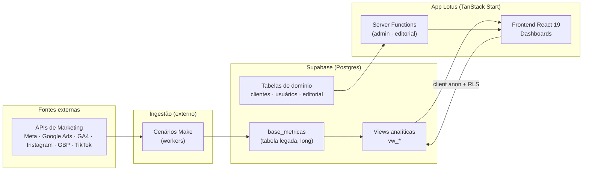

# 🪷 Centro de Conhecimento da Lotus

> A fonte única de verdade sobre **como a Lotus funciona, por que foi construída assim e como evoluí-la com segurança**.

Este Centro de Conhecimento é escrito no padrão _docs-as-code_: mora junto do código, em
Markdown, versionado no Git. Foi estruturado para, no futuro, ser publicado **dentro da
própria plataforma Lotus** como uma central de ajuda/engenharia (estilo Stripe Docs ou
Vercel Docs).

**Novo no time?** Comece por **[START HERE](./START_HERE.md)** — onboarding em menos de 1 hora.

Depois: [Onboarding técnico](./10-onboarding/onboarding.md) para setup local.

---

## Dois estados da documentação

| Estado                 | Documento principal                                          |
| ---------------------- | ------------------------------------------------------------ |
| **Como funciona hoje** | [Estado atual](./02-architecture/current-state.md)           |
| **Para onde vamos**    | [Arquitetura alvo](./02-architecture/target-architecture.md) |

Ferramentas **transitórias**: Make (ingestão), Lovable (build/deploy). Ver
[ADR-0009](./02-architecture/adr/0009-platform-proprietary-infrastructure.md).

---

## Como este handbook está organizado

| #   | Seção                                            | O que você encontra                                                                                                                                                                                         | Para quem       |
| --- | ------------------------------------------------ | ----------------------------------------------------------------------------------------------------------------------------------------------------------------------------------------------------------- | --------------- |
| —   | **[START HERE](./START_HERE.md)**                | Ponto de entrada, mapa mental, roteiro de 1h                                                                                                                                                                | Novos devs      |
| 00  | [Empresa](./00-company/mission.md)               | Missão, [Sistema de Engenharia](./00-company/engineering-system.md), filosofia, glossário                                                                                                                   | Todos           |
| 01  | [Produto](./01-product/product-overview.md)      | O que a Lotus faz, personas, jornadas                                                                                                                                                                       | PM, Eng, Vendas |
| 02  | [Arquitetura](./02-architecture/overview.md)     | Estado atual, arquitetura alvo, fluxo de dados, ADRs                                                                                                                                                        | Engenharia      |
| 03  | [Backend](./03-backend/overview.md)              | Server functions, [auth](./03-backend/auth.md), [segurança](./03-backend/security.md), API                                                                                                                  | Engenharia      |
| 04  | [Banco de dados](./04-database/schema.md)        | Schema, [RLS](./04-database/rls-policies.md), views, migrations, métricas                                                                                                                                   | Eng, Dados      |
| 05  | [Frontend](./05-frontend/overview.md)            | Stack, [estrutura](./05-frontend/repository-structure.md), roteamento, UI, [erros](./05-frontend/observability-errors.md)                                                                                   | Engenharia      |
| 06  | [Dashboards](./06-dashboards/dashboards.md)      | KPIs, telas analíticas, [módulos admin](./06-dashboards/admin-modules.md)                                                                                                                                   | Eng, PM         |
| 06b | [Engine de métricas](./06-engine/overview.md)    | PlatformDef, [fórmulas](./06-engine/formulas.md), [período](./06-engine/period.md), [catálogo](./06-engine/platform-catalog.md)                                                                             | Eng, Dados      |
| 07  | [Integrações](./07-integrations/integrations.md) | Catálogo, Make, coletores alvo                                                                                                                                                                              | Eng, Ops        |
| 08  | [Operações](./08-operations/deployment.md)       | Deploy, [ambientes](./08-operations/environments.md), [CI/CD](./08-operations/cicd.md), [observabilidade](./08-operations/observability.md), [troubleshooting](./08-operations/troubleshooting.md), runbook | Eng, Ops        |
| 09  | [Padrões](./09-standards/development.md)         | Convenções, [governança](./09-standards/governance.md), testes, fluxo, doc-as-code                                                                                                                          | Engenharia      |
| 10  | [Onboarding](./10-onboarding/onboarding.md)      | Setup local, primeiros passos                                                                                                                                                                               | Novos devs      |
| 11  | [Roadmap](./11-roadmap/roadmap.md)               | Próximos passos e dívidas priorizadas                                                                                                                                                                       | Todos           |
| 12  | [Changelog](./12-changelog/changelog.md)         | Histórico de mudanças relevantes                                                                                                                                                                            | Todos           |
| 13  | [Platform Hub](./13-platform-hub/README.md)      | Hub de conexões RC1 — handoff, homologação, próximos passos, `hub:doctor`                                                                                                                                   | Eng, Ops        |
| —   | [Auditoria de completude](./AUDIT.md)            | Cobertura CTO, lacunas, matriz código→doc                                                                                                                                                                   | Liderança, Eng  |

---

## Mapa mental do sistema

> Diagramas detalhados em [Arquitetura → Visão geral](./02-architecture/overview.md) e
> [Arquitetura → Fluxo de dados](./02-architecture/data-flow.md).

---

## Princípio editorial: documentação viva

Este handbook **não é um README estático**. A regra de ouro:

> **Toda funcionalidade nova ou alteração relevante deve vir acompanhada da atualização da documentação correspondente, no mesmo Pull Request.**

Como isso é garantido na prática está descrito em
**[Padrões → Documentação como código](./09-standards/documentation.md)** e é reforçado
por uma regra do Cursor em [`.cursor/rules/docs-maintenance.mdc`](../.cursor/rules/docs-maintenance.mdc).

---

## Convenções deste handbook

- **Idioma:** português do Brasil. Termos técnicos consagrados ficam em inglês.
- **Frontmatter:** todo documento começa com bloco YAML (`title`, `description`, `status`, `owner`, `last_review`).
- **Lacunas honestas:** quando uma informação não pôde ser confirmada no código, ela é
  marcada com o bloco abaixo, em vez de ser inventada:

> ⚠️ **INFORMAÇÃO NÃO ENCONTRADA** — descrição do que falta e onde provavelmente está.

- **Referências de código:** sempre que possível citamos o caminho real do arquivo
  (`src/lib/...`) para o leitor abrir a fonte.
