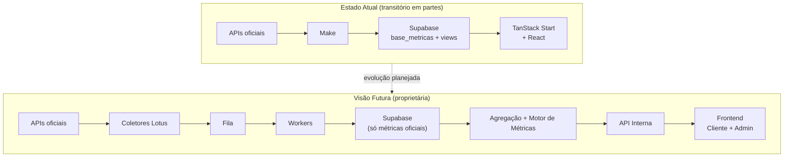

# START HERE

> Bem-vindo ao **Centro de Conhecimento da Lotus**. Este documento foi escrito para que um
> novo desenvolvedor compreenda a plataforma, sua arquitetura e sua direção estratégica em
> **menos de uma hora**.

---

## O que é a Lotus? (5 minutos)

A **Lotus** é um SaaS de **Business Intelligence** voltado para agências e empresas que
desejam acompanhar indicadores de marketing em um único ambiente.

O objetivo não é apenas exibir métricas — é **transformar dados brutos em informações
confiáveis** para tomada de decisão.

**Hoje (observado no repositório):** a Lotus opera como portal de performance e operação
para uma agência de marketing, com dashboards multi-plataforma, painel administrativo e
fluxo editorial/aprovações. O código vive em `supabase-magic-portal/`.

**Visão futura (estratégica):** plataforma completamente proprietária, multi-tenant em
escala, consolidando dezenas de integrações de marketing com coletores próprios, fila de
processamento e motor de métricas unificado.

Detalhes: [Missão](./00-company/mission.md) · [Visão de produto](./01-product/product-overview.md)

---

## Dois estados — leia isto antes de tudo (10 minutos)

Toda a documentação da Lotus distingue **dois mundos**. Não confunda um com o outro.

|                        | **Estado Atual**                                   | **Visão Futura (Arquitetura Alvo)**                          |
| ---------------------- | -------------------------------------------------- | ------------------------------------------------------------ |
| **O que é**            | Como o sistema funciona **hoje**, no código        | Como a Lotus **deverá** funcionar quando madura              |
| **Ingestão**           | Make → Supabase (`base_metricas`)                  | Coletores proprietários → Fila → Workers → Supabase          |
| **App**                | TanStack Start + Supabase + Lovable                | Stack proprietária (TanStack ou evolução) **sem** Lovable    |
| **Métricas derivadas** | Parte calculada nas **views SQL** (dívida)         | Calculadas **somente** na camada de aplicação                |
| **Onde ler**           | [Estado atual](./02-architecture/current-state.md) | [Arquitetura alvo](./02-architecture/target-architecture.md) |



Ferramentas **transitórias** (a serem removidas no longo prazo):

- **Make** — ingestão de dados (não versionada neste repositório)
- **Lovable** — build/deploy transitório (`@lovable.dev/vite-tanstack-config`); **não** é ambiente de dev
- **Horizons** — citado na visão estratégica; **não encontrado no repositório**

## Sistema de Engenharia (2 minutos)

A Lotus trata **engenharia como sistema**, não como documentação solta.

| Artefato                                                    | Função                         |
| ----------------------------------------------------------- | ------------------------------ |
| [Sistema de Engenharia](./00-company/engineering-system.md) | Charter CTO                    |
| [Governança](./09-standards/governance.md)                  | Processos, PRs, ADRs           |
| [CONTRIBUTING.md](../CONTRIBUTING.md)                       | Como contribuir                |
| [CI](../.github/workflows/ci.yml)                           | Lint · test · build · validate |
| `npm run check`                                             | Gate local = gate CI           |

Mandato: **código ↔ docs sincronizados** · melhoria contínua · ADRs para decisões.

---

## Fluxo de desenvolvimento oficial (2 minutos)

**Cursor** é o ambiente de engenharia. Todo código é escrito neste repositório.

```
Desenvolvimento (Cursor) → Commit → Git → GitHub → Deploy → Portal Lotus
```

Detalhes: [Fluxo oficial](./09-standards/development-workflow.md) · [ADR-0010](./02-architecture/adr/0010-cursor-official-development-environment.md)

---

## Mapa do repositório (10 minutos)

```
supabase-magic-portal/
├── src/
│   ├── routes/              # Rotas TanStack Router (file-based)
│   ├── components/lotus/    # Componentes de domínio (dashboards, KPIs)
│   ├── lib/
│   │   ├── platforms/       # Engine declarativo (PlatformDef, fórmulas)
│   │   ├── admin.functions.ts
│   │   └── editorial.functions.ts
│   └── integrations/supabase/
├── supabase/migrations-official/   # DDL versionado (01–08)
└── docs/                    # ← Você está aqui (Engineering Handbook)
```

| Caminho                         | Responsabilidade                                   |
| ------------------------------- | -------------------------------------------------- |
| `src/lib/platforms/`            | Definições de plataforma, fórmulas, engine de KPIs |
| `src/lib/*.functions.ts`        | Server functions (admin, editorial) — service-role |
| `supabase/migrations-official/` | Schema, views, RLS, editorial                      |
| `docs/`                         | Centro de Conhecimento (docs-as-code)              |

---

## Fluxo de dados em 60 segundos

**Estado atual:**

1. Make lê IDs de `cadastro_clientes` e consulta APIs externas.
2. Make grava métricas em `base_metricas` (formato long: cliente + plataforma + métrica + valor + data).
3. Views SQL (`vw_*`) normalizam e agregam por dia/plataforma.
4. Frontend lê views via Supabase client (anon + RLS) e aplica engine TS para KPIs adicionais.

**Visão futura:** coletores Lotus substituem Make; banco armazena **apenas métricas oficiais**
das APIs; CTR, CPC, CPA etc. são calculados exclusivamente no motor de métricas da aplicação.

Diagrama completo: [Fluxo de dados](./02-architecture/data-flow.md)

---

## Plataformas

| Plataforma                   | Estado atual (código)               | Métricas oficiais (alvo)                                                    |
| ---------------------------- | ----------------------------------- | --------------------------------------------------------------------------- |
| Google Ads                   | ✅ `PlatformDef` + views            | impressions, clicks, spend, conversions                                     |
| Meta Ads                     | ✅                                  | impressions, reach, clicks, spend, conversions                              |
| Instagram                    | ✅                                  | reach, accounts_engaged, likes, comments, saves, shares, total_interactions |
| GA4                          | ✅                                  | users, sessions, events, conversions                                        |
| Google Business              | ⚠️ catálogo, sem dashboard completo | —                                                                           |
| TikTok                       | ⚠️ catálogo, sem dashboard completo | —                                                                           |
| LinkedIn, Pinterest, YouTube | ❌ não implementados                | visão futura                                                                |

Catálogo: `src/lib/integrations-catalog.ts` · Detalhes: [Integrações](./07-integrations/integrations.md)

---

## Autenticação e multi-tenant (5 minutos)

- **Auth:** Supabase Auth (email/senha).
- **Papéis:** `admin`, `cliente` (tabela `user_roles`).
- **Isolamento:** RLS + função `current_user_clientes()` filtra dados por cliente.
- **Server functions sensíveis:** service-role em `*.server.ts` (nunca expor ao browser).

Rotas protegidas: `src/routes/_authenticated/`

Detalhes: [Auth](./03-backend/auth.md) · [Segurança](./03-backend/security.md) · [RLS](./04-database/rls-policies.md)

---

## Princípios arquiteturais (memorize estes 4)

1. **Fonte única de verdade** — cada regra de negócio/cálculo existe em um só lugar.
2. **Banco só com dados oficiais** — métricas derivadas (CTR, CPC, engagement rate) na aplicação.
3. **Camada de fórmulas única** — `src/lib/platforms/formulas.ts` (alvo); hoje há exceções nas views SQL.
4. **Arquitetura declarativa** — nova plataforma = `PlatformDef` + registry + coletor.

Filosofia completa: [Princípios de engenharia](./00-company/philosophy.md)

---

## Roteiro de leitura (restante da hora)

Siga esta ordem:

| Tempo  | Documento                                                                                      | Por quê                         |
| ------ | ---------------------------------------------------------------------------------------------- | ------------------------------- |
| 10 min | [Estado atual](./02-architecture/current-state.md)                                             | Stack, limites, dívidas reais   |
| 10 min | [Arquitetura alvo](./02-architecture/target-architecture.md)                                   | Para onde estamos indo          |
| 10 min | [Engine de métricas](./06-engine/overview.md) + [PlatformDef](./06-engine/platform-catalog.md) | Como KPIs são calculados        |
| 10 min | [Auth](./03-backend/auth.md) + [Schema](./04-database/schema.md)                               | Dados e segurança               |
| 10 min | [Frontend](./05-frontend/overview.md) + [Dashboards](./06-dashboards/dashboards.md)            | Como a UI consome dados         |
| 5 min  | [ADRs](./02-architecture/adr/README.md)                                                        | Decisões já tomadas             |
| 5 min  | [Roadmap](./11-roadmap/roadmap.md) + [Auditoria](./AUDIT.md)                                   | Próximos passos e cobertura doc |

**Setup local:** [Onboarding](./10-onboarding/onboarding.md) — use `.env.example` na raiz do projeto.

---

## Como contribuir com documentação

A documentação é **parte integrante do código**. Regra Cursor em
`.cursor/rules/docs-maintenance.mdc`:

- Toda feature nova atualiza o doc correspondente.
- Decisões arquiteturais relevantes geram um ADR.
- Nunca invente: marque lacunas com `⚠️ INFORMAÇÃO NÃO ENCONTRADA`.

Padrões: [Documentação como código](./09-standards/documentation.md)

---

## Índice completo

O handbook completo está em **[docs/README.md](./README.md)**.

---

## Perguntas frequentes

**Onde está o backend?** Não há servidor Node separado. TanStack Start server functions +
Supabase (Postgres + RLS).

**Onde está o Make?** Fora deste repositório. Ver [Pipeline Make (transitório)](./07-integrations/current-pipeline-make.md).

**Por que views calculam CTR se o princípio diz o contrário?** Dívida técnica do estado atual.
Ver [Modelo de métricas — Gap atual vs alvo](./04-database/metrics-model.md#gap-atual-vs-arquitetura-alvo).

**Qual Supabase project?** ID `ywvhoctcmibjitvwkkhb` (observado em config do projeto).

---

_Última revisão deste documento: 2026-06-26. Se algo aqui divergir do código, o código
prevalece — abra um PR corrigindo a doc._
